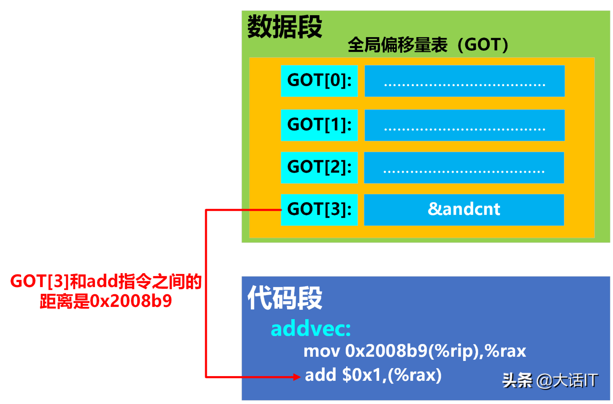

## 三、地址无关代码

现在我们也得到了一个问题，那就是共享对象在被装载时，如何确定它在进程虚拟地址空间中的位置？为了实现动态链接，我们首先会遇到的问题就是共享对象地址的冲突问题。

很明显，在动态链接的情况下，如果不同的模块目标装载地址都一样是不行的。而对于单个程序来讲，我们可以手工指定进程虚拟地址空间中各个模块的地址，比如把 0x1000 到 0x2000 分配给模块 A，把地址 0x2000 到 0x3000 分配给模块 B。但是，如果某个模块被多个程序使用，甚至多个模块被多个程序使用，那么管理这些模块的地址将是一件无比繁琐的事情。

比如一个很简单的情况，一个人制作了一个程序，该程序需要用到模块 B，但是不需要用到模块 A，所以他以为地址 0x1000 到 0x2000 是空闲的，于是分配给了另外一个模块 C。这样 C 和原先的模块 A 的目标地址就冲突了，任何人以后将不能在同一个程序里面使用模块 A 和 C。想象一个有着成千上万个并且由不同公司和个人开发的共享对象的系统中，采用这种手工分配的方式几乎是不可行的。

因此，为了解决这个模块装载地址固定的问题，我们设想是否可以让共享对象在任意地址加载? 这个问题另一种表述方法就是: 共享对象在编译时不能假设自己在进程虚拟地址空间中的位置。与此不同的是，**<font color="red">可执行文件基本可以确定自己在进程虚拟空间中的起始位置，因为可执行文件往往是第一个被加载的文件</font>**，它可以选择一个固定空闲的地址，比如 Linux 下一般都是 0x08040000，Windows 下一般都是 0x0040000。

共享对象（.so）的位置不可假定是 **<font color="red">由于共享库（shared object，也就是 .so 文件）是被可执行文件或其它模块动态加载进来的</font>**，它们的加载地址要等到运行时由动态链接器来决定，因此在编译阶段无法为它们选定一个固定的虚拟地址。它们必须编译成位置无关代码（Position-Independent Code，PIC）。

可执行文件（而非共享库）在进程启动时通常是第一个映射进虚拟地址空间的二进制模块，所以链接器在把它打包时就可以给它一个"默认基址"（default load base），并让操作系统把它按这个地址加载进去——因为此时地址空间还是空闲的，不会与别的映射冲突。

### 1.装载时重定位

装载时重定位的基本思路就是，**<font color="red">在链接时，对所有绝对地址的引用不作重定位，而把这一步推迟到装载时再完成</font>**。一旦模块装载地址确定，即目标地址确定，那么系统就对程序中所有的绝对地址引用进行重定位。假设函数 foobar 相对于代码段的起始地址是 0x100，当模块被装载到 0x10000000 时，我们假设代码段位于模块的最开始，即代码段的装载地址也是 0x10000000，那么我们就可以确定 foobar 的地址为 0x10000100。这时候，系统遍历模块中的重定位表，把所有对 foobar 的地址引用都重定位至 0x10000100。

>在 Windows 中，这种装载时重定位又被叫做基址重置（Rebasing）。

但是装载时重定位的方法并不适合用来解决上面的共享对象中所存在的问题。可以想象，动态链接模块被装载映射至虚拟空间后，指令部分是在多个进程之间共享的，由于装载时重定位的方法需要修改指令，所以没有办法做到同一份指令被多个进程共享，因为指令被重定位后对于每个进程来讲是不同的。当然，动态连接库中的可修改数据部分对于不同的进程来说有多个副本，所以它们可以采用装载时重定位的方法来解决。

>如果使用装载时重定位修改指令部分的地址，那么每个进程加载库的基址可能不同，**<font color="red">导致同一份指令在内存中有不同的副本，这样就无法实现真正的共享，失去了动态链接库可以节省内存的优势</font>**。
>**<font color="red">而数据段每个进程需要有自己的副本，因为这些数据是进程私有的</font>**。因此，数据部分可以使用装载时重定位，每个进程的数据段根据加载地址进行调整，而代码段保持不变，从而实现共享。

### 2.地址无关代码

装载时重定位是解决动态模块中有绝对地址引用的办法之一，但是它有一个很大的缺点是指令部分无法在多个进程之间共享，这样就失去了动态链接节省内存的一大优势。我们还需要有一种更好的方法解决共享对象指令中对绝对地址的重定位问题。其实我们的目的很简单，希望程序模块中共享的指令部分在装载时不需要因为装载地址的改变而改变，所以实现的 **<font color="blue">基本想法就是把指令中那些需要被修改的部分分离出来，跟数据部分放在一起，这样指令部分就可以保持不变，而数据部分可以在每个进程中拥有一个副本</font>**。这种方案就是目前被称为地址无关代码 (PIC，Position-independent Code) 的技术。

PIC 的实现原理很简单，在代码中对所有全局数据和函数引用添加一个额外的中间层（GOT 和 PLT）。通过巧妙地利用链接和加载过程中的结果，使共享库的代码部分实现位置无关。

#### 2.1 GOT 表

PIC 的一个关键点是**利用链接时已知的代码段和数据段之间的偏移**。当链接器合并多个目标文件时，它会整合它们的各个部分，形成一个大的代码段。因此，链接器了解各个部分的大小和它们的相对位置。举例来说，代码段可能在数据段前面，这意味着从代码部分中的**任意指令到数据段开头的偏移量等于代码部分的大小减去指令距离代码部分开头的偏移量**。这两个量都是链接器已知的。

<div align="center">
    
</div>

如上图所示，代码段被加载到某个地址，假设是 **`0xXXXX0000`**，紧随其后的是偏移为 **`0xXXXXF000`** 的数据段。如果代码段中偏移为 0x80 的某个指令需要引用数据部分的内容，链接器知道相对偏移量（在上图中为 **`0xEF80`**），所以可以将此偏移量编码到指令中。

>注意：如果在代码段和数据段之间放置了别的段，或者如果数据段在代码段之前，都不会影响结果。**因为链接器分配了它们放置的位置，并且知道所有段的大小**。

全局偏移表 GOT 可以帮我们实现位置无关数据寻址。**<font color="red">实际上 GOT 就是一个地址表，存储在数据段中</font>**。假设代码段中的某个指令想要引用一个变量。它会引用 GOT 中的一个条目，而不是直接使用绝对地址引用 (这将需要进行重定位)。由于 GOT 位于数据段的一个已知位置，这个引用是相对的，并且在链接器中是已知的，而 GOT 条目本身将包含变量的绝对地址：

>在动态链接的可执行文件或共享库中，有一个特殊的节，名为 **`.dynamic`**。这个节本质上是一个键值对数组，为动态链接器（ld.so）提供了所有它需要的信息，比如依赖哪些共享库、符号表在哪里、以及 GOT 的地址在哪里。记录 GOT 位置的关键“字段”就是 **`.dynamic`** 节中的一个特定条目（entry），其类型标记为 **`DT_PLTGOT`**，其值 d_ptr 直接指向了 **`.got`** 的起始虚拟地址。

<div align="center">
    
</div>

我们前面提到要使得代码地址无关，**<font color="red">基本的思想就是把跟地址相关的部分放到数据段里面</font>**，很明显，这些其他模块的全局变量的地址是跟模块装载地址有关的。ELF 的做法是在数据段里面专门建立一个指向这些变量的指针数组，也被称为全局偏移表 (Global Offset Table，GOT)，当代码需要引用该全局变量时，可以通过 GOT 中相对应的项间接引用。

通过将变量引用重定向到 GOT，我们避免了在代码段中直接使用绝对地址，而是通过 GOT 中的条目进行引用，从而减少了需要在加载时进行的具体地址修正（只需要对 GOT 修正一次）。但是我们在数据段中引入的 GOT，因为全局偏移表中仍然包含变量的绝对地址，所以需要重定位。那么这样做的优点有哪些呢？

- 加载时重定位需要对每个变量的引用都进行重定位，而在全局偏移表中，只需要对每个变量进行一次重定位；
- 数据段是可写的，并且在进程之间不共享；

举一个实际例子来说，GOT 中每个条目都有一个重定位条目，当可执行文件加载时，会根据重定位条目对全局变量进行重定位，将条目的内容设置为全局变量重定位后的地址，如下图所示：

```c{.line-numbers}
int addcnt = 0;
void addvec(int *x,int *y,int *z, int n) 
{
    int i;
    addcnt++;
    for(i = 0; i < n; i++){
        z[i] = x[i] + y[i];
    }
}
```

由下图和上述代码可以看出，addvec 函数引用了全局变量 addcnt，在 addvec 函数中执行指令 **`mov 0x2008b9(%rip)，%rax`** 时，**`0x2008b9`** 是当前执行指令的下条指令和 **`GOT[3]`** 的距离，**<font color="red">这个距离是固定的，与内存无关的</font>**，**`mov 0x2008b9(%rip)，%rax`** 指令通过访问 **`GOT[3]`** 来间接获取 addcnt 的全局变量的地址，当 addcnt 全局变量的内存地址发生变化时，只需要将 **`GOT[3]`** 的内容进行调整，addvec 的所有指令不需要进行调整，这就实现了全局变量引用的位置无关。**`add $0x1, (%rax)`** 指令将 addcnt 全局变量的值增加 1。

<div align="center">
    
</div>

#### 2.2 延迟绑定（PLT）

据统计 ELF 程序在静态链接下要比动态库稍微快点，大约为 1%~5%，因此动态链接是以牺牲一部分性能为代价的。我们知道动态链接比静态链接慢的主要原因是动态链接下对于**全局和静态的数据访问都要进行复杂的 GOT 定位，然后间接寻址**；对于模块间的调用也要先定位 GOT，然后再进行间接跳转，如此一来，程序的运行速度必定会减慢。

另外一个减慢运行速度的原因是动态链接的链接工作在运行时完成，即程序开始执行时，动态链接器都要进行一次链接工作，**这时动态链接器会寻找并装载所需要的共享对象，然后进行符号查找地址重定位等工作**，这些工作势必减慢程序的启动速度。接下来介绍的 PLT 可以优化动态链接的性能。

在动态链接下，程序模块之间包含了大量的函数引用 (全局变量往往比较少，因为大量的全局变量会导致模块之间耦合度变大)，所以在程序开始执行前，动态链接会耗费不少时间用于解决模块之间的函数引用的符号查找以及重定位，这也是我们上面提到的减慢动态链接性能的第二个原因。不过在一个程序运行过程中，会有很多函数在程序执行完时都不会被用到，所以如果一开始就把所有函数都链接好实际上是一种浪费。

所以 ELF 采用了一种叫做延迟绑定(Lazy Binding) 的做法，**<font color="red">基本的思想就是当函数第一次被用到时才进行绑定 (符号查找、重定位等)，如果没有用到则不进行绑定</font>**。这样的做法可以大大加快程序的启动速度，特别有利于一些有大量函数引用和大量模块的程序。

当我们调用某个外部模块的函数时，如果按照通常的做法应该是通过 GOT 中相应的项进行间接跳转。PLT 为了实现延迟绑定，在这个过程中间又增加了一层间接跳转。调用函数并不直接通过 GOT 进行跳转，而是通过一个叫做 PLT 项的结构进行跳转。**<font color="red">每个外部函数在 PLT 中都有一个相应的项，比如</font>** **`addvec()`** **<font color="red">函数在 PLT 中的项地址我们称之为 **`addvec@plt`**。下面是 **`addvec@plt`** 的实现</font>**：

```armasm{.line-numbers}
;addvec@plt:
jmp *(addvec@GOT)
; n 表示调用的函数在重定位表 .rel.plt 中的偏移量
push n
; moduleID 为当前共享库、模块或可执行文件 ID，实际上就是一个 link_map 结构指针。link_map 结构链表第一个结点表示的是可执行文件
push moduleID
; _dl_runtime_resolve 查找需要解析函数的绝对地址，并对 .got.plt 中的 GOT 表项进行重定位
jump _dl_runtime_resolve
```

**`addvec@plt`** 的第一条指令是一条通过 GOT 间接跳转的指令。**`addvec@GOT`** 表示 GOT 中保存 **`addvec()`** 这个函数相应的项。如果链接器在初始化阶段已经初始化该项，并且将 **`addvec()`** 的地址填入该项，那么这个跳转指令的结果就是我们所期望的，跳转到 **`addvec()`**，实现函数正确调用。

<div align="center">
    
</div>

但是为了实现延迟绑定，链接器在初始化阶段并没有将 **`addvec()`** 的地址填入到对应 GOT 条目中，而是将上面代码中第二条指令 **`push n`** 的地址填入到 **`addvec@GOT`** 中（即对应的 **`.got.plt`** 表中），这个步骤不需要查找任何符号，所以代价很低。延迟绑定机制下，GOT 和 PLT 之间的关系如上图所示，当一个目标文件第一次调用 addvec 函数时，调用过程如下：

- 执行指令 **`call 0x4005c0`**，**`0x4005c0`** 为 PLT[2] 表项的地址；
- **`PLT[2]`** 表项中第一条指令的效果是跳转到 **`GOT[4]`** 指向的地址，这个地址在第一次调用时，刚好是 **`PLT[2]`** 表项中第二条指令的地址，相当于跳转到 **`pushq 0x01`**；
- 第二条指令将一个数字 1 压入堆栈中，**这个数字是 addvec 这个符号引用在重定位表 **`.rel.plt`** 中的下标/偏移量**，然后跳转到 **`PLT[0]`** 表项；
- **`pushq *GOT[1]`** 指令将模块的 ID 压入到堆栈；
- 第四条指令跳转到 **`_dl_runtime_resolve()`** 函数，**`dl_runtime_resolve()`** 函数来完成符号解析和重定位工作，**<font color="red">`_dl_runtime_resolve()` 在进行一系列工作以后将 `addvec()` 的真正地址填入到 `addvec@GOT` 中</font>**。

一旦 **`addvec()`** 这个函数被解析完毕，**<font color="blue">当我们再次调用 `addvec@plt` 时，第一条 jmp 指令就能够跳转到真正的 `addvec()` 函数中，而不会再继续执行 `addvec@plt` 中第二条指令开始的那段代码，那段代码只会在符号未被解析时执行一次</font>**。

ELF 将 GOT 拆分成了两个表叫做 .got 和 .got.plt。其中 **.got 用来保存全局变量引用的地址，.got.plt 用来保存函数引用的地址**，也就是说，所有对于外部函数的引用全部被分离出来放到了 .got.plt 中。另外 .got.plt 还有一个特殊的地方是它的前三项是有特殊意义的：

- 第一项保存的是 .dynamic 段的地址，这个段描述了本模块动态链接相关的信息；
- 第二项保存的是本模块的 ID；
- 第三项保存的是 **`_dl_runtime_resolve()`** 的地址；
 
<div align="center">
    
</div>

其中第二项和第三项由动态链接器在装载共享模块的时候负责将它们初始化，**`.got.plt`** 的其余项分别对应每个外部函数的引用。在实际的 PLT 中，为了减少代码的重复，ELF 把上面例子中的最后两条指令放到 PLT 中的第一项（**`PLT[0]`**）。并且规定 PLT 表每项的长度是 16 个字节，刚好用来存放 3 条指令。

>每个动态链接的共享库 (.so 文件) 和主可执行文件一样，都有其自己独立的 PLT (Procedure Linkage Table) 和 GOT (Global Offset Table)。

实际的 PLT 基本结构代码如下：

```armasm{.line-numbers}
PLT0:
;moduleID 本模块的 ID
push *(GOT + 4)
;_dl_runtime_resolve 函数的地址
jump *(GOT + 8)

addvec@plt:
jmp *(addvec@GOT)
push n
jump PLT0
```