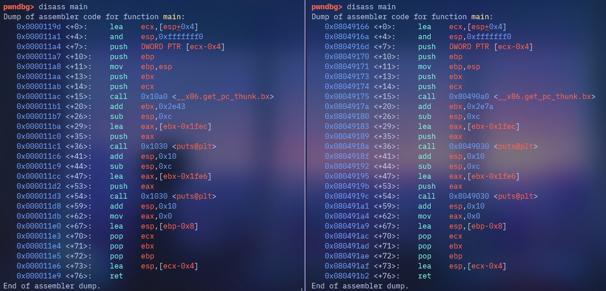
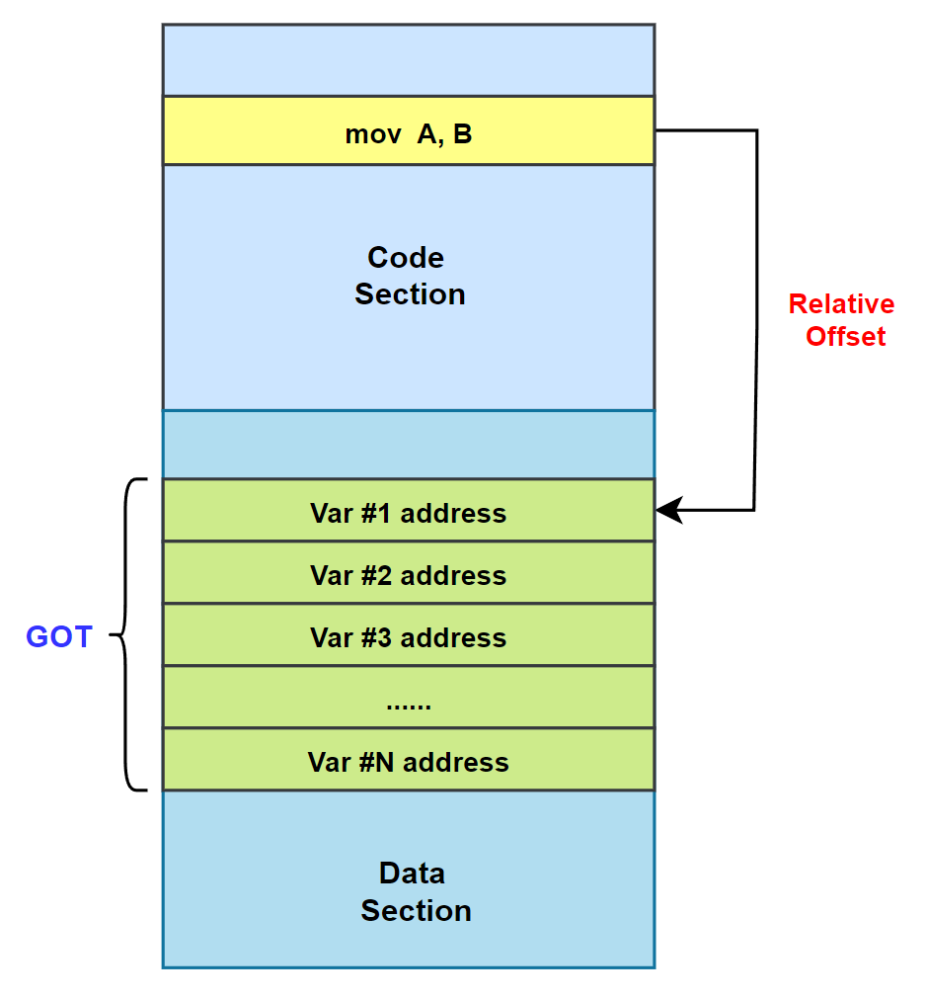
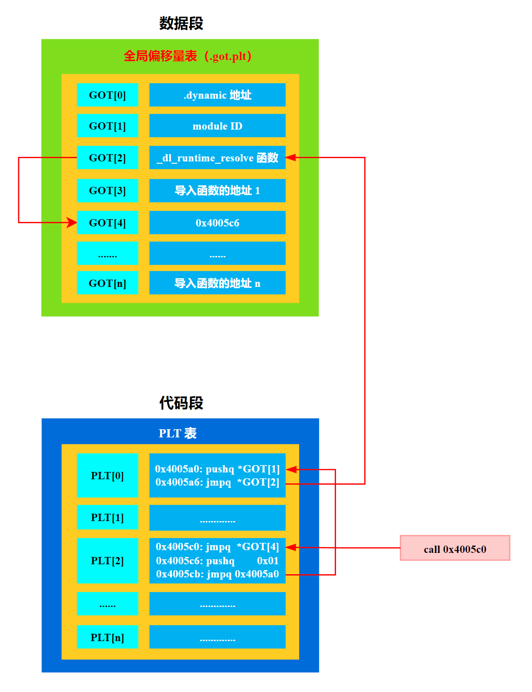

## 三、地址无关代码

现在我们也得到了一个问题，那就是共享对象在被装载时，如何确定它在进程虚拟地址空间中的位置？为了实现动态链接，我们首先会遇到的问题就是共享对象地址的冲突问题。

很明显，在动态链接的情况下，如果不同的模块目标装载地址都一样是不行的。而对于单个程序来讲，我们可以手工指定进程虚拟地址空间中各个模块的地址，比如把 0x1000 到 0x2000 分配给模块 A，把地址 0x2000 到 0x3000 分配给模块 B。但是，如果某个模块被多个程序使用，甚至多个模块被多个程序使用，那么管理这些模块的地址将是一件无比繁琐的事情。

比如一个很简单的情况，一个人制作了一个程序，该程序需要用到模块 B，但是不需要用到模块 A，所以他以为地址 0x1000 到 0x2000 是空闲的，于是分配给了另外一个模块 C。这样 C 和原先的模块 A 的目标地址就冲突了，任何人以后将不能在同一个程序里面使用模块 A 和 C。想象一个有着成千上万个并且由不同公司和个人开发的共享对象的系统中，采用这种手工分配的方式几乎是不可行的。

因此，为了解决这个模块装载地址固定的问题，我们设想是否可以让共享对象在任意地址加载? 这个问题另一种表述方法就是: 共享对象在编译时不能假设自己在进程虚拟地址空间中的位置。与此不同的是，**<font color="red">可执行文件基本可以确定自己在进程虚拟空间中的起始位置，因为可执行文件往往是第一个被加载的文件</font>**，它可以选择一个固定空闲的地址，比如 Linux 下一般都是 0x08040000，Windows 下一般都是 0x0040000。

共享对象（.so）的位置不可假定是 **<font color="red">由于共享库（shared object，也就是 .so 文件）是被可执行文件或其它模块动态加载进来的</font>**，它们的加载地址要等到运行时由动态链接器来决定，因此在编译阶段无法为它们选定一个固定的虚拟地址。它们必须编译成位置无关代码（Position-Independent Code，PIC）。

可执行文件（而非共享库）在进程启动时通常是第一个映射进虚拟地址空间的二进制模块，所以链接器在把它打包时就可以给它一个"默认基址"（default load base），并让操作系统把它按这个地址加载进去——因为此时地址空间还是空闲的，不会与别的映射冲突。

### 1.装载时重定位

装载时重定位的基本思路就是，**<font color="red">在链接时，对所有绝对地址的引用不作重定位，而把这一步推迟到装载时再完成</font>**。一旦模块装载地址确定，即目标地址确定，那么系统就对程序中所有的绝对地址引用进行重定位。假设函数 foobar 相对于代码段的起始地址是 0x100，当模块被装载到 0x10000000 时，我们假设代码段位于模块的最开始，即代码段的装载地址也是 0x10000000，那么我们就可以确定 foobar 的地址为 0x10000100。这时候，系统遍历模块中的重定位表，把所有对 foobar 的地址引用都重定位至 0x10000100。

>在 Windows 中，这种装载时重定位又被叫做基址重置（Rebasing）。

但是装载时重定位的方法并不适合用来解决上面的共享对象中所存在的问题。可以想象，动态链接模块被装载映射至虚拟空间后，指令部分是在多个进程之间共享的，由于装载时重定位的方法需要修改指令，所以没有办法做到同一份指令被多个进程共享，因为指令被重定位后对于每个进程来讲是不同的。当然，动态连接库中的可修改数据部分对于不同的进程来说有多个副本，所以它们可以采用装载时重定位的方法来解决。

>如果使用装载时重定位修改指令部分的地址，那么每个进程加载库的基址可能不同，**<font color="red">导致同一份指令在内存中有不同的副本，这样就无法实现真正的共享，失去了动态链接库可以节省内存的优势</font>**。
>**<font color="red">而数据段每个进程需要有自己的副本，因为这些数据是进程私有的</font>**。因此，数据部分可以使用装载时重定位，每个进程的数据段根据加载地址进行调整，而代码段保持不变，从而实现共享。

### 2.地址无关代码

装载时重定位是解决动态模块中有绝对地址引用的办法之一，但是它有一个很大的缺点是指令部分无法在多个进程之间共享，这样就失去了动态链接节省内存的一大优势。我们还需要有一种更好的方法解决共享对象指令中对绝对地址的重定位问题。其实我们的目的很简单，希望程序模块中共享的指令部分在装载时不需要因为装载地址的改变而改变，所以实现的 **<font color="blue">基本想法就是把指令中那些需要被修改的部分分离出来，跟数据部分放在一起，这样指令部分就可以保持不变，而数据部分可以在每个进程中拥有一个副本</font>**。这种方案就是目前被称为地址无关代码 (PIC，Position-independent Code) 的技术。

PIC 的实现原理很简单，在代码中对所有全局数据和函数引用添加一个额外的中间层（GOT 和 PLT）。通过巧妙地利用链接和加载过程中的结果，使共享库的代码部分实现位置无关。

为了支撑动态链接这一工作过程，在 ELF 文件中有 3 个 Section 与之相关：

- **`.got`**：全局偏移表（Global Offset Table），用于存储外部符号的绝对地址，由链接器进行填充。
- **`.plt`**：过程链接表（Procedure Linkage Table），存有从 **`.got.plt`** 中查找外部函数地址的代码，若是第一次调用该函数，则会触发链接器解析函数地址并填充在 **`.got.plt`** 相应的位置；若函数地址已经存储在 **`.got.plt`** 中则直接跳转到对应地址继续执行。
- **`.got.plt`**：GOT 中专用于 PLT 存储外部函数地址的部分，是属于 GOT 的一部分。

类似的概念同样存在于可执行文件上，被称为位置无关可执行文件（Position-independent Executable，PIE）。上述编译指令中 **`-no-pie`** 参数的意义即为关闭 PIE。当 PIE 关闭时，链接器会默认将其加载到 OS 虚拟地址空间的代码段（Text Segment）中，此时可执行文件将会有一个固定的地址前缀（如 x86-32 下为 **`0x08048000`**，x86-64 下为 **`0x0000000000400000`**），这也正是代码段的起始地址。使用 GDB 分别对开启 PIE 和未开启 PIE 的程序进行反编译，**<font color="red">可以看见开启 PIE 的代码地址以及函数调用地址均为相对的偏移量，而未开启 PIE 的程序则全部为绝对地址</font>**：

<div align="center">
    
</div>

## 四、GOT 表

### 1.GOT 介绍

PIC 的一个关键点是**利用链接时已知的代码段和数据段之间的偏移**。当链接器合并多个目标文件时，它会整合它们的各个部分，形成一个大的代码段。因此，链接器了解各个部分的大小和它们的相对位置。举例来说，代码段可能在数据段前面，这意味着从代码部分中的**任意指令到数据段开头的偏移量等于代码部分的大小减去指令距离代码部分开头的偏移量**。这两个量都是链接器已知的。

<div align="center">
    
</div>

如上图所示，代码段被加载到某个地址，假设是 **`0xXXXX0000`**，紧随其后的是偏移为 **`0xXXXXF000`** 的数据段。如果代码段中偏移为 0x80 的某个指令需要引用数据部分的内容，链接器知道相对偏移量（在上图中为 **`0xEF80`**），所以可以将此偏移量编码到指令中。

>注意：如果在代码段和数据段之间放置了别的段，或者如果数据段在代码段之前，都不会影响结果。**因为链接器分配了它们放置的位置，并且知道所有段的大小**。

全局偏移表 GOT 可以帮我们实现位置无关数据寻址。**<font color="red">实际上 GOT 就是一个地址表，存储在数据段中</font>**。假设代码段中的某个指令想要引用一个变量。它会引用 GOT 中的一个条目，而不是直接使用绝对地址引用 (这将需要进行重定位)。由于 GOT 位于数据段的一个已知位置，这个引用是相对的，并且在链接器中是已知的，而 GOT 条目本身将包含变量的绝对地址：

>在动态链接的可执行文件或共享库中，有一个特殊的节，名为 **`.dynamic`**。这个节本质上是一个键值对数组，为动态链接器（ld.so）提供了所有它需要的信息，比如依赖哪些共享库、符号表在哪里、以及 GOT 的地址在哪里。记录 GOT 位置的关键“字段”就是 **`.dynamic`** 节中的一个特定条目（entry），其类型标记为 **`DT_PLTGOT`**，其值 d_ptr 直接指向了 **`.got`** 的起始虚拟地址。

<div align="center">
    
</div>

我们前面提到要使得代码地址无关，**<font color="red">基本的思想就是把跟地址相关的部分放到数据段里面</font>**，很明显，这些其他模块的全局变量的地址是跟模块装载地址有关的。ELF 的做法是在数据段里面专门建立一个指向这些变量的指针数组，也被称为全局偏移表 (Global Offset Table，GOT)，当代码需要引用该全局变量时，可以通过 GOT 中相对应的项间接引用。

通过将变量引用重定向到 GOT，我们避免了在代码段中直接使用绝对地址，而是通过 GOT 中的条目进行引用，从而减少了需要在加载时进行的具体地址修正（只需要对 GOT 修正一次）。但是我们在数据段中引入的 GOT，因为全局偏移表中仍然包含变量的绝对地址，所以需要重定位。那么这样做的优点有哪些呢？

- 加载时重定位需要对每个变量的引用都进行重定位，而在全局偏移表中，只需要对每个变量进行一次重定位；
- 数据段是可写的，并且在进程之间不共享；

举一个实际例子来说，GOT 中每个条目都有一个重定位条目，当可执行文件加载时，会根据重定位条目对全局变量进行重定位，将条目的内容设置为全局变量重定位后的地址，如下图所示：

```c{.line-numbers}
int addcnt = 0;
void addvec(int *x,int *y,int *z, int n) 
{
    int i;
    addcnt++;
    for(i = 0; i < n; i++){
        z[i] = x[i] + y[i];
    }
}
```

由下图和上述代码可以看出，addvec 函数引用了全局变量 addcnt，在 addvec 函数中执行指令 **`mov 0x2008b9(%rip)，%rax`** 时，**`0x2008b9`** 是当前执行指令的下条指令和 **`GOT[3]`** 的距离，**<font color="red">这个距离是固定的，与内存无关的</font>**，**`mov 0x2008b9(%rip)，%rax`** 指令通过访问 **`GOT[3]`** 来间接获取 addcnt 的全局变量的地址，当 addcnt 全局变量的内存地址发生变化时，只需要将 **`GOT[3]`** 的内容进行调整，addvec 的所有指令不需要进行调整，这就实现了全局变量引用的位置无关。**`add $0x1, (%rax)`** 指令将 addcnt 全局变量的值增加 1。

<div align="center">
    
</div>

### 2.实例：通过 GOT 进行数据引用 (位置无关)

#### 2.1 反汇编既 ELF 头分析

首先编写一个简单的函数，其中有一个全局变量 myglob，在函数中取全局变量的值然后加上 a 和 b 返回。然后使用 **`-fPIC`** 和 **`-shared`** 将这个代码编译成动态链接库：

```c{.line-numbers}
int my_glob = 42;

int ml_func(int a, int b) {
   return my_glob + a + b;
}
```

接下来使用 **`gcc ml_fun.c -shared -o libreloc.so -fPIC -m32`** 命令将 **`ml_func.c`** 编译成动态共享库 **`libreloc.so`**，然后查看此动态库的汇编代码：
 
```c{.line-numbers}
monica@monica-virtual-machine:~/linkers_loaders$ gcc ml_fun.c -shared -o libreloc.so -fPIC -m32
monica@monica-virtual-machine:~/linkers_loaders$ objdump -d libreloc.so 
0000114d <ml_func>:
    114d:	55                   	push   %ebp
    114e:	89 e5                	mov    %esp,%ebp
    1150:	e8 19 00 00 00       	call   116e <__x86.get_pc_thunk.ax>
    1155:	05 ab 2e 00 00       	add    $0x2eab,%eax
    115a:	8b 80 f0 ff ff ff    	mov    -0x10(%eax),%eax
    1160:	8b 10                	mov    (%eax),%edx
    1162:	8b 45 08             	mov    0x8(%ebp),%eax
    1165:	01 c2                	add    %eax,%edx
    1167:	8b 45 0c             	mov    0xc(%ebp),%eax
    116a:	01 d0                	add    %edx,%eax
    116c:	5d                   	pop    %ebp
    116d:	c3                   	ret 
```

**`call   116e <__x86.get_pc_thunk.ax>`** 指令将下一条指令的地址（即 **`0x1155`**）保存到 **`%eax`** 寄存器中，接下来 **`add    $0x2eab,%eax`** 和 **`mov    -0x10(%eax),%eax`** 两条指令将 %eax 中寄存器的值分别加上 **`0x2eab`** 和减去 0x10，最后等于 **`0x3ff0`**。

接下来查看一下 libreloc.so 库的 GOT 表：

```c{.line-numbers}
monica@monica-virtual-machine:~/linkers_loaders$ readelf -S libreloc.so 
  [16] .got              PROGBITS        00003fec 002fec 000014 04  WA  0   0  4
  [17] .got.plt          PROGBITS        00004000 003000 00000c 04  WA  0   0  4
  [18] .data             PROGBITS        0000400c 00300c 000008 00  WA  0   0  4
```

我们用 readelf 看到 .got 表格的首地址为 **`0x3fec`**，那 **`0x3ff0`** 肯定就是 .got 表格的内容了，里面保存着 myglob 全局变量的地址。接下来查看一下 libreloc.so 的重定位表：

```c{.line-numbers}
monica@monica-virtual-machine:~/linkers_loaders$ readelf -r libreloc.so 

重定位节 '.rel.dyn' at offset 0x274 contains 8 entries:
 偏移量     信息    类型              符号值      符号名称
00003f3c  00000008 R_386_RELATIVE   
00003f40  00000008 R_386_RELATIVE   
0000400c  00000008 R_386_RELATIVE   
00003fec  00000106 R_386_GLOB_DAT    00000000   __cxa_finalize
00003ff0  00000506 R_386_GLOB_DAT    00004010   my_glob
00003ff4  00000206 R_386_GLOB_DAT    00000000   _ITM_registerTMCl[...]
00003ff8  00000306 R_386_GLOB_DAT    00000000   _ITM_deregisterTM[...]
00003ffc  00000406 R_386_GLOB_DAT    00000000   __gmon_start__
```

我们可以看到 myglob 在 **`0x3fe0`** 处。该重定位的类型是 **`R_386_GLOB_DAT`**，它告诉动态加载器，要将符号的实际地址放入该偏移量。

#### 2.2 GDB 分析

我们先来写一个 driver.c，在这里面来调用库中的 **`ml_func()`** 函数：

```c{.line-numbers}
#include <stdio.h>

extern int ml_func(int a, int b);

int main() {
   int result = ml_func(10, 20);
   printf("ml_func result: %d\n", result);
   return 0;
}
```

接下来将 driver.c 和 **`libreloc.so`** 动态链接，并且使用 gdb 进行调试：

```c{.line-numbers}
monica@monica-virtual-machine:~/linkers_loaders$ gcc -o driver driver.c ./libreloc.so -m32
monica@monica-virtual-machine:~/linkers_loaders$ gdb driver
Reading symbols from driver...
(No debugging symbols found in driver)
(gdb) break ml_func
Breakpoint 1 at 0x1060
(gdb) r
Starting program: /home/monica/linkers_loaders/driver 
[Thread debugging using libthread_db enabled]
Using host libthread_db library "/lib/x86_64-linux-gnu/libthread_db.so.1".

Breakpoint 1, 0xf7fba150 in ml_func () from ./libreloc.so
(gdb) disas ml_func
Dump of assembler code for function ml_func:
   0xf7fba14d <+0>:	push   %ebp
   0xf7fba14e <+1>:	mov    %esp,%ebp
=> 0xf7fba150 <+3>:	call   0xf7fba16e <__x86.get_pc_thunk.ax>
   0xf7fba155 <+8>:	add    $0x2eab,%eax
   0xf7fba15a <+13>:	mov    -0x10(%eax),%eax
   0xf7fba160 <+19>:	mov    (%eax),%edx
   0xf7fba162 <+21>:	mov    0x8(%ebp),%eax
   0xf7fba165 <+24>:	add    %eax,%edx
   0xf7fba167 <+26>:	mov    0xc(%ebp),%eax
   0xf7fba16a <+29>:	add    %edx,%eax
   0xf7fba16c <+31>:	pop    %ebp
   0xf7fba16d <+32>:	ret    
End of assembler dump.
(gdb) x/wx 0xf7fbcff0
0xf7fbcff0:	0xf7fbd010
(gdb) p &my_glob
$1 = (<data variable, no debug info> *) 0xf7fbd010 <my_glob>
(gdb) 
```

在执行 **`call  0xf7fba16e <__x86.get_pc_thunk.ax>`** 命令后，同样将下一条指令的地址 **`0xf7fba155`** 保存到 %eax 中，接着同样将 %eax 中寄存器的值分别加上 **`0x2eab`** 和减去 0x10，最后得到 **`0xf7fbcff0`** 地址。根据前面的分析，我们知道这个地址里保存的应该是全局变量 myglob 的地址 **`0xf7fbd010`**。

>在这里我们发现 my_glob 虽然是一个全局变量，但是本模块内的函数对其的访问还是通过 GOT 来实现的，因此实际上，**<font color="red">对于当前动态共享库内部静态数据变量的访问，采用相对地址的方式来访问。但是对于同一个动态共享库内全局变量的访问，还是采用 GOT 方式来访问</font>**。动态共享库必定是采用了

## 五、延迟绑定（PLT）

### 1.PLT 介绍

据统计 ELF 程序在静态链接下要比动态库稍微快点，大约为 1%~5%，因此动态链接是以牺牲一部分性能为代价的。我们知道动态链接比静态链接慢的主要原因是动态链接下对于**全局和静态的数据访问都要进行复杂的 GOT 定位，然后间接寻址**；对于模块间的调用也要先定位 GOT，然后再进行间接跳转，如此一来，程序的运行速度必定会减慢。

另外一个减慢运行速度的原因是动态链接的链接工作在运行时完成，即程序开始执行时，动态链接器都要进行一次链接工作，**这时动态链接器会寻找并装载所需要的共享对象，然后进行符号查找地址重定位等工作**，这些工作势必减慢程序的启动速度。接下来介绍的 PLT 可以优化动态链接的性能。

在动态链接下，程序模块之间包含了大量的函数引用 (全局变量往往比较少，因为大量的全局变量会导致模块之间耦合度变大)，所以在程序开始执行前，动态链接会耗费不少时间用于解决模块之间的函数引用的符号查找以及重定位，这也是我们上面提到的减慢动态链接性能的第二个原因。不过在一个程序运行过程中，会有很多函数在程序执行完时都不会被用到，所以如果一开始就把所有函数都链接好实际上是一种浪费。

所以 ELF 采用了一种叫做延迟绑定(Lazy Binding) 的做法，**<font color="red">基本的思想就是当函数第一次被用到时才进行绑定 (符号查找、重定位等)，如果没有用到则不进行绑定</font>**。这样的做法可以大大加快程序的启动速度，特别有利于一些有大量函数引用和大量模块的程序。

当我们调用某个外部模块的函数时，如果按照通常的做法应该是通过 GOT 中相应的项进行间接跳转。PLT 为了实现延迟绑定，在这个过程中间又增加了一层间接跳转。调用函数并不直接通过 GOT 进行跳转，而是通过一个叫做 PLT 项的结构进行跳转。**<font color="red">每个外部函数在 PLT 中都有一个相应的项，比如</font>** **`addvec()`** **<font color="red">函数在 PLT 中的项地址我们称之为 **`addvec@plt`**。下面是 **`addvec@plt`** 的实现</font>**：

```armasm{.line-numbers}
;addvec@plt:
jmp *(addvec@GOT)
; n 表示调用的函数在重定位表 .rel.plt 中的偏移量
push n
; moduleID 为当前共享库、模块或可执行文件 ID，实际上就是一个 link_map 结构指针。link_map 结构链表第一个结点表示的是可执行文件
push moduleID
; _dl_runtime_resolve 查找需要解析函数的绝对地址，并对 .got.plt 中的 GOT 表项进行重定位
jump _dl_runtime_resolve
```

**`addvec@plt`** 的第一条指令是一条通过 GOT 间接跳转的指令。**`addvec@GOT`** 表示 GOT 中保存 **`addvec()`** 这个函数相应的项。如果链接器在初始化阶段已经初始化该项，并且将 **`addvec()`** 的地址填入该项，那么这个跳转指令的结果就是我们所期望的，跳转到 **`addvec()`**，实现函数正确调用。

<div align="center">
    
</div>

但是为了实现延迟绑定，链接器在初始化阶段并没有将 **`addvec()`** 的地址填入到对应 GOT 条目中，而是将上面代码中第二条指令 **`push n`** 的地址填入到 **`addvec@GOT`** 中（即对应的 **`.got.plt`** 表中），这个步骤不需要查找任何符号，所以代价很低。延迟绑定机制下，GOT 和 PLT 之间的关系如上图所示，当一个目标文件第一次调用 addvec 函数时，调用过程如下：

- 执行指令 **`call 0x4005c0`**，**`0x4005c0`** 为 PLT[2] 表项的地址；
- **`PLT[2]`** 表项中第一条指令的效果是跳转到 **`GOT[4]`** 指向的地址，这个地址在第一次调用时，刚好是 **`PLT[2]`** 表项中第二条指令的地址，相当于跳转到 **`pushq 0x01`**；
- 第二条指令将一个数字 1 压入堆栈中，**这个数字是 addvec 这个符号引用在重定位表 **`.rel.plt`** 中的下标/偏移量**，然后跳转到 **`PLT[0]`** 表项；
- **`pushq *GOT[1]`** 指令将模块的 ID 压入到堆栈；
- 第四条指令跳转到 **`_dl_runtime_resolve()`** 函数，**`dl_runtime_resolve()`** 函数来完成符号解析和重定位工作，**<font color="red">`_dl_runtime_resolve()` 在进行一系列工作以后将 `addvec()` 的真正地址填入到 `addvec@GOT` 中</font>**。

一旦 **`addvec()`** 这个函数被解析完毕，**<font color="blue">当我们再次调用 `addvec@plt` 时，第一条 jmp 指令就能够跳转到真正的 `addvec()` 函数中，而不会再继续执行 `addvec@plt` 中第二条指令开始的那段代码，那段代码只会在符号未被解析时执行一次</font>**。

ELF 将 GOT 拆分成了两个表叫做 .got 和 .got.plt。其中 **.got 用来保存全局变量引用的地址，.got.plt 用来保存函数引用的地址**，也就是说，所有对于外部函数的引用全部被分离出来放到了 .got.plt 中。另外 .got.plt 还有一个特殊的地方是它的前三项是有特殊意义的：

- 第一项保存的是 .dynamic 段的地址，这个段描述了本模块动态链接相关的信息；
- 第二项保存的是本模块的 ID；
- 第三项保存的是 **`_dl_runtime_resolve()`** 的地址；

<div align="center">
    
</div>

其中第二项和第三项由动态链接器在装载共享模块的时候负责将它们初始化，**`.got.plt`** 的其余项分别对应每个外部函数的引用。在实际的 PLT 中，为了减少代码的重复，ELF 把上面例子中的最后两条指令放到 PLT 中的第一项（**`PLT[0]`**）。并且规定 PLT 表每项的长度是 16 个字节，刚好用来存放 3 条指令。

>每个动态链接的共享库 (.so 文件) 和主可执行文件一样，都有其自己独立的 PLT (Procedure Linkage Table) 和 GOT (Global Offset Table)。

实际的 PLT 基本结构代码如下：

```armasm{.line-numbers}
PLT0:
;moduleID 本模块的 ID
push *(GOT + 4)
;_dl_runtime_resolve 函数的地址
jump *(GOT + 8)

addvec@plt:
jmp *(addvec@GOT)
push n
jump PLT0
```

### 2.调试 PLT 函数调用过程

#### 2.1 准备工作

下面将对基于 GOT 和 PLT 来进行外部符号地址重定向的工作方式进行分析。为了便于演示过程，编写了两个 C 文件，一个编译为共享的动态链接库，另一个是可执行程序。代码和编译命令如下：

```c{.line-numbers}
// plt.c
// gcc -g -m32 -no-pie -L. plt.c libplt.so -o plt
#include <stdio.h>

static int a;
extern int b;
extern void external();

void internal() {
    printf("[*] INT\n");
}

int main(void) {
    printf("a = %d, b = %d\n", a, b);
    internal();
    external();
    return 0;
}

// libplt.c
// gcc -g -m32 -shared -fPIC libplt.c -o libplt.so
#include <stdio.h>
int b = 0xdeadbeef;
void external() {
    printf("[*] EXT\n");
}
```

```c{.line-numbers}
monica@monica-virtual-machine:~/linkers_loaders$ gcc -m32  plt.c ./libplt.so -o plt
monica@monica-virtual-machine:~/linkers_loaders$ objdump -d plt | grep main
00001030 <__libc_start_main@plt-0x10>:
00001040 <__libc_start_main@plt>:
    10b6:	e8 85 ff ff ff       	call   1040 <__libc_start_main@plt>
000011e8 <main>:
monica@monica-virtual-machine:~/linkers_loaders$ gcc -m32  plt.c ./libplt.so -o plt -no-pie
monica@monica-virtual-machine:~/linkers_loaders$ objdump -d plt | grep main
08049030 <__libc_start_main@plt-0x10>:
08049040 <__libc_start_main@plt>:
 80490a7:	e8 94 ff ff ff       	call   8049040 <__libc_start_main@plt>
080491c1 <main>:
```

如果我们使用 **`gcc -g -m32 -no-pie plt.c ./libplt.so -o plt`** 编译 **`plt.c`** 文件，注意这里是生成一个单一的、完整的、可执行的程序。链接器可以全面分析这些组件内部的符号定义和引用关系。它知道哪些符号是在这个模块内部定义的，哪些符号是未定义的（需要从外部共享库解析），反汇编 plt 部分二进制程序如下所示，使用相对偏移就可以跳转到 internal 函数内部去执行。

```armasm{.line-numbers}
80491f5:	e8 56 fe ff ff       	call   8049050 <printf@plt>
80491fa:	83 c4 10             	add    $0x10,%esp
80491fd:	e8 94 ff ff ff       	call   8049196 <internal>
8049202:	e8 69 fe ff ff       	call   8049070 <external@plt>
```

如果我们使用 **`gcc -g -m32 plt.c ./libplt.so -o plt -fPIC -shared`** 编译 **`plt.c`** 文件，注意这里链接器正在执行 **中间链接（Intermediate Linking）** 来创建一个可重用的共享库。它的目标是生成一个独立的、位置无关的、必须严格遵守动态链接 ABI（应用二进制接口）规则的模块。根据 ELF 动态链接的规范，这样一个符号是可被抢占的（Preemptible）。这意味着，当这个库被加载时，主程序或一个通过 **`LD_PRELOAD`** 加载的更高优先级的库，可以提供一个同名的 internal 函数来覆盖库中的版本。

为了保证这个规则有效，库内部对 internal 的调用必须通过一个能够被动态链接器在运行时重定向的机制。这个机制就是 PLT (Procedure Linkage Table)。如果链接器此时擅自优化，生成了一条直接的 PC 相对调用，那么这个调用就会被"写死"，永远指向当前库内部的 internal 版本。这将破坏符号抢占机制，导致严重的行为不一致和错误。

因此，链接器必须生成 **`call <internal@plt>`**。这个指令将调用引向 PLT 的一个桩（stub），这个桩再通过 GOT 间接跳转。在程序运行时，由动态链接器（ld.so）负责决定到底将哪个 internal 函数（库内部的，还是外部抢占的）的地址填入 GOT，从而保证了动态链接的灵活性和正确性。

反汇编 plt 部分二进制程序如下所示，此时使用 **`call <internal@plt>`** 指令来调用 internal 函数。

```armasm{.line-numbers}
11ec:	e8 4f fe ff ff       	call   1040 <printf@plt>
11f1:	83 c4 10             	add    $0x10,%esp
11f4:	e8 67 fe ff ff       	call   1060 <internal@plt>
11f9:	e8 72 fe ff ff       	call   1070 <external@plt>
```

#### 2.2 函数调用流程（Lazy Binding）

动态链接下第一次调用 glibc 的函数需要通过 PLT 表中的一段代码解析函数的真实地址，这也是 ELF 的延迟绑定的特点。具体的解析方式就是通过调用 **`_dl_runtime_resolve(link_map_obj, reloc_arg)`**，如果我们可以控制整个解析过程中的参数，那么就能解析我们想要的函数地址。以调用 printf 函数为例，回顾一下整个流程：

1. **`call printf@PLT`**
2. **`jmp *(printf@GOT)`** -> (第一次会 jmp 回来，解析之后就直接 jmp 到解析出来的地址了) -> **`push n`** -> **`jmp &PLT[0]`** (跳到公共表项)
3. **`push GOT[1]`** (**`link_map`** 可以理解为模块 ID) -> **`jmp *GOT[2]`** (跳转到 **`_dl_runtime_resolve`** 函数)
以上步骤相当于调用了 **`_dl_runtime_resolve(link_map_obj, reloc_arg)`**
4. 解析完毕后会把解析出来的地址写回通过 reloc_arg 定位到的 **`.rel.plt`** 表项的 **`r_offset`** 指向的位置 (其实就是 **`.got.plt`** 表中的对应项)

#### 2.3 **`link_map`** 结构体定义

```c{.line-numbers}
#include <link_map.h>
/* 描述加载的共享库的结构体。“l_next”和“l_prev”成员构成了启动时加载的所有共享对象的链表。
   这些数据结构存在于运行时动态链接器使用的空间中。 修改它们可能会导致灾难性的后果。 如有
   必要，此数据结构将来可能会更改。 用户级程序必须避免定义这种类型的对象。 */
struct link_map {
    /* 这些最初的几个成员是调试器协议的一部分。 这与SVR4中使用的格式相同。 */
    /* 运行时加载地址 - 链接时加载地址 即为 link_map 数据结构中 l_addr 字段的值，对于共享文件来说，可以简单理解为文件加载基地址 */
    ElfW(Addr) l_addr;
    char *l_name;       /* 绝对文件名 */
    ElfW(Dyn) *l_ld;    /* 共享对象的动态节 */
    struct link_map *l_next, *l_prev;  /* 加载的共享对象链表指针 */
    /* 以下所有成员都是动态链接器的内部组件，可能随时改变不受提醒 */
    /* 当在多个名称空间中使用ld.so时，该元素与指向该类型的相同副本的指针不同。 */
    struct link_map *l_real;
    /* 该link map所属的命名空间个数 */
    Lmid_t l_ns;
    struct libname_list *l_libname;
    /* 指向“.dynamic”节的索引指针。
    这个数组用于快速访问动态节的信息，在lookup系列函数中会频繁使用。
    它的有关定义还包含了一系列用于访问信息的功能宏。 */
    ElfW(Dyn) *l_info[DT_NUM + DT_THISPROCNUM + DT_VERSIONTAGNUM
                    + DT_EXTRANUM + DT_VALNUM + DT_ADDRNUM];
    const ElfW(Phdr) *l_phdr;  /* 指向程序头表的指针。 */
    ElfW(Addr) l_entry;        /* 入口点位置。 */
    ElfW(Half) l_phnum;        /* 程序头条目的数量。 */
    ElfW(Half) l_ldnum;        /* dynamic节条目数量 */
    /* DT_NEEDED依存项及其依存项的数组，按依赖关系查找符号（包含和不包含重复项）。 在加载依赖项之前，没有任何条目。 */
    struct r_scope_elem l_searchlist;
    /* 我们需要一个特殊的搜索列表来处理标记有DT_SYMBOLIC的对象。 */
    struct r_scope_elem l_symbolic_searchlist;
    /* 第一次导致该对象被加载的对象。  */
    struct link_map *l_loader;
    /* 版本名称的数组。 */
    struct r_found_version *l_versions;
    unsigned int l_nversions;
    /* 符号Hash表 */
    Elf_Symndx l_nbuckets;
    Elf32_Word l_gnu_bitmask_idxbits;
    Elf32_Word l_gnu_shift;
    const ElfW(Addr) *l_gnu_bitmask;
    union {
        const Elf32_Word *l_gnu_buckets;
        const Elf_Symndx *l_chain;
    };
    union {
        const Elf32_Word *l_gnu_chain_zero;
        const Elf_Symndx *l_buckets;
    };
    unsigned int l_direct_opencount; /* dlopen/dlclose的引用计数。  */
    enum {                    /* 该对象来自何处。 */
        lt_executable,        /* 主要的可执行程序。 */
        lt_library,           /* 主可执行文件需要的库。 */
        lt_loaded             /* 额外的运行时加载的共享库。 */
    } l_type:2;

    //.....
};
```

#### 2.4 静态分析—PLT

使用 **`gcc -g -m32 -no-pie plt.c ./libplt.so -o plt`** 编译 **`plt.c`** 文件，反汇编的结果如下所示：

```armasm{.line-numbers}
080491c1 <main>:
 80491c1:	8d 4c 24 04          	lea    0x4(%esp),%ecx
 80491c5:	83 e4 f0             	and    $0xfffffff0,%esp
 80491c8:	ff 71 fc             	push   -0x4(%ecx)
 80491cb:	55                   	push   %ebp
 80491cc:	89 e5                	mov    %esp,%ebp
 80491ce:	53                   	push   %ebx
 80491cf:	51                   	push   %ecx
 80491d0:	e8 fb fe ff ff       	call   80490d0 <__x86.get_pc_thunk.bx>
 80491d5:	81 c3 2b 2e 00 00    	add    $0x2e2b,%ebx
 80491db:	8b 83 f8 ff ff ff    	mov    -0x8(%ebx),%eax
 80491e1:	8b 10                	mov    (%eax),%edx
 80491e3:	8b 83 28 00 00 00    	mov    0x28(%ebx),%eax
 80491e9:	83 ec 04             	sub    $0x4,%esp
 80491ec:	52                   	push   %edx
 80491ed:	50                   	push   %eax
 80491ee:	8d 83 10 e0 ff ff    	lea    -0x1ff0(%ebx),%eax
 80491f4:	50                   	push   %eax
 80491f5:	e8 56 fe ff ff       	call   8049050 <printf@plt>
 80491fa:	83 c4 10             	add    $0x10,%esp
 80491fd:	e8 94 ff ff ff       	call   8049196 <internal>
 8049202:	e8 69 fe ff ff       	call   8049070 <external@plt>
 8049207:	b8 00 00 00 00       	mov    $0x0,%eax
 804920c:	8d 65 f8             	lea    -0x8(%ebp),%esp
 804920f:	59                   	pop    %ecx
 8049210:	5b                   	pop    %ebx
 8049211:	5d                   	pop    %ebp
 8049212:	8d 61 fc             	lea    -0x4(%ecx),%esp
 8049215:	c3                   	ret   
```

出现了 4 个 call 指令，其中 **`__x86.get_pc_thunk.bx`** **<font color="red">函数是用于获取当前 PC 的值并存储在对应寄存器里</font>**（这里是 %ebx，同理还有 **`__x86.get_pc_thunk.ax`** 是保存到 %eax 中，效果都是类似的）。由于在 32 位下不支持直接访问 PC 寄存器，所以采用这样的实现方式，64 位则是直接取 PC 的值。

剩余三个函数则分别是 C 代码中调用的三个函数。其中 **`internal()`** 函数直接指向对应的代码（对应地址在 **`.text`** 段），其余两个外部函数直接标注出了这是指向 PLT 的地址。接下来使用 **`readelf -S plt`** 查看 plt 程序中各个节的分布：

```c{.line-numbers}
monica@monica-virtual-machine:~/linkers_loaders$ readelf -S plt
There are 35 section headers, starting at offset 0x3994:

节头：
  [Nr] Name              Type            Addr     Off    Size   ES Flg Lk Inf Al
  [ 0]                   NULL            00000000 000000 000000 00      0   0  0
  [ 1] .interp           PROGBITS        08048194 000194 000013 00   A  0   0  1
  [ 2] .note.gnu.bu[...] NOTE            080481a8 0001a8 000024 00   A  0   0  4
  [ 3] .note.ABI-tag     NOTE            080481cc 0001cc 000020 00   A  0   0  4
  [ 4] .gnu.hash         GNU_HASH        080481ec 0001ec 000020 04   A  5   0  4
  [ 5] .dynsym           DYNSYM          0804820c 00020c 000080 10   A  6   1  4
  [ 6] .dynstr           STRTAB          0804828c 00028c 000073 00   A  0   0  1
  [ 7] .gnu.version      VERSYM          08048300 000300 000010 02   A  5   0  2
  [ 8] .gnu.version_r    VERNEED         08048310 000310 000030 00   A  6   1  4
  [ 9] .rel.dyn          REL             08048340 000340 000010 08   A  5   0  4
  [10] .rel.plt          REL             08048350 000350 000020 08  AI  5  22  4
  [11] .init             PROGBITS        08049000 001000 000024 00  AX  0   0  4
  [12] .plt              PROGBITS        08049030 001030 000050 04  AX  0   0 16
  [13] .text             PROGBITS        08049080 001080 00019a 00  AX  0   0 16
  [14] .fini             PROGBITS        0804921c 00121c 000018 00  AX  0   0  4
  [15] .rodata           PROGBITS        0804a000 002000 000020 00   A  0   0  4
  [16] .eh_frame_hdr     PROGBITS        0804a020 002020 00003c 00   A  0   0  4
  [17] .eh_frame         PROGBITS        0804a05c 00205c 0000d4 00   A  0   0  4
  [18] .init_array       INIT_ARRAY      0804bf00 002f00 000004 04  WA  0   0  4
  [19] .fini_array       FINI_ARRAY      0804bf04 002f04 000004 04  WA  0   0  4
  [20] .dynamic          DYNAMIC         0804bf08 002f08 0000f0 08  WA  6   0  4
  [21] .got              PROGBITS        0804bff8 002ff8 000008 04  WA  0   0  4
  [22] .got.plt          PROGBITS        0804c000 003000 00001c 04  WA  0   0  4
  [23] .data             PROGBITS        0804c01c 00301c 000008 00  WA  0   0  4
  [24] .bss              NOBITS          0804c024 003024 000008 00  WA  0   0  4
  [25] .comment          PROGBITS        00000000 003024 00002b 01  MS  0   0  1
  [26] .debug_aranges    PROGBITS        00000000 00304f 000020 00      0   0  1
  [27] .debug_info       PROGBITS        00000000 00306f 0000e7 00      0   0  1
  [28] .debug_abbrev     PROGBITS        00000000 003156 0000c6 00      0   0  1
  [29] .debug_line       PROGBITS        00000000 00321c 000067 00      0   0  1
  [30] .debug_str        PROGBITS        00000000 003283 0000ef 01  MS  0   0  1
  [31] .debug_line_str   PROGBITS        00000000 003372 00003a 01  MS  0   0  1
  [32] .symtab           SYMTAB          00000000 0033ac 0002a0 10     33  19  4
  [33] .strtab           STRTAB          00000000 00364c 0001f5 00      0   0  1
  [34] .shstrtab         STRTAB          00000000 003841 000151 00      0   0  1
```

可以看到 plt 程序的 **`.plt`** 节的地址是 **`0x08049030`**，接下来可以 dump 出 **`.plt`** 段的具体数据：

```c{.line-numbers}
monica@monica-virtual-machine:~/linkers_loaders$ gdb plt
GNU gdb (Ubuntu 12.1-0ubuntu1~22.04.2) 12.1
Copyright (C) 2022 Free Software Foundation, Inc.
Reading symbols from plt...
(gdb) b main
Breakpoint 1 at 0x80491db: file plt.c, line 14.
(gdb) r
Starting program: /home/monica/linkers_loaders/plt 
[Thread debugging using libthread_db enabled]
Using host libthread_db library "/lib/x86_64-linux-gnu/libthread_db.so.1".

Breakpoint 1, main () at plt.c:14
14	    printf("a = %d, b = %d\n", a, b);
(gdb) x/16i 0x08049030
   0x8049030:	push   DWORD PTR ds:0x804c004
   0x8049036:	jmp    DWORD PTR ds:0x804c008
   0x804903c:	add    BYTE PTR [eax],al
   0x804903e:	add    BYTE PTR [eax],al
   0x8049040 <__libc_start_main@plt>:	jmp    DWORD PTR ds:0x804c00c
   0x8049046 <__libc_start_main@plt+6>:	push   0x0
   0x804904b <__libc_start_main@plt+11>:	jmp    0x8049030
   0x8049050 <printf@plt>:	jmp    DWORD PTR ds:0x804c010
   0x8049056 <printf@plt+6>:	push   0x8
   0x804905b <printf@plt+11>:	jmp    0x8049030
   0x8049060 <puts@plt>:	jmp    DWORD PTR ds:0x804c014
   0x8049066 <puts@plt+6>:	push   0x10
   0x804906b <puts@plt+11>:	jmp    0x8049030
   0x8049070 <external@plt>:	jmp    DWORD PTR ds:0x804c018
   0x8049076 <external@plt+6>:	push   0x18
   0x804907b <external@plt+11>:	jmp    0x8049030
```

经过 GDB 的标注，可以发现 PLT 表可以通过每 0x10 个字节来进行划分。首先是第一部分，这段代码是 PLT 的公共代码，用于调用动态链接器中的 **`_dl_runtime_resolve`** 函数来装填外部函数的地址。**<font color="red">但是在程序尚未运行的时候，这两个地址（`0x804c004` 和 `0x804c008`，位于 `.got.plt`）对应的值为 0，是因为这两个值同样是由动态链接器进行填充</font>**。

剩余的每 0x10 个字节分别对应各个外部函数的处理代码。下面以 **`printf()`** 函数为例，读取对应的数据，可以发现对应的地址恰好是函数的处理代码中的第二条 push 指令：

```c{.line-numbers}
(gdb) x/wx 0x804c010
0x804c010 <printf@got.plt>:  0x08049056
```

也就是说，在默认状态下（也就是函数第一次调用时），第一条 jmp 指令的作用等效于继续向下执行。很容易发现不同函数中，push 的值也不尽相同，这个值是由什么来确定的呢？可以在重定向表 **`.rel.plt`** 中找到答案。如下所示，可以看见每个重定位的函数表项所占用的空间都是 8 个字节，**<font color="red">所以 push 的值也就相当于对应函数在重定位表中的偏移值，链接器也就可以通过这个偏移值来定位到要解析的函数信息</font>**。对于 **`__libc_start_main`** 这个函数，偏移值就是 0（因为它位于重定位表中的第一项）。

```c{.line-numbers}
monica@monica-virtual-machine:~/linkers_loaders$ readelf -r plt

重定位节 '.rel.dyn' at offset 0x340 contains 2 entries:
 偏移量     信息    类型              符号值      符号名称
0804bff8  00000306 R_386_GLOB_DAT    00000000   b
0804bffc  00000506 R_386_GLOB_DAT    00000000   __gmon_start__

重定位节 '.rel.plt' at offset 0x350 contains 4 entries:
 偏移量     信息    类型              符号值      符号名称
0804c00c  00000107 R_386_JUMP_SLOT   00000000   __libc_start_main@GLIBC_2.34
0804c010  00000207 R_386_JUMP_SLOT   00000000   printf@GLIBC_2.0
0804c014  00000407 R_386_JUMP_SLOT   00000000   puts@GLIBC_2.0
0804c018  00000607 R_386_JUMP_SLOT   00000000   external
```

#### 2.5 静态分析—**`link_map`**

在 push 指令之后，所有的函数处理代码最终都会跳转到一个一样的地址，对应的也就是 PLT 的第一项公共代码，也就是交由链接器进行地址的解析和装填。第一条指令 **`push  DWORD PTR ds:0x804c004`** 将 link_map 的指针值 **`0xf7ffda40`** 保存到栈中，第二条指令 **`jmp  DWORD PTR ds:0x804c008`** 跳转到 **`_dl_runtime_resolve`** 函数，函数地址位于 **`0xf7fd8f80`**。

```c{.line-numbers}
(gdb) x/x 0x804c004
0x804c004:  0xf7ffda40
(gdb) x/x 0x804c008
0x804c008:  0xf7fd8f80
```

接下来查看 **`link_map`** 结构体的内容如下所示，**`link_map`** 结构体的前三项分别为：

- 运行时加载地址 - 链接时加载地址，对于共享文件来说，可以简单理解为文件运行时加载基地址；
- 绝对文件名；
- 共享对象的动态节；

```c{.line-numbers}
(gdb) x/20wx 0xf7ffda40
0xf7ffda40:	0x00000000	0xf7ffdd40	0x0804bf08	0xf7fbe000
0xf7ffda50:	0x00000000	0xf7ffda40	0x00000000	0xf7ffdd34
0xf7ffda60:	0x00000000	0x0804bf10	0x0804bf80	0x0804bf78
0xf7ffda70:	0x00000000	0x0804bf50	0x0804bf58	0x00000000
0xf7ffda80:	0x00000000	0x00000000	0x0804bf60	0x0804bf68
```

