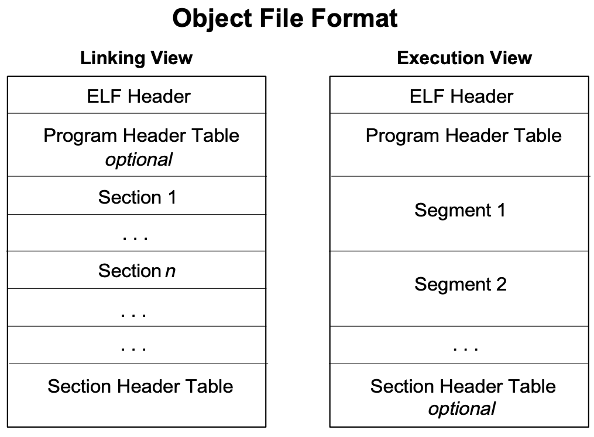
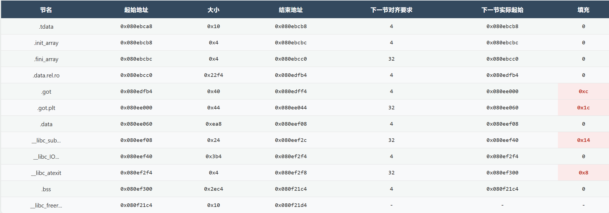
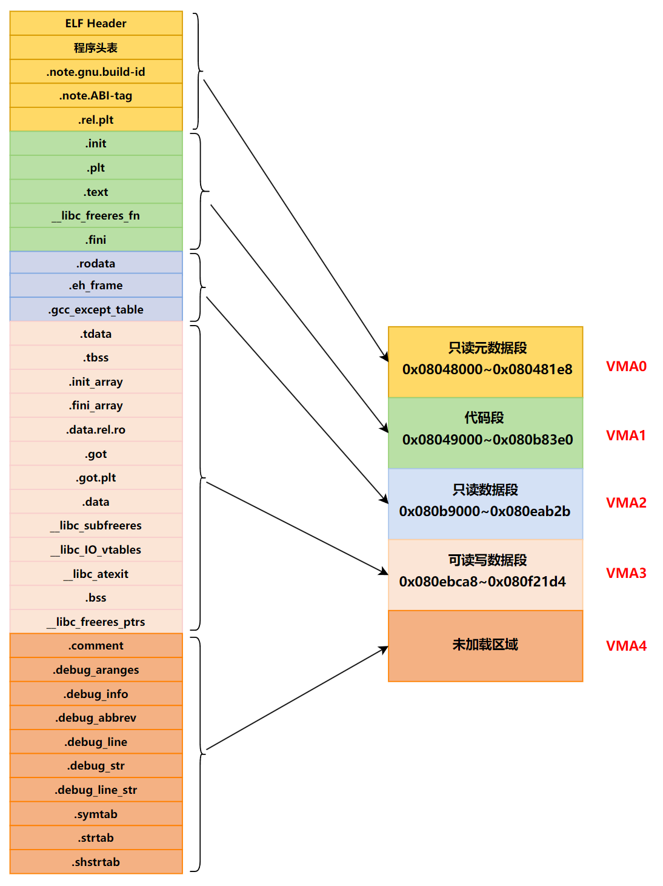

# 可执行文件的装载

## 一、进程的虚拟空间分布

### 1.ELF 文件链接视图和执行视图

在一个正常的进程中，可执行文件中包含的往往不止代码段，还有数据段、BSS 等，所以映射到进程虚拟空间的往往不止一个段。当段的数量增多时，就会产生空间浪费的问题。因为我们知道，ELF 文件被映射时，是以系统的页长度作为单位的，那么每个段在映射时的长度应该都是系统页长度的整数倍; 如果不是，那么多余部分也将占用一个页。一个 ELF 文件中往往有十几个段，那么内存空间的浪费是可想而知的。

当我们站在操作系统装载可执行文件的角度看问题时，可以发现 OS 实际上并不关心可执行文件各个段所包含的实际内容，操作系统只关心一些跟装载相关的问题，最主要的是段的权限 (可读、可写、可执行)。ELF 文件中，段的权限基本上是三种：

- 以代码段为代表的权限为 **<font color="red">可读可执行的段</font>**；
- 以数据段和 BSS 段为代表的权限为 **<font color="red">可读可写的段</font>**；
- 以只读数据段为代表的权限为 **<font color="red">只读的段</font>**；

那么我们的方案就是：**<font color="blue">对于相同权限的段，把它们合并到一起当作一个段进行映射</font>**。比如有两个段分别叫 **`.text`** 和 **`.init`**，它们包含的分别是程序的可执行代码和初始化代码，并且它们的权限相同，都是可读可执行，所以可以将它们合并（合并之后可以减少页面占用），如下所示。

<div align="center">
    
</div>

ELF 可执行文件引入了一个概念叫做 Segment，**一个 Segment 包含一个或多个属性类似的 Section**。正如我们上面的例子中看到的，如果将 **`.text`** 段和 **`.init`** 段合并在一起看作是一个 Segment，那么装载的时候就可以将它们看作一个整体一起映射，也就是说映射以后在进程虚存空间中只有一个相对应的 VMA，而不是两个。

>从链接的角度看，ELF 文件是按照 Section 存储的，事实也确实如此；从装载的角度看，ELF 文件又可以按照 Segment 进行划分。

Segment 的概念实际上是从装载的角度重新划分了 ELF 的各个段。**在将目标文件链接成可执行文件的时候，链接器会尽量把相同权限属性的段分配在同一空间**。比如可读可执行的段都放在一起，这种段的典型是代码段；可读可写的段都放在一起，这种段的典型是数据段。在 ELF 中把这些属性相似的、又连在一起的段叫做一个 Segment，而系统正是按照 Segment 而不是 Section 来映射可执行文件的。

假设有如下代码，我们使用静态连接的方式将其编译连接成可执行文件，然后得到的可执行文件 **`SectionMapping.elf`** 是一个 Linux 下很典型的可执行文件：

```c{.line-numbers}
#include <stdio.h>

int main() {
    while(1) {
        sleep(1000);
    }
    return 0;
}
```

使用 **`readelf`** 来查看，发现这个可执行文件有 35 个 Section。

```c{.line-numbers}
monica@monica-virtual-machine:~/linkers_loaders$ gcc -static file1.c -o SectionMapping.elf -m32 -g
monica@monica-virtual-machine:~/linkers_loaders$ readelf -S SectionMapping.elf 
There are 35 section headers, starting at offset 0xb7378:

节头：
  [Nr] Name              Type            Addr     Off    Size   ES Flg Lk Inf Al
  [ 0]                   NULL            00000000 000000 000000 00      0   0  0
  [ 1] .note.gnu.bu[...] NOTE            08048134 000134 000024 00   A  0   0  4
  [ 2] .note.ABI-tag     NOTE            08048158 000158 000020 00   A  0   0  4
  [ 3] .rel.plt          REL             08048178 000178 000070 08  AI 32  18  4
  [ 4] .init             PROGBITS        08049000 001000 000024 00  AX  0   0  4
  [ 5] .plt              PROGBITS        08049028 001028 000070 00  AX  0   0  8
  [ 6] .text             PROGBITS        080490a0 0010a0 06e777 00  AX  0   0 16
  [ 7] __libc_freeres_fn PROGBITS        080b7820 06f820 000ba5 00  AX  0   0 16
  [ 8] .fini             PROGBITS        080b83c8 0703c8 000018 00  AX  0   0  4
  [ 9] .rodata           PROGBITS        080b9000 071000 01c040 00   A  0   0 32
  [10] .eh_frame         PROGBITS        080d5040 08d040 0159e4 00   A  0   0  4
  [11] .gcc_except_table PROGBITS        080eaa24 0a2a24 000107 00   A  0   0  1
  [12] .tdata            PROGBITS        080ebca8 0a2ca8 000010 00 WAT  0   0  4
  [13] .tbss             NOBITS          080ebcb8 0a2cb8 000024 00 WAT  0   0  4
  [14] .init_array       INIT_ARRAY      080ebcb8 0a2cb8 000004 04  WA  0   0  4
  [15] .fini_array       FINI_ARRAY      080ebcbc 0a2cbc 000004 04  WA  0   0  4
  [16] .data.rel.ro      PROGBITS        080ebcc0 0a2cc0 0022f4 00  WA  0   0 32
  [17] .got              PROGBITS        080edfb4 0a4fb4 000040 00  WA  0   0  4
  [18] .got.plt          PROGBITS        080ee000 0a5000 000044 04  WA  0   0  4
  [19] .data             PROGBITS        080ee060 0a5060 000ea8 00  WA  0   0 32
  [20] __libc_subfreeres PROGBITS        080eef08 0a5f08 000024 00 WAR  0   0  4
  [21] __libc_IO_vtables PROGBITS        080eef40 0a5f40 0003b4 00  WA  0   0 32
  [22] __libc_atexit     PROGBITS        080ef2f4 0a62f4 000004 00 WAR  0   0  4
  [23] .bss              NOBITS          080ef300 0a62f8 002ec4 00  WA  0   0 32
  [24] __libc_freer[...] NOBITS          080f21c4 0a62f8 000010 00  WA  0   0  4
  [25] .comment          PROGBITS        00000000 0a62f8 00002b 01  MS  0   0  1
  [26] .debug_aranges    PROGBITS        00000000 0a6323 000020 00      0   0  1
  [27] .debug_info       PROGBITS        00000000 0a6343 0000a1 00      0   0  1
  [28] .debug_abbrev     PROGBITS        00000000 0a63e4 000061 00      0   0  1
  [29] .debug_line       PROGBITS        00000000 0a6445 000056 00      0   0  1
  [30] .debug_str        PROGBITS        00000000 0a649b 0000dc 01  MS  0   0  1
  [31] .debug_line_str   PROGBITS        00000000 0a6577 00003d 01  MS  0   0  1
  [32] .symtab           SYMTAB          00000000 0a65b4 0099b0 10     33 1271  4
  [33] .strtab           STRTAB          00000000 0aff64 00729a 00      0   0  1
  [34] .shstrtab         STRTAB          00000000 0b71fe 000177 00      0   0  1
Key to Flags:
  W (write), A (alloc), X (execute), M (merge), S (strings), I (info),
  L (link order), O (extra OS processing required), G (group), T (TLS),
  C (compressed), x (unknown), o (OS specific), E (exclude),
  R (retain), D (mbind), p (processor specific)
```

我们可以使用 readelf 命令来查看 ELF 的 Segment。描述 Segment 的结构叫程序头表（Program Header Table），它描述了 ELF 文件该如何被操作系统映射到进程的虚拟空间。

>缩写 A 代表分配内存的意思，一个节有 A 标志表示它会被链接器放进一个 LOAD 段，最终它会在程序运行时被加载到内存中。

```c{.line-numbers}
monica@monica-virtual-machine:~/linkers_loaders$ readelf -l SectionMapping.elf 

Elf 文件类型为 EXEC (可执行文件)
Entry point 0x80495b0
There are 8 program headers, starting at offset 52

程序头：
  Type           Offset   VirtAddr   PhysAddr   FileSiz MemSiz  Flg Align
  LOAD           0x000000 0x08048000 0x08048000 0x001e8 0x001e8 R   0x1000
  LOAD           0x001000 0x08049000 0x08049000 0x6f3e0 0x6f3e0 R E 0x1000
  LOAD           0x071000 0x080b9000 0x080b9000 0x31b2b 0x31b2b R   0x1000
  LOAD           0x0a2ca8 0x080ebca8 0x080ebca8 0x03650 0x0652c RW  0x1000
  NOTE           0x000134 0x08048134 0x08048134 0x00044 0x00044 R   0x4
  TLS            0x0a2ca8 0x080ebca8 0x080ebca8 0x00010 0x00034 R   0x4
  GNU_STACK      0x000000 0x00000000 0x00000000 0x00000 0x00000 RW  0x10
  GNU_RELRO      0x0a2ca8 0x080ebca8 0x080ebca8 0x02358 0x02358 R   0x1

 Section to Segment mapping:
  段节...
   00     .note.gnu.build-id .note.ABI-tag .rel.plt 
   01     .init .plt .text __libc_freeres_fn .fini 
   02     .rodata .eh_frame .gcc_except_table 
   03     .tdata .init_array .fini_array .data.rel.ro .got .got.plt .data __libc_subfreeres __libc_IO_vtables __libc_atexit .bss __libc_freeres_ptrs 
   04     .note.gnu.build-id .note.ABI-tag 
   05     .tdata .tbss 
   06     
   07     .tdata .init_array .fini_array .data.rel.ro .got 

monica@monica-virtual-machine:~/linkers_loaders$ readelf -h SectionMapping.elf
ELF 头：
  Magic：   7f 45 4c 46 01 01 01 03 00 00 00 00 00 00 00 00 
  类别:                              ELF32
  数据:                              2 补码，小端序 (little endian)
  Version:                           1 (current)
  OS/ABI:                            UNIX - GNU
  ABI 版本:                          0
  类型:                              EXEC (可执行文件)
  系统架构:                          Intel 80386
  版本:                              0x1
  入口点地址：               0x80495b0
  程序头起点：          52 (bytes into file)
  Start of section headers:          750456 (bytes into file)
  标志：             0x0
  Size of this header:               52 (bytes)
  Size of program headers:           32 (bytes)
  Number of program headers:         8
  Size of section headers:           40 (bytes)
  Number of section headers:         35
  Section header string table index: 34
```

我们可以看到，这个可执行文件中共有 8 个 Segment。从装载的角度看，我们目前只关心 4 个 LOAD 类型的 Segment，因为只有它是需要被映射的，其他的诸如 **`NOTE`**、**`TLS`**、**`GNU_STACK`** 都是在装载时起辅助作用的。注意 PHT 中的 **`Offset`**、**`VirtAddr`** 和 SHT 中的 **`Off`**、**`Addr`** 的值相互对应。也就是说，**<font color="red">链接器决定了文件的最终布局和偏移，而加载器会严格按照链接器定义的各个段的文件偏移和大小，将它们映射到内存中，并保持它们之间的相对偏移不变</font>**。

```c{.line-numbers}
// SHT 表
第 1 个 LOAD 段：0x08048000 ~ 0x080481e8，size 为 0xb4+0x134=0x1e8
第 2 个 LOAD 段：0x08049000 ~ 0x080b83e0，size 为 0x6f3e0
第 3 个 LOAD 段：0x080b9000 ~ 0x080eab2b，size 为 0x31b2b
第 4 个 LOAD 段：0x080ebca8 ~ 0x080f21d4，size 为 0x652c
// PHT 表
第 1 个 LOAD 段：0x08048000 ~ 0x080481e8，size 为 0x1e8
第 2 个 LOAD 段：0x08049000 ~ 0x080b83e0，size 为 0x6f3e0
第 3 个 LOAD 段：0x080b9000 ~ 0x080eab2b，size 为 0x31b2b
第 4 个 LOAD 段：0x080ebca8 ~ 0x080f21d4，size 为 0x652c
```

这里有 3 点需要注意，第 1 点是为什么第一个 LOAD 段的大小 **`0x1e8`**，远大于它所映射的节 (**`.note.gnu.build-id`**、**`.note.ABI-tag`**、**`.rel.plt`**) 的大小之和 **`0xb4`**？**<font color="red">因为第一个 LOAD 段是一个特殊的段，它不仅包含了它所映射的节，还必须包含用于加载程序自身的文件元数据——即位于文件最头部的 ELF 头 和程序头表 (PHT)</font>**。

An executable file using the ELF file format consists of an ELF header, followed by a program header table or a section header table, or both. The ELF header is always at offset zero of the file. The program header table and the section header table's offset in the file are defined in the ELF header.  The two tables describe the rest of the particularities of the file. 也就是说 ELF 头始终位于文件偏移量 0 的位置，后面跟着程序头表（PHT）。

正如 ELF 规范所述，一个可执行文件总是以 ELF 头 (ELF Header) 开始，其后通常跟着程序头表 (PHT)，大小分别为 **`52（0x34）`** 和 **`32*8=256（0x100）`**（根据 ELF 头可知，程序头表中每个条目大小为 32 字节，而程序头表中一共有 8 个段），两者相加就等于 **`0x134`**。所以第一个 LOAD 段的大小，是文件头部元数据（ELF 头和程序段表）和其映射的节（**`.note.gnu.build-id`**、**`.note.ABI-tag`**、**`.rel.plt`**）内容大小的总和（**`0x134+0x24+0x20+0x70=0x1e8`**）。

> 需要明确的是，**[Nr] 0 是一个特殊的空节 (NULL Section)，它是一个占位符，本身不包含任何数据**。ELF 头和程序头表并不属于任何节，它们是 ELF 文件顶层的独立结构。

第 2 点需要注意的是第 4 个 LOAD 段的 MemSiz 不等于所映射的各个 Section（**`.tdata`**、**`.init_array`**、**`.fini_array`** 等）的大小之和，这是因为链接器在内存中布局各个节时，并不仅仅是把它们一个挨一个地紧密排列。为了保证性能和满足硬件要求，它必须确保每个节的起始地址都符合其对齐要求（Al 列）。如果一个节自然结束的位置不符合下一个节的对齐要求，链接器就必须在它们之间插入"填充字节"。

第四个 LOAD 段内存布局与对齐填充布局如下所示，**`节内容总大小 (0x64e8) + 对齐填充总大小 (0x44) = 0x652c`**，现在与 PHT 中第四个 LOAD 段的 MemSiz 完全一样。

<div align="center">
  
</div>

第 3 点就是第 4 个 LOAD 段的 MemSiz 为 0x0652c，大于 FileSiz 的大小 0x03650。 因为 **`.bss`** 和 **`.tbss`** 存放的是未初始化的全局/静态变量。它们在文件中不需要占用空间（只需记录大小），但在加载到内存时必须分配实际的空间并清零。MemSiz 和 FileSiz 之间的差值（**`0x2edc`**）几乎完全等于 **`.bss`** 节的大小 (**`0x2ec4`**) 加上 **`.tbss`** 的大小 (**`0x24`**)。

另外从上面可以看出，具有相同权限的节通常被合并到同一段中：

- 第一个 LOAD 段包含节 **`.note.gnu.build-id`**、**`.note.ABI-tag`**、**`.rel.plt`**，此 LOAD 段的权限是只读（A/R）；
- 第二个 LOAD 段包含节 **`.init`**、**`.plt`**、**`.text`**、**`__libc_freeres_fn .fini`**，此 LOAD 段的权限是可读可执行（AX/RE）；
- 第三个 LOAD 段包含节 **`.rodata`**、**`.eh_frame`**、**`.gcc_except_table`**，此 LOAD 段的权限是只读（A/R）；
- 第四个 LOAD 段包含节 **`.tdata`**、**`.init_array`**、**`.fini_array`**、**`.data.rel.ro`**、**`.got`**、**`.got.plt`**、**`.data`**、**`__libc_subfreeres`**、**`__libc_IO_vtables`**、**`__libc_atexit`**、**`.bss`**、**`__libc_freeres_ptrs`**，此 LOAD 段的权限是可读可写（WA/RW）；

可以用下图来表示 **`SectionMapping.elf`** 可执行文件的段与进程虚拟空间的映射关系。

<div align="center">
  
</div>

由上图可以发现，**`SectionMapping.elf`** 被重新划分成了 5 个部分，有一些段包含只读元数据，它们被统一映射到一个 VMA0; 另外一部分段是可读可执行的代码，它们被映射到了 VMA1 等等; 还有一部分段在程序装载时没有被映射的，它们是一些包含调试信息和字符串表等段，这些段在程序执行时没有用，所以不需要被映射。很明显，所有相同属性的 Section 被归类到一个 Segment，并且映射到同一个 VMA。

### 3.总结

#### 3.1 链接视图

**<font color="red">链接视图 (Sections)：主要供链接器（静态链接器 ld 或动态链接器 `ld.so` 在某些阶段）和分析工具（如 readelf，objdump）使用。它将文件内容组织成逻辑上不同的节区，每个节区包含特定类型的信息</font>**。

在链接视图中，节区（Sections）是 ELF 文件在链接时的基本组织单位。它们包含了程序和链接过程所需的所有信息。目的是将不同类型的信息（如代码、数据、符号表、重定位信息、字符串表、调试信息等）分门别类地存放。

节区头部表（Section Header Table，SHT）是链接视图的核心，它是一个数组，每个元素（节区头部）描述了一个节区的详细信息，如节区名称、类型、大小、在文件中的偏移量、对齐方式、属性（如是否可写、可执行）等。

#### 3.2 装载视图

**<font color="red">装载视图 (Segments)：主要供操作系统加载器和动态链接器使用。它描述了文件中的哪些部分应该被加载到内存的什么位置，以及它们在内存中的属性（如权限）。这些可加载的部分被称为段</font>**。

在装载视图（Loading View）中，段（Segments）也常被称为程序头部 (Program Headers)，描述了 ELF 文件在运行时如何被加载到进程的虚拟地址空间中。目的是告诉操作系统加载器如何创建进程的内存映像。同时将具有相似内存访问权限（如只读且可执行、可读写）的多个节区组合在一起，以便高效地映射到内存并设置保护属性。

程序头部表（Program Header Table，PHT）是装载视图的核心。它是一个数组，每个元素（程序头部）描述了一个段的信息，如段的类型（如 **`PT_LOAD`** 表示可加载段）、在文件中的偏移量、在内存中的虚拟地址、物理地址（较少使用）、段在文件中的大小、段在内存中的大小、段的标志（权限 **`PF_R`**，**`PF_W`**，**`PF_X`**）和对齐方式。

