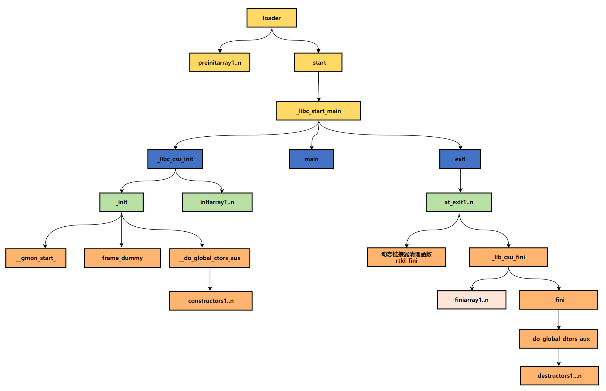
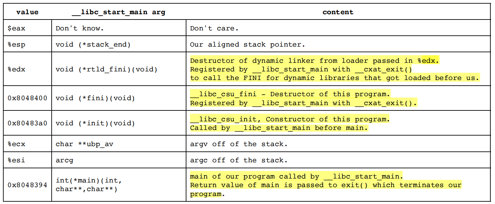

# 可执行文件的装载之三

# 三、main 函数启动

<div align="center">
    
</div>

## 1.如何进入 main 函数

我们将要构建一个最简单的 C 程序，即一个空的 main 函数，然后我们将查看它的反汇编代码，来探究程序是如何执行到 main 函数的。我们会看到，**程序最先运行的是一个被链接到每个程序中、名为 **`_start`** 的函数，它最终会引导你的程序去运行 main 函数**。

```c{.line-numbers}
// prog1.c
int main() {

}
```

如果你愿意，可以把这份代码保存为 **`prog1.c`**，然后跟着我们一起操作。首先，我会像这样来编译它。在我们尝试用 gdb 调试后续版本（prog2）之前，我们先来看看它的反汇编代码，并借此了解一下我们的程序是如何启动的。

```c{.line-numbers}
gcc -ggdb -o prog1 prog1.c
```

**<font color="red">当你运行一个程序时，无论是通过 shell（命令行）还是 GUI（图形界面），它们都会调用 **`execve()`**，这实际上是执行了 Linux 的 **`execve()`** 系统调用</font>**。简单来说，**`execve()`** 系统调用的作用是为新程序建立一个栈空间，并将 argc（参数数量）、argv（参数数组）和 envp（环境变量）压入这个栈中。文件描述符 0、1 和 2（即 stdin 标准输入、stdout 标准输出和 stderr 标准错误）则会保持 shell 原本为它们设置的状态。

>换句话说，当你执行一个新程序时，这个新程序并不会自己去创建一套全新的标准输入/输出通道，而是直接继承了启动它的那个程序（也就是父进程，通常是命令行 shell）的设置。

同时，加载器（loader）会为你完成大量的工作，比如设置代码和数据的重定位（relocations），以及调用你的预初始化函数（preinitializers）。当这一切都准备就绪后，控制权便通过调用 **`_start()`** 函数正式移交给了你的程序。下面就是从 **`objdump -d prog1`** 的输出中截取的、包含 **`_start`** 函数的部分。

```armasm{.line-numbers}
080482e0 <_start>:
80482e0: 31 ed          xor %ebp,%ebp
80482e2: 5e             pop %esi                                ;%esi -> argc
80482e3: 89 e1          mov %esp,%ecx                           ;%ecx -> argv                           
80482e5: 83 e4 f0       and $0xfffffff0,%esp                 
80482e8: 50             push %eax                               ;%eax -> unknown parameter
80482e9: 54             push %esp                               ;%esp -> aligned stack pointer, stack_end
80482ea: 52             push %edx                               ;%edx -> rtld_fini
80482eb: 68 00 84 04 08 push $0x8048400                         ;$0x8048400 -> fini
80482f0: 68 a0 83 04 08 push $0x80483a0                         ;$0x80483a0 -> init
80482f5: 51             push %ecx                               ;%ecx -> ubp_av/argv
80482f6: 56             push %esi                               ;%esi -> argc
80482f7: 68 94 83 04 08 push $0x8048394                         ;$0x8048394 -> main
80482fc: e8 c3 ff ff ff call 80482c4 <__libc_start_main@plt>
8048301: f4             hlt
```

任何值与自身进行异或（xor）运算，结果都为零。因此，**`xor %ebp, %ebp`** 这条指令的作用就是将 **`%ebp`** 寄存器（基址指针）清零。**<font color="red">这是 ABI（应用程序二进制接口）规范所建议的做法，用于标记整个函数调用栈最外层的"栈帧"（frame）</font>**。这么做的目的是 **`%ebp`** 是栈帧基址指针，它被用来形成一个"栈帧链"，让调试器（如 gdb）或异常处理器能够进行栈回溯（stack unwinding）。**<font color="red">通过将最外层（第一个）栈帧的"前一个"帧指针设置为 0 (NULL)，我们为这个链条提供了一个明确的终点</font>**。当调试器回溯到 **`%ebp`** 为 0 时，它就知道已经到达了调用栈的底部。这就是"标记最外层栈帧（mark the outermost frame）"的意思。

接下来，我们从栈顶弹出一个值。在程序入口处，栈上存放着 argc、argv 和 envp，所以这次 pop 操作会将 argc 存入 **`%esi`** 寄存器。我们只是暂时保存一下它，稍后会再把它压回栈中。

由于我们弹出了 argc，栈顶指针 **`%esp`** 现在正指向 argv。随后的 mov 指令会将 argv 的地址放入 **`%ecx`** 寄存器，而这个过程不会移动栈顶指针。然后，我们将栈顶指针与一个掩码（mask）进行 and（按位与）运算，这个操作会清除掉指针地址的最低四位。这个操作会使栈顶指针向更低的地址移动 0 到 15 个字节，具体移动多少取决于它原来的值。但无论如何，运算的结果都会使它在 16 字节的边界上对齐。进行对齐操作是为了让所有的栈变量都能很好地对齐，从而提升内存和缓存的访问效率。

>System V AMD64 调用约定要求栈必须按 16 字节对齐，也就是说，在调用 call 指令之前 (the end of the input argument area)，**`%rsp`** 指针必须是 16 的倍数（对应 16 进制是最后 1 位是 0）。

在某次具体的运行中，进入 **`_start`** 函数时 **`%esp`** 的值是 **`0xbffff770`**。当我们弹出 argc 后，**`%esp`** 变成了 **`0xbffff774`**。它的地址变大了（请记住，向栈中压入数据会使地址向低内存方向移动，而弹出数据则会使地址向高内存方向移动）。**而在执行完 and 指令后，栈顶指针又回到了 `0xbffff770`**。

## 2.准备调用 **`___libc_start_main`** 函数

接下来，我们开始为 **`__libc_start_main`** 函数准备参数，并将它们压入栈中。第一个被压入栈的值来自 **`%eax`** 寄存器，但它其实是一个无用的"垃圾值"。之所以要压入它，仅仅是因为总共需要传递 7 个有意义的参数，所以必须额外增加这第 8 个值来凑数，以确保栈能维持 16 字节对齐。这个值本身不会有任何实际用途。

**`__libc_start_main`** 这个函数是从 glibc（GNU C 库）中链接而来的。在 glibc 的源码树中，你可以在 **`csu/libc-start.c`** 这个文件里找到它的定义。**`__libc_start_main`** 函数的声明大致如下：

```c{.line-numbers}
int __libc_start_main(int (*main) (int, char**, char**), 
                      int argc, char** ubp_av, 
                      void (*init) (void),
                      void (*fini) (void),
                      void (*rtld_fini) (void),
                      void (*stack_end));
```

因此，我们可以预见到，在调用 **`__libc_start_main`** 函数之前，**`_start`** 函数会按照相反的顺序（即从右至左）将这些参数压入栈中。其所需的参数如下所示：

<div align="center">
    
</div>

## 3.环境变量在哪？

你有没有注意到，我们并没有从栈上获取 **`envp`**——那个指向我们环境变量的指针？它也不是 **`__libc_start_main`** 函数的参数之一。但我们知道 main 函数的调用形式可以是 **`int main(int argc, char** argv, char** envp)`**，那么这到底是怎么回事呢？

```c{.line-numbers}
void __libc_init_first(int argc, char *arg0, ...) {
    char **argv = &arg0, **envp = &argv[argc + 1];
    __environ = envp;
    __libc_init (argc, argv, envp);
}
```

原来，**`__libc_start_main`** 会调用 **`__libc_init_first`** 函数。该函数会立即利用一个内部的诀窍，找到位于参数数组 (argv) 终止空指针之后的环境变量，然后设置一个名为 **`__environ`** 的全局变量。**<font color="red">在此之后，`__libc_start_main` 每当需要用到环境变量时——包括最后调用 `main` 函数的时候——就会使用这个全局变量</font>**。

在 envp 被找到之后，**`__libc_start_main`** 运用了同样的技巧，而且，惊喜来了！紧跟在 envp 数组的终止空指针之后，还存放着另一个向量——ELF 辅助向量（ELF auxiliary vector），加载器就是通过这个向量来向进程传递一些额外信息的。

要想查看这个向量里到底有什么，一个简单的方法是在运行程序前，先设置 **`LD_SHOW_AUXV=1`** 这个环境变量。下面就是对我们的 prog1 程序执行该操作的结果。**`AT_ENTRY`** 指明了 **`_start`** 函数的入口地址；还有我们的用户 ID（userid）、有效用户 ID（effective userid）以及用户组 ID（groupid）。我们还能看到处理器架构是 686（i686）。

**`AT_PHDR`** 指向 ELF 程序头（program header）的位置。这个程序头包含了程序所有段（segment）在内存中的位置、重定位条目（relocation entries）的信息，以及加载器（loader）运行所需要知道的任何其他信息。而 **`AT_PHENT`** 则指明了程序头中每个条目（entry）的大小（以字节为单位）。

```c{.line-numbers}
$ LD_SHOW_AUXV=1 ./prog1
AT_SYSINFO: 0xe62414
AT_SYSINFO_EHDR: 0xe62000
AT_HWCAP: fpu vme de pse tsc msr pae mce cx8 apic
mtrr pge mca cmov pat pse36 clflush dts
acpi mmx fxsr sse sse2 ss ht tm pbe
AT_PAGESZ: 4096
AT_CLKTCK: 100
AT_PHDR: 0x8048034
AT_PHENT: 32
AT_PHNUM: 8
AT_BASE: 0x686000
AT_FLAGS: 0x0
AT_ENTRY: 0x80482e0
AT_UID: 1002
AT_EUID: 1002
AT_GID: 1000
AT_EGID: 1000
AT_SECURE: 0
AT_RANDOM: 0xbff09acb
AT_EXECFN: ./prog1
AT_PLATFORM: i686
```

## 4.**`__libc_start_main`** 函数

下面的 **`__libc_start_main`** 函数是精简后的伪代码：

```c{.line-numbers}
/* Note: the fini parameter is ignored here for shared library.  It  
   is registered with __cxa_atexit.  This had the disadvantage that  
   finalizers were called in more than one place.  */  
STATIC int  
LIBC_START_MAIN (int (*main) (int, char **, char ** MAIN_AUXVEC_DECL),  
         int argc, char *__unbounded *__unbounded ubp_av,  
#ifdef LIBC_START_MAIN_AUXVEC_ARG  
         ElfW(auxv_t) *__unbounded auxvec,  
#endif  
         __typeof (main) init,  
         void (*fini) (void),  
         void (*rtld_fini) (void), void *__unbounded stack_end)  
{  
  ...  
  /* Register the destructor of the dynamic linker if there is any.  */  
  if (__builtin_expect (rtld_fini != NULL, 1))  
    __cxa_atexit ((void (*) (void *)) rtld_fini, NULL, NULL);  
  
  /* Call the initializer of the libc.  This is only needed here if we  
     are compiling for the static library in which case we haven't  
     run the constructors in `_dl_start_user'.  */  
  __libc_init_first (argc, argv, __environ);  
  
  /* Register the destructor of the program, if any.  */  
  if (fini)  
    __cxa_atexit ((void (*) (void *)) fini, NULL, NULL);  
  
  /* Call the initializer of the program, if any.  */  
  if (init)  
    (*init) (argc, argv, __environ MAIN_AUXVEC_PARAM);  
  
  /* Nothing fancy, just call the function.  */  
  result = main (argc, argv, __environ MAIN_AUXVEC_PARAM);  
  
  exit (result);  
}  
```

**`crt1.o`** 中包含一个名为 **`_start`** 的入口点，这是操作系统内核执行完 **`execve`** 系统调用后跳转到的第一个用户空间地址。**`_start`** 的主要工作非常简单：

1. 从栈上准备好 argc、argv 等参数；
2. 将 main、init、fini 等函数的地址作为参数压栈；
3. 调用 **`__libc_start_main`**；

因此，**`__libc_start_main`** 函数是被 **`_start`** 调用的。

### 4.1 注册 rtld_fini 函数

#### 4.1.1 **`__cxa_atexit`** 函数

**`__cxa_atexit`** 是一个标准的、在 C++ ABI (Application Binary Interface) 中定义的函数，用于注册一个在程序退出时要调用的函数。**`atexit()`** 函数通常就是对 **`__cxa_atexit`** 的一个简单封装。

**`__cxa_atexit()`** registers a function to be called by exit or when a shared library is unloaded. The **`__cxa_atexit()`** function is used to implement **`atexit()`**, as described in ISO POSIX (2003). **<font color="red">Calling `atexit(func)` from the statically linked part of an application shall be equivalent to `__cxa_atexit(func, NULL, NULL)`</font>**。

C++ 标准规定，当程序退出时，全局对象的析构函数必须以其构造顺序的逆序被调用。为了实现这一点，大多数编译器和运行库都通过调用 C 标准库的 atexit 函数来注册这些析构函数。文档如下：

>The C++ Standard requires that destructors be called for global objects when a program exits in the opposite order of construction. Most implementations have handled this by calling the C library atexit routine to register the destructors. This is problematic because **the 1999 C Standard only requires that the implementation support 32 registered functions**, although most implementations support many more. More important, **it does not deal at all with the ability in most implementations to remove [Dynamic Shared Objects] from a running program image by calling dlclose prior to program termination**.
>The API specified below is intended to provide standard-conforming treatment during normal program exit, which includes executing atexit-registered functions in the correct sequence relative to constructor-registered destructors, and reasonable treatment during early DSO unload (e.g. dlclose).
>As described in the Itanium™ C++ ABI, __cxa_atexit() registers a destructor function to be called by exit() or when a shared library is unloaded. When a shared library is unloaded, **<font color="red">any destructor function associated with that shared library, identified by `dso_handle`, shall be called with the single argument arg, and then that function shall be removed, or marked as complete, from the list of functions to run at `exit()`</font>**. On a call to exit(), any remaining functions registered shall be called with the single argument arg. Destructor functions shall always be called in the reverse order to their registration (i.e. the most recently registered function shall be called first).

从文档可知，**`__cxa_atexit`** 要解决 **`atexit`** 函数的两个痛点，第一个是数量限制，C 标准对 **`atexit`** 的要求很低，只保证至少支持 32 个函数的注册。在一个大型的、包含众多库和全局对象的复杂 C++ 程序中，这个数量很容易被突破。

第二个是动态库卸载问题，这个是更严重、更根本的问题。**`atexit`** 注册的函数形成一个全局的"清理列表"，**<font color="red">整个列表只会在程序完全退出时才会被执行，它无法处理程序运行期间的动态事件</font>**。

假设你的程序是一个插件化的服务器，通过 **`dlopen()`** 加载了一个插件（一个 **`plugin.so`** 动态库）。这个插件里定义了一些全局对象。后来，你决定卸载这个插件，于是调用了 **`dlclose()`**。插件的析构函数已经被注册到了全局的 **`atexit`** 列表中，**`dlclose`** 会卸载插件的代码和数据，但析构函数的指针还留在 **`atexit`** 列表中。等到很久以后主程序退出时，**`exit()`** 函数会尝试去调用这个指针，而此时它指向的地址早已是无效内存，导致程序崩溃（段错误）。

因此可以使用 **`__cxa_atexit`**，其函数原型为：

```c{.line-numbers}
int __cxa_atexit(void (*func)(void *), void *arg, void *dso_handle);
```

- **`func`**：要注册的析构函数指针；
- **`arg`**：传递给析构函数的参数；
- **`dso_handle`**：由链接器为每个可执行/共享对象提供的句柄，用来标识"这个回调属于哪个 DSO"（是属于主程序、liba.so 还是 libb.so）。这样在 **`dlclose()`** 卸载某库时会调用 **`__cxa_finalize(dso)`**，运行时能只调用该 DSO 库登记的析构函数并将其从全局列表剔除；进程 **`exit()`** 时再对余下析构函数按 LIFO 顺序调用。

>**`__cxa_finalize`** 函数的原型为 **`void __cxa_finalize(void * d);`**
>When **`__cxa_finalize(d)`** is called, it shall walk the termination function list, **<font color="red">calling each in turn if d matches the handle of the termination function entry</font>**. If d is NULL, it shall call all the termination funtions. Multiple calls to **`__cxa_finalize`** shall not result in calling termination function entries multiple times; the implementation may either remove entries or mark them finished. The termination functions shall always be called in the reverse order of their registration (i.e. the most recently registered function shall be called first).

No user interface to **`__cxa_atexit`** is supported, so the user is not able to register an atexit function with a parameter or a home DSO. 出于可移植性与安全性考虑，不要在用户代码中直接调用 **`__cxa_atexit`**。普通开发者无法提供 **`dso_handle`** 这个参数，这是一个由 **工具链（编译器和链接器）** 在幕后管理的概念。

#### 4.1.2 **`__builtin_expect`** 函数

```c{.line-numbers}
  /* Register the destructor of the dynamic linker if there is any.  */  
  if (__builtin_expect (rtld_fini != NULL, 1))  
    __cxa_atexit ((void (*) (void *)) rtld_fini, NULL, NULL);  
```

**`__libc_start_main`** 函数首先使用 GCC/Clang 的一个编译器内置函数 **`__builtin_expect(condition, expected_value)`**，给编译器提供分支预测的提示。**`__builtin_expect(rtld_fini != NULL, 1)`** 是在告诉编译器，**`rtld_fini != NULL`** 这个条件极有可能为真（因为绝大多数现代程序都是动态链接的）。这有助于编译器优化指令流水线，是一个微小的性能优化。

>**`__builtin_expect`** Indicates that an expression is likely to evaluate to a specified value. The compiler may use this knowledge to direct optimizations. If the expression does not actually evaluate at run time to the predicted value, performance may suffer. Therefore, this built-in function should be used with caution.

#### 4.1.3 注册 **`rtld_fini`** 函数

```c{.line-numbers}
  /* Register the destructor of the dynamic linker if there is any.  */  
  if (__builtin_expect (rtld_fini != NULL, 1))  
    __cxa_atexit ((void (*) (void *)) rtld_fini, NULL, NULL);  
```

所以如果 **`rtld_fini`** 存在（即程序是动态链接的），就把它注册到"退出函数列表"中。**`exit()`** 函数在被调用时，会以"后进先出"（LIFO）的顺序调用这个列表里的所有函数。

### 4.2 注册 fini 函数

```c{.line-numbers}
    /* Register the destructor of the program, if any.  */  
    if (fini)  
        __cxa_atexit ((void (*) (void *)) fini, NULL, NULL);
```

这里将 fini 函数指针（指向 **`__lib_csu_fini`** 函数）同样使用 **`__cxa_atexit`** 注册到退出函数列表。当 main 程序退出，调用 exit() 函数，继而回调注册的退出函数列表，其中就有 **`__lib_csu_fini`** 函数，最终调用 **`__do_global_dtors_aux`** 函数，逐个调用析构函数 destructor。

### 4.3 调用 init 函数

```c{.line-numbers}
    /* Call the initializer of the program, if any.  */
    if (init)
        (*init) (argc, argv, __environ MAIN_AUXVEC_PARAM);
```

这是调用 main 之前的最后一步准备工作，实际调用的为 **`__lib_csu_init`** 函数，最终依次调用 **`__gmon_start_`**、**`frame_dummy`**、**`__do_global_ctors_aux`** 函数，并且 **`__do_global_ctors_aux`** 函数会执行所有全局构造函数（即所有用 **`__attribute__((constructor))`** 修饰的函数）。

### 4.4 调用 main 函数

```c{.line-numbers}
    /* Nothing fancy, just call the function.  */  
    result = main (argc, argv, __environ MAIN_AUXVEC_PARAM);  
```

在完成了所有铺垫工作之后，**`__libc_start_main`** 会调用我们自己写的 main 函数，并将 argc 和 argv 等参数传递给它，main 函数的返回值被保存在 result 变量中。

### 4.5 调用 exit 函数

```c{.line-numbers}
    exit (result); 
```

