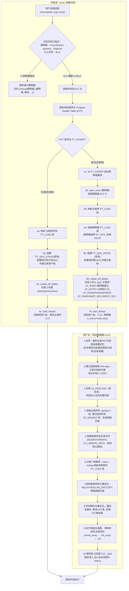

## 二、可执行文件的装载过程

### 1.Linux 可执行文件类型的注册机制

在说明 ELF 文件的加载过程以前，我们先回答一个问题，就是：为什么 Linux 可以运行 ELF 文件？内核对所支持的每种可执行的程序类型都有个 **`struct linux_binfmt`** 的数据结构：

```c{.line-numbers}
/*
  * This structure defines the functions that are used to load the binary formats that
  * linux accepts.
  */
struct linux_binfmt {
    struct list_head lh;
    struct module *module;
    int (*load_binary)(struct linux_binprm *);
    int (*load_shlib)(struct file *);
    int (*core_dump)(struct coredump_params *cprm);
    unsigned long min_coredump;     /* minimal dump size */
 };
```

**`linux_binfmt`** 定义在 **`include/linux/binfmts.h`** 中，linux 支持其他不同格式的可执行程序，在这种方式下，linux 能运行其他操作系统所编译的程序，如 MS-DOS 程序，BSD Unix 的 COFF 可执行格式，因此 linux 内核用 **`struct linux_binfmt`** 来描述各种可执行程序。linux 内核对所支持的每种可执行的程序类型都有个 **`struct linux_binfmt`** 的数据结构，其提供了 3 种方法来加载和执行可执行程序：

- **`load_binary`**：通过读存放在可执行文件中的信息为当前进程建立一个新的执行环境；
- **`load_shlib`**：用于动态的把一个共享库捆绑到一个已经在运行的进程，这是由 **`uselib()`** 系统调用激活的；
- **`core_dump`**：在名为 core 的文件中，存放当前进程的执行上下文，这个文件通常是在进程接收到一个缺省操作为 dump 的信号时被创建的，其格式取决于被执行程序的可执行类型；

总结来说，**`linux_binfmt`** 是内核里为"某种可执行/目标文件格式"的一组回调。这个结构体常见的三个回调是：**`load_binary`**、**`load_shlib`**、**`core_dump`**。**`load_shlib`** 只在进程显式调用 **`uselib()`** 这个系统调用时被触发。调用链如下所示：

```c{.line-numbers}
用户态: uselib("/path/to/lib")
   ↓
内核: sys_uselib -> 打开文件 -> 依次尝试各个已注册的 linux_binfmt
   ↓
某个格式识别成功 -> 调用该格式的 binfmt->load_shlib(file)
```

历史上 **`uselib()`** 用于在已运行的进程上下文中，请求内核按目标文件格式将指定共享库装载到当前进程的虚拟地址空间。内核会遍历已注册的 **`linux_binfmt`** 实例，完成格式识别后调用相应的 **`load_shlib`** 回调。**<font color="red">而在 ELF 时代，复杂的符号解析、重定位（REL/RELA）、`PLT/GOT` 构建以及依赖发现（`DT_NEEDED`）等都在用户态动态链接器（通常是 `/lib/ld-linux-*.so*`）里完成</font>**，而不是让内核的 **`load_shlib()`** 来做。

所有的 **`linux_binfmt`** 对象都处于一个链表中，第一个元素的地址存放在 formats 变量中，可以通过调用 **`register_binfmt()`** 和 **`unregister_binfmt()`** 函数在链表中插入和删除元素。在系统启动期间，为每个编译进内核的可执行格式都执行 **`registre_binfmt()`** 函数。当实现了一个新的可执行格式的模块正被装载时，也执行这个函数，当模块被卸载时，执行 **`unregister_binfmt()`** 函数。

当我们执行一个可执行程序的时候，内核会 **`list_for_each_entry`** 遍历所有注册的 **`linux_binfmt`** 对象，对其调用 **`load_binary`** 方法来尝试加载，直到加载成功为止。其中的 **`load_binary`** 函数指针指向的就是一个可执行程序的处理函数。而我们研究的 ELF 文件格式的 **`linux_binfmt`** 结构对象 elf_format，定义如下，在 /fs/binfmt.c 中：

```c{.line-numbers}
static struct linux_binfmt elf_format = {
    .module       = THIS_MODULE,
    .load_binary  = load_elf_binary,
    .load_shlib   = load_elf_library,
    .core_dump    = elf_core_dump,
    .min_coredump = ELF_EXEC_PAGESIZE,
    .hasvdso      = 1
};
```

要支持 ELF 文件的运行，则必须向内核登记注册 **`elf_format`** 这个 **`linux_binfmt`** 类型的数据结构，加入到内核支持的可执行程序的队列中。内核提供两个函数来完成这个功能，一个注册，一个注销，即：

```c{.line-numbers}
int register_binfmt(struct linux_binfmt * fmt)
int unregister_binfmt(struct linux_binfmt * fmt)
```

当需要运行一个程序时，则扫描这个队列，依次调用各个数据结构所提供的 load 处理程序来进行加载工作，ELF 中加载程序即为 **`load_elf_binary`**。内核中已经注册的可运行文件结构 **`linux_binfmt`** 会让其所属的加载程序 **`load_binary`** 逐一前来认领需要运行的程序 binary，如果某个格式的处理程序发现相符后，便执行该格式映像的装入和启动。

### 2.内核空间的加载过程 **`load_elf_binary`**

内核中实际执行 **`execv()`** 或 **`execve()`** 系统调用的程序是 **`do_execve()`**，这个函数先打开目标映像文件，并从目标文件的头部（第一个字节开始）读入若干（当前 Linux 内核中是 128）字节（实际上就是填充 ELF 文件头，下面的分析可以看到），然后调用另一个函数 **`search_binary_handler()`**，在此函数里面，它会搜索我们上面提到的 Linux 支持的可执行文件类型队列，让各种可执行程序的处理程序前来认领和处理。如果类型匹配，则调用 **`load_binary`** 函数指针所指向的处理函数来处理目标映像文件。

在 ELF 文件格式中，处理函数是 **`load_elf_binary`** 函数，下面主要就是分析 **`load_elf_binary`** 函数的执行过程（说明：因为内核中实际的加载需要涉及到很多东西，这里只关注跟 ELF 文件的处理相关的代码）。

1. 填充并且检查目标程序 ELF 头部；
2. **`load_elf_phdrs`** 加载目标程序的程序头表；
3. 如果需要动态链接, 则寻找和处理解释器段；
4. 检查并读取解释器的程序表头；
5. 装入目标程序的段 segment；
6. **`create_elf_tables`** 填写目标文件的参数环境变量等必要信息；
7. **`start_kernel`** 宏准备进入新的程序入口；

#### 2.1 填充并且检查目标程序 ELF 头部

```c{.line-numbers}
struct pt_regs *regs = current_pt_regs();
struct {
    struct elfhdr elf_ex;
    struct elfhdr interp_elf_ex;
} *loc;
struct arch_elf_state arch_state = INIT_ARCH_ELF_STATE;

loc = kmalloc(sizeof(*loc), GFP_KERNEL);
if (!loc) {
    retval = -ENOMEM;
    goto out_ret;
}

/* Get the exec-header 使用映像文件的前 128 个字节对 bprm->buf 进行了填充  */
loc->elf_ex = *((struct elfhdr *)bprm->buf);

retval = -ENOEXEC;
/* First of all, some simple consistency checks 比较文件头的前四个字节 */
if (memcmp(loc->elf_ex.e_ident, ELFMAG, SELFMAG) != 0)
    goto out;
/*  还要看映像的类型是否 ET_EXEC 和 ET_DYN 之一；前者表示可执行映像，后者表示共享库  */
if (loc->elf_ex.e_type != ET_EXEC && loc->elf_ex.e_type != ET_DYN)
    goto out;
```

在 **`load_elf_binary`** 之前，内核已经使用映像文件的前 128 个字节对 bprm->buf 进行了填充，15 行就是使用这此信息填充映像的文件头，然后 19 行就是比较文件头的前四个字节，查看是否是 ELF 文件类型定义的 "\177ELF"。除这 4 个字符以外，还要看映像的类型是否 **`ET_EXEC`** 和 **`ET_DYN`** 之一；前者表示可执行映像，后者表示共享库。

对于内核来说，只有 **`ET_EXEC`** 和 **`ET_DYN`** 这两类 ELF 才能被"装载成一个进程的内存映像"，**<font color="red">其余的 `ET_REL` 是编译器编译生成的中间目标文件（`.o` 文件），它里面的地址都是相对的，符号也未被解析</font>**。还需要被链接器 (ld) 处理后才能变成 **`ET_EXEC`** 或 **`ET_DYN`**。**`ET_CORE`** 核心转储文件是程序崩溃时产生的内存快照，用于调试。**`ET_DYN`** 是位置无关的"共享对象"格式（DSO），现代 PIE（Position-Independent Executable）主程序本身就是 **`ET_DYN`**；如果不接受 **`ET_DYN`**，PIE 可执行文件将无法运行。

简而言之：检查 **`ET_EXEC/ET_DYN`** 是为了只接受"能被直接装载成进程映像"的 ELF 类型；其中 **`ET_EXEC`** 覆盖传统可执行，**`ET_DYN`** 同时覆盖共享库、动态链接器以及现代的 PIE 可执行，从而保证动态链接与 ASLR 的正常工作，并避免对 **`ET_REL/ET_CORE`** 等不合法输入做无意义或危险的处理。

#### 2.2 **`load_elf_phdrs`** 加载目标程序的程序头表

```c{.line-numbers}
elf_phdata = load_elf_phdrs(&loc->elf_ex, bprm->file);
if (!elf_phdata)
    goto out;
```

而这个 **`load_elf_phdrs`** 函数就是通过 **`kernel_read`** 读入整个 program header table。从函数代码中可以看到，一个可执行程序必须至少有一个段（segment），而所有段的大小之和不能超过 64K (65536u)。

```c{.line-numbers}
/**
 * load_elf_phdrs() - load ELF program headers
 * @elf_ex:   ELF header of the binary whose program headers should be loaded
 * @elf_file: the opened ELF binary file
 *
 * Loads ELF program headers from the binary file elf_file, which has the ELF
 * header pointed to by elf_ex, into a newly allocated array. The caller is
 * responsible for freeing the allocated data. Returns an ERR_PTR upon failure.
 */
static struct elf_phdr *load_elf_phdrs(struct elfhdr *elf_ex, struct file *elf_file)
{
      struct elf_phdr *elf_phdata = NULL;
      int retval, size, err = -1;

      /*
       * If the size of this structure has changed, then punt, since
       * we will be doing the wrong thing.
       * elf_ex->e_phentsize 记录在 ELF 文件中，表示"该文件认为一个程序头的大小是多少字节"
       * sizeof(struct elf_phdr) 是"当前内核认为一个程序头的大小是多少字节"
       * 如果两者不相等，说明编译这个程序的工具链和编译内核的工具链对 ELF 格式的理解不一致。
       */
      if (elf_ex->e_phentsize != sizeof(struct elf_phdr))
          goto out;

      /* Sanity check the number of program headers... */
      /*
       * 检查二：程序头数量的合理性校验
       * elf_ex->e_phnum 是文件中记录的程序头的数量
       * 数量必须大于等于 1 (一个合法的 ELF 可执行文件至少有一个程序头)
       * 数量也不能过大，这里的 65536U / sizeof(struct elf_phdr) 是一个安全上限，防止一个恶意的、声称自己有几十万个程序头的文件导致后续计算总大小时发生整数溢出，同时避免得到一个离谱的大块分配，65536U（64 KB）常被用作 header 区域合理上限
       */
      if (elf_ex->e_phnum < 1 || elf_ex->e_phnum > 65536U / sizeof(struct elf_phdr))
          goto out;

      /* ...and their total size. */
      // 计算程序头表的总大小（字节）
      size = sizeof(struct elf_phdr) * elf_ex->e_phnum;
      /*
       * ELF_MIN_ALIGN 通常是页大小 PAGE_SIZE。程序头表的总大小通常很小（几百字节）
       * 远小于一个内存页。如果计算出的 size 比这个值还大，几乎可以肯定是文件被破坏或被恶意构造了
       */
      if (size > ELF_MIN_ALIGN)
          goto out;
      
      /*
       * 为程序头表分配内核内存。
       * kmalloc 是内核提供的内存分配函数。
       * GFP_KERNEL 是一个标志，表示这是一个常规的内存分配，如果暂时没有足够内存，当前进程可以"睡眠"等待，如果内存分配失败，kmalloc 会返回 NULL
       */
      elf_phdata = kmalloc(size, GFP_KERNEL);
      if (!elf_phdata)
          goto out;

      /* Read in the program headers */
      // 从文件中读取程序头表数据。这是函数的核心操作，将读取的程序头表数据保存到刚刚分配的 elf_phdata 内存中
      retval = kernel_read(elf_file, elf_ex->e_phoff, (char *)elf_phdata, size);
      if (retval != size) {
          err = (retval < 0) ? retval : -EIO;goto out;
      }

      /* Success! */
      err = 0;
      out:
      if (err) {
          kfree(elf_phdata);
          elf_phdata = NULL;
      }
      return elf_phdata;
}
```

#### 2.3 寻找和处理解释器段

这个 for 循环的目的在于寻找和处理目标映像的解释器段。在 Linux 中，当你运行一个普通的程序时，它所依赖的共享库（如 **`libc.so`**）并不是由内核直接加载的。相反，内核会先加载并运行一个被称为"动态链接器"的特殊程序（例如 **`/lib64/ld-linux-x86-64.so.2`**），**<font color="red">然后由这个动态链接器去负责加载主程序所需的所有共享库</font>**。

解释器段的类型为 **`PT_INTERP`**，找到后就根据其位置的 p_offset 和大小 p_filesz 把整个解释器段的内容读入缓冲区。解释器段实际上只是一个字符串，即解释器的文件名，如 **`/lib/ld-linux.so.2`**, 或者 64 位机器上对应的叫做 **`/lib64/ld-linux-x86-64.so.2`**，有了解释器的文件名以后，就通过 **`open_exec()`** 打开这个文件，再通过 **`kernel_read()`** 读入其 128 个字节，即解释器映像的头部。

```c{.line-numbers}
/* sizeof(linux_binprm->buf) */
#define BINPRM_BUF_SIZE 128

// loc->elf_ex.e_phnum 是程序头的总数量
// 这个 for 循环的目的是遍历 ELF 文件的每一个程序头，寻找一个特殊的程序头
for (i = 0; i < loc->elf_ex.e_phnum; i++) {
    /*  3.1  检查是否有需要加载的解释器  */
    // p_type 是程序头的一个字段，用来标识这个程序头的类型
    // PT_INTERP (Program Interpreter) 是一个特殊的类型，这个程序头指向的位置，就存放着解释器的路径字符串
    if (elf_ppnt->p_type == PT_INTERP) {
        /* This is the program interpreter used for
         * shared libraries - for now assume that this
         * is an a.out format binary
         */

        /*  3.2 根据其位置的 p_offset 和大小 p_filesz 把整个"解释器"段的内容读入缓冲区  */
        retval = kernel_read(bprm->file, elf_ppnt->p_offset, elf_interpreter,elf_ppnt->p_filesz);

        if (elf_interpreter[elf_ppnt->p_filesz - 1] != '\0')
            goto out_free_interp;
        /*  3.3 通过 open_exec() 打开解释器文件 */
        interpreter = open_exec(elf_interpreter);


        /* Get the exec headers 
         * 3.4  通过 kernel_read() 读入解释器的前 128 个字节，即解释器映像的头部。
         */
        retval = kernel_read(interpreter, 0, bprm->buf, BINPRM_BUF_SIZE);
        /* Get the exec headers */
        // 将读到的数据（ELF 文件头）存放到一个专门为解释器准备的结构体中
        loc->interp_elf_ex = *((struct elfhdr *)bprm->buf);
        break;
    }
    elf_ppnt++;
}
```

#### 2.4 检查并读取解释器的程序表头

如果需要加载解释器，前面经过一趟 for 循环已经找到了需要的解释器信息 elf_interpreter，他也是当作一个 ELF 文件，因此跟目标可执行程序一样，我们需要 **`load_elf_phdrs`** 加载解释器的程序头表 program header table。

```c{.line-numbers}
/* 4.检查并读取解释器的程序表头 */

/* Some simple consistency checks for the interpreter 
4.1  检查解释器头的信息  */
if (elf_interpreter) {
retval = -ELIBBAD;
/* Not an ELF interpreter */

/* Load the interpreter program headers
   4.2  读入解释器的程序头
 */
interp_elf_phdata = load_elf_phdrs(&loc->interp_elf_ex, interpreter);
if (!interp_elf_phdata)
    goto out_free_dentry;
```

至此我们已经把目标执行程序和其所需要的解释器都加载初始化（加载到内存中），并且完成检查工作，也加载了程序头表program header table，下面开始加载程序的段信息。

#### 2.5 装入目标程序的段 segment

这段代码从目标映像的程序头中搜索类型为 **`PT_LOAD`** 的段（Segment）。在二进制映像中，只有类型为 **`PT_LOAD`** 的段才是需要装入的。当然在装入之前，需要确定装入的地址（只要考虑的就是页面对齐，还有该段的 **`p_vaddr`** 域的值）。确定了装入地址后，就通过 **`elf_map()`** 为它们在进程的虚拟地址空间中创建相应的虚拟内存区域 (VMA)，建立起从虚拟地址到可执行文件内容的映射关系。

```c{.line-numbers}
// 循环会遍历 loc->elf_ex.e_phnum 个程序头
for(i = 0, elf_ppnt = elf_phdata; i < loc->elf_ex.e_phnum; i++, elf_ppnt++) {

    /* 5.1 搜索 PT_LOAD 的段，这个是需要装入的 */
    /*
     * 这是循环中的“过滤器”。程序头表里有很多类型的段，比如
     * PT_INTERP (解释器路径), PT_NOTE (备注信息), PT_GNU_STACK (栈属性) 等。
     * 这些段提供了元数据，但它们本身并不包含需要直接加载到内存运行的代码或数据。
     * 只有 p_type 为 PT_LOAD 的段，才是真正需要被加载到内存中
     */
    if (elf_ppnt->p_type != PT_LOAD)
        continue;


    /* 5.2 检查地址和页面的信息  */
    ////////////
    // ......
    ///////////

    /*  5.3 虚拟地址空间与目标映像文件的映射确定了装入地址后，
     *  就通过 elf_map() 建立虚拟地址空间与目标映像文件中某个连续区间之间的映射，本质上就是创建一个 VMA。
     *  其返回值就是实际映射的起始地址 
     */
    error = elf_map(bprm->file, load_bias + vaddr, elf_ppnt, elf_prot, elf_flags, total_size);
}
```

非常重要的一点，**`elf_map()`** **<font color="red">在这里并不会立即从硬盘把文件的内容复制到物理内存 (RAM) 中。它做的是一个"懒加载"的设置：它只在进程的页表中建立起映射关系</font>**，标记出"这段虚拟地址对应着硬盘上那个文件的某某部分"。真正的物理内存分配和文件数据读取，要等到程序开始运行后，第一次访问到这块虚拟地址时，触发一个**缺页中断 (Page Fault)**，再由内核的缺页中断处理程序从硬盘加载那一页的数据到物理内存中。

#### 2.6 填写程序的入口地址

完成了目标程序和解释器的加载准备工作，**<font color="red">同时目标程序的各个段的虚拟内存映射也已经建立完成</font>**。我们的目标程序已经准备好了要执行了，但是还缺少一样东西，就是我们程序的入口地址。没有入口地址，操作系统就不知道从哪里开始执行这个已经构建好内存布局的可执行映像。

这段程序的逻辑非常简单，如果需要装入解释器，就通过 **`load_elf_interp`** 装入其映像，并把将来进入用户空间的入口地址设置成 **`load_elf_interp()`** 的返回值，即解释器映像的入口地址。而若不装入解释器，那么这个入口地址就是目标映像本身的入口地址。

```c{.line-numbers}
if (elf_interpreter) {
        unsigned long interp_map_addr = 0;
        elf_entry = load_elf_interp(&loc->interp_elf_ex, interpreter, &interp_map_addr, load_bias, interp_elf_phdata);
        /*  入口地址是解释器映像的入口地址  */
    } else {
        /*  入口地址是目标程序的入口地址  */
        elf_entry = loc->elf_ex.e_entry;
    }
}
```

#### 2.7 `create_elf_tables` 填写目标文件的参数环境变量等必要信息

在完成装入，启动用户空间的映像运行之前，还需要为目标映像和解释器准备好一些有关的信息，这些信息包括常规的 argc、envc 等等，还有一些"辅助向量(Auxiliary Vector)"。这些信息需要复制到用户空间，使它们在 CPU 进入解释器或目标映像的程序入口时出现在用户空间堆栈上。这里的 **`create_elf_tables()`** 就起着这个作用。

```c{.line-numbers}
install_exec_creds(bprm);
// 在新程序的栈上创建 ELF 信息表
// 此时新程序的栈区已经被分配好了，create_elf_tables 函数将在新程序的栈顶精心布置好启动信息，从高地址到低地址依次是：参数和环境变量字符串、辅助向量 (Auxiliary Vector, AUXV)、环境变量指针数组、参数指针数组、参数个数
retval = create_elf_tables(bprm, &loc->elf_ex, load_addr, interp_load_addr);
if (retval < 0)
    goto out;
/* N.B. passed_fileno might not be initialized? */
current->mm->end_code = end_code;
current->mm->start_code = start_code;
current->mm->start_data = start_data;
current->mm->end_data = end_data;
current->mm->start_stack = bprm->p;
```

#### 2.8 `start_thread` 宏准备进入新的程序入口

最后，**`start_thread()`** 这个宏操作会将 eip 和 esp 改成新的地址，就使得 CPU 在返回用户空间时就进入新的程序入口。如果存在解释器映像，那么这就是解释器映像的程序入口，否则就是目标映像的程序入口。

那么什么情况下有解释器映像存在，什么情况下没有呢？如果目标映像与各种库的链接是静态链接，因而无需依靠共享库、即动态链接库，那就不需要解释器映像；否则就一定要有解释器映像存在。

总结来说，内核在执行 **`load_elf_binary`** 方法时，流程如下所示：

1. 读取并检查目标可执行程序的头信息，检查完成后加载目标程序的程序头表；
2. 如果需要解释器则读取并检查解释器的头信息，检查完成后加载解释器的程序头表；
3. 装入目标程序的段 segment，这些才是目标程序二进制代码中的真正可执行映像；
4. 填写程序的入口地址 (如果有解释器则填入解释器的入口地址，否则直接填入可执行程序的入口地址)；
5. **`create_elf_tables`** 填写目标文件的参数环境变量以及辅助变量等必要信息；
6. **`start_kernel`** 宏准备进入新的程序入口；

### 3.总结

#### 3.1 内核加载阶段

When the Linux kernel is asked to execute a program, it looks at the start of the file to determine what kind of program it is. The kernel then consults both its built-in rules for shell scripts and native binaries and the binfmt_misc settings (a feature of the kernel allowing users to register custom program interpreters) to determine how to handle the program. A file beginning with "#!" is identified as the input of the interpreter named on the rest of the line. This faculty is what lets the kernel appear to execute shell scripts directly — in reality executing an interpreter and passing the script as an argument. A file starting with **`\x7fELF`**, on the other hand, is recognized an an ELF file. **<font color="red">The kernel first looks to see whether the file contains a `PT_INTERP` element in the program header. When present, this element indicates that the program is dynamically linked</font>**.

当进程调用 **`execve()`** 加载一个 ELF 格式可执行文件时，Linux 内核首先读取 ELF 头并检查验证这是一个支持的 ELF 格式，接着内核读取整个程序头表（Program Header Table），每个程序头表条目（**`Elf_Phdr`**）描述了文件中一个段在内存中的布局。内核重点关注其中三种类型的条目：

- **`PT_LOAD`** 段：可加载段，描述进程运行时需要映射到内存的区域，包括代码段和数据段，以及零初始化的 BSS 段长度，只有类型为 **`PT_LOAD`** 的段才需要实际装入内存。内核会根据段的 **`p_vaddr`**（虚拟地址）和对齐要求计算映射地址，然后调用类似 mmap 的机制将文件中该段的数据映射到进程的用户空间地址。映射时使用段的 **`p_flags`** 设置内存页权限（读、写、执行）。如果段在文件中的大小 (**`p_filesz`**)小于内存大小 (**`p_memsz`**)，说明该段末尾有 BSS（未初始化数据）需要在内存中留出空间并填零。
- **`PT_INTERP`** 段：解释器段，存在于动态链接的可执行文件，包含动态链接器（运行时链接器）的路径字符串（例如 **`/lib64/ld-linux-x86-64.so.2`**），内核在遍历程序头时如果发现 **`PT_INTERP`**，会读取该段内容获得解释器路径。随后内核使用 **`open_exec()`** 打开这个解释器文件（它本身也是一个 ELF 可执行文件），**<font color="red">并执行类似于加载主程序的过程（实际上使用 **`load_elf_interp()`**）来加载动态链接器，读取其 ELF 头和程序头表，将解释器的所有 **`PT_LOAD`** 段映射到新进程的内存空间</font>**。动态链接器通常是以 **`ET_DYN`** 类型（共享对象）编译的，因此内核会将其映射到随机地址（ASLR），类似共享库的加载方式。加载完成后，内核会将进程的入口指令地址设置为该解释器的入口点，而不是原程序的入口。也就是说，execve 系统调用返回用户态时，首先运行的是动态链接器的代码。对于没有 **`PT_INTERP`** 的静态链接 ELF，可执行文件加载完毕后入口地址直接指向程序自身的 **`_start`**。
- **`PT_GNU_STACK`** 段：GNU 栈标记段，非载入段，但如果存在，内核会检查其标志位以确定新进程的栈是否需要可执行权限，通常现代编译器默认标记栈为不可执行（NX）。

Program Header 中是否存在 **`PT_INTERP`** 段，这一步决定了程序是静态链接还是动态链接：

**（1）静态链接程序**

没有 **`PT_INTERP`** 段，表示该可执行文件不依赖运行时动态链接器，内核将按照 ELF Program Header 描述，将可执行文件的各个 **`PT_LOAD`** 段映射到新进程的内存中（代码段、数据段等），对未在文件中占空间的 BSS 段区域用零填充。随后，内核在新进程的寄存器中设置指令指针（IP）为可执行文件 ELF 头中 **`e_entry`** 指定的入口地址，然后开始执行程序。由于是静态链接，程序所需的所有符号在编译/ 链接时已解析，无需运行时加载其他库，也不需要动态链接器介入。

>The kernel then goes on **mapping** the program's segments into memory, according to the information contained in the ELF program headers. Finally, it passes the execution, by directly modifying the IP register, to the entry address read from the ELF header of the program (**`e_entry`**). **Arguments are passed to the program on the stack (the code responsible for this is in `create_elf_tables`)**.

The kernel only really cares about three types of program header entries. **<font color="red">The first type is the **`PT_LOAD`** segment</font>**, which describes areas of the new program's running memory. This includes code and data sections that come from the executable file, together with the size of a BSS section. The BSS will be filled with zeroes (thus only its length needs to be stored in the executable file). **The second entry of interest is a `PT_INTERP` entry</font>**, which identifies the run-time linker needed to assemble the complete program; for the time being, we'll assume a statically linked ELF binary and return to dynamic linking later. **<font color="red">Finally, the kernel also gets a single bit of information from a **`PT_GNU_STACK`** entry,</font>** if present, which indicates whether the program's stack should be made executable or not.

**（2）动态链接器**

有 **`PT_INTERP`** 段，指明运行时需要借助动态链接器（也称"ELF 解释器"）来完成链接过程，对于这种可执行文件，内核在加载时会进行额外的步骤：首先同样将程序自身的 **`PT_LOAD`** 段映射入内存，然后加载指定的动态链接器，**<font color="red">将动态链接器（`ld.so`）的 `PT_LOAD` 段也映射到新进程内存空间</font>**。动态链接器通常是 **`ET_DYN`** 的（自身不依赖其他共享库，以避免递归依赖，从而解决自举问题），内核接着将进程的入口点设置为动态链接器的入口地址，而不是程序本身的入口地址。

内核还通过辅助向量（auxiliary vector）向动态链接器传递了一些信息，例如待执行程序的入口地址（**`AT_ENTRY`**）、程序头表地址（**`AT_PHDR`**）等。完成这些准备后，内核返回到用户空间，实际开始执行的是动态链接器代码。动态链接器此时会从用户空间接管后续的链接和加载工作：它获知了主程序的入口地址（通过 **`AT_ENTRY`**）和程序头位置，随后将负责加载程序依赖的共享库并解析符号，然后跳转到主程序的真实入口开始执行。**<font color="red">总结来说，内核只负责将主程序和动态链接器加载到内存并启动动态链接器，而用户空间的动态链接器负责加载余下的所有依赖库、完成符号重定位，最终将控制权交给主程序</font>**。

The dynamic linker doesn't "load" or "execute" the interpreted ELF executable binary at all. The kernel loads both the interpreter and the interpreted ELF executable binary into memory and begins execution at the entry point of the interpreter. The entry point of the interpreted binary is passed to the interpreter via the **`AT_ENTRY`** field in the auxiliary vector.

#### 3.2 用户动态链接器 ld.so 的运行与链接过程

当动态链接程序由内核将控制权移交给动态链接器 **`ld.so`** 后，接下来发生的一系列步骤均在用户空间进行。动态链接器的主要职责是完成程序运行前的最后链接步骤：查找并加载所需的共享库、执行符号解析和重定位、准备程序运行环境，然后将控制权交给可执行程序的入口点。下面分阶段介绍动态链接器在运行时执行的关键步骤：

##### 3.2.1 自我重定位

由于动态链接器本身通常被编译为 PIE（位置无关可执行）以便随机化加载地址，**`ld.so`** 启动后首先会解析并处理自身的重定位项。在未完成自身重定位之前，动态链接器避免调用任何外部库函数或访问全局变量，以免由于尚未重定位而出错。

The first major task of the dynamic linker is to read its own program header and apply relocations to itself. This process includes patching the subsequent code with the location of global structures and functions—prior to applying these relocations, the linker is careful not to call any functions from other compilation units or access global variables.

##### 3.2.2 准备链接映射和处理特殊对象

**`ld.so`** 为即将加载的各模块建立一个 **链接映射（link map）** 数据结构，以记录已加载对象的符号地址、依赖关系等信息。内核在进程中预先映射的虚拟 DSO（vDSO）也会被动态链接器定位并加入链接映射，以便后续解析符号时将其视为普通依赖库的一部分。

The first step in identifying dependencies is to set up the link map — the structure that records information for use by **`dlinfo()`**. Once that is done, the dynamic linker finds where the kernel mapped the vDSO, a shared object includes code that can service some system calls without needing to switch to the kernel, a technique that is most often used for the **`gettimeofday()`** system call. The dynamic linker places the vDSO in the link map, so that the same code that handles linking other dependencies can handle shared objects that call into the vDSO.

此外，动态链接器在正式加载依赖项之前，会检查环境变量如 **`LD_PRELOAD`**，按照其中列出的共享库路径强制加载一些库。这些预加载库可以覆盖原本程序依赖库中的符号，实现调试或替换内存分配器等用途。动态链接器将 **`LD_PRELOAD`** 中的库也加入待加载清单，确保它们优先于其他依赖被加载并重定位。

By this point, it may seem as though the stage is set to actually read and link the shared objects upon which the program depends, but there is one more step to complete. Users can override functions at run time by specifying shared objects in the **`LD_PRELOAD`** environment variable. Overriding functions in this way can be used for many purposes, such as to debug an application, to use an alternate allocator such as the Boehm-Demers-Weiser conservative garbage collector or jemalloc, or to fake the time and date for the application using libfaketime, for example. The dynamic linker resolves preloaded libraries first, so that when it is linking later libraries it can direct them to the overridden function definitions in one pass.

##### 3.2.3 解析动态段并加载依赖库

**`ld.so`** 通过读取主程序映射内存中的 **动态段表（.dynamic）** 来获取关于依赖库和重定位的信息。动态段中包含若干 **`DT_*`** 入口，例如 **`DT_NEEDED`**。

Now the dynamic linker has everything that it needs to finish arranging the address space of the program. Starting with the program being loaded, the linker looks for **`DT_NEEDED`** declarations in the program's header, which indicate that the program depends on another shared object. The linker searches for these **`DT_NEEDED`** declarations recursively, building a list of all shared objects that will be required by any of the program's transitive dependencies. **`DT_NEEDED`** entries can include absolute paths, but they can also include relative paths that are resolved by consulting the directories in the **`LD_LIBRARY_PATH`** environment variable, or a default set of directories. The dynamic linker then traverses this list of dependencies backward, so that a shared object's dependencies will be loaded before it is.

动态链接器首先遍历主程序的 **`DT_NEEDED`** 项，递归构建出所有直接和间接依赖的共享库列表，对于每一个依赖的库文件，**`ld.so`** 按顺序执行：

- **定位库文件**：如果 **`DT_NEEDED`** 给出了库的绝对路径，则直接使用；否则按照编译时记录的 **`RPATH/RUNPATH`** 和环境变量 **`LD_LIBRARY_PATH`** 以及系统默认路径顺序搜索该库，找到后使用 **`open()`** 打开库文件；
- **映射库到内存**：调用 **`mmap()`** 将共享库的 **`PT_LOAD`** 段映射到进程地址空间中（通常以随机地址加载以利用 ASLR 提高安全性），这一步和内核加载可执行文件段的方式类似，但由用户空间完成。加载时会为库的 BSS 段保留零初始化空间，并记录库的加载基址。
- **加入链接映射**：在链接映射中创建该库模块的记录，保存其基址、符号表地址、依赖列表等信息，方便后续符号解析。

动态链接器按照依赖关系逆拓扑顺序加载库，即先加载依赖树底层的库，再向上加载依赖它们的库。这样可以确保在对某库进行重定位之前，其所依赖的其他库已经加载并完成重定位。

##### 3.2.4 符号解析与重定位

所有需要的共享对象映射完成后，动态链接器开始处理各模块的重定位表，将符号引用补填为实际地址。主要包括两类：

- **静态重定位（立即重定位）**：这类重定位通常在 **`.rela.dyn`** 或 **`.rel.dyn`** 段中，包括对全局变量等的修正，这些符号可能在程序或库的数据段中被引用，必须在程序开始执行前填充正确地址。**`ld.so`** 遍历每个模块的重定位项，如类型为 **`R_386_GLOB_DAT`**（x86-32 位），根据符号表找到目标符号定义所在的模块基地址（**`l_addr`**）及偏移（**`st_value`**），计算符号的运行时地址（**`l_addr+st_value`**），然后写入指定的内存位置（GOT 表中）。对于 **`R_386_RELATIVE`**（x86-32 位）类型的重定位入口就是专门用来重定位指针变量 p 这种类型的，变量 p 在装载时需要加上一个装载地址值 A，才是正确的结果，这类与模块基址相关的重定位，**`ld.so`** 直接将偏移加上模块加载基址写入目标位置。
- **延迟重定位**：对函数调用入口的重定位项（如 x86-32 位的 **`R_386_JUMP_SLOT`**）通常使用过程链接表 PLT 机制来延迟解析。动态链接器会先将此类重定位对应的 GOT 入口设置为指向自己的一个解析 stub，而不立即填入最终函数地址。这样当程序第一次调用该函数时，才由 PLT 引导进入动态链接器进行解析，如果系统或应用要求立即绑定（例如设置了 **`-Wl,-z,now`** 或环境变量 **`LD_BIND_NOW=1`**），ld.so 也会在此阶段直接解析所有 **`R_386_JUMP_SLOT`** 重定位，将函数真实地址写入 GOT，从而禁用延迟绑定。

Unlike with relocations that point to data, which need to be resolved before the program starts running **<font color="red">because the dynamic linker cannot know when they will be accessed</font>**, the relocations in the PLT's GOT don't need to be applied immediately. The dynamic linker initially fills the PLT's GOT with the address of a function from the dynamic linker itself. This function consults the link map to determine where the external symbol in question is located, and then rewrites the corresponding entry of the PLT's GOT. **Linking is only performed for external functions that are actually called, and only once the program has started up**. For most programs, this improves performance and makes the initial startup speed of the program faster.

在重定位过程中，动态链接器使用每个模块的符号表来解析符号引用。符号解析通常遵循全局符号查找规则：先查找主程序自身的符号，再按各依赖库的加载顺序查找，匹配第一个全局符号定义（符号版本、弱符号等特殊情况此处不展开）。一旦找到定义，**`ld.so`** 计算目标地址并进行重定位填充。

##### 3.2.5 栈内存的建立和属性

在加载 ELF 文件的过程中，内核也会为新进程设置好栈区（stack）。**<font color="red">首先，内核清空旧进程的用户空间映射，并根据系统配置和随机化策略确定新栈的最高地址</font>**。通常栈区被安排在高地址处，并向下增长。内核通过地址空间布局随机化（ASLR）对栈起始地址施加一个随机偏移。此外，根据前述对 **`PT_GNU_STACK`** 的检查结果，内核设置栈内存段的可执行权限：默认情况下栈不可执行，如果 ELF 指明需要可执行栈则会启用执行权限。

##### 3.2.6 初始栈布局：argv、env 和辅助向量

在完成可执行文件（以及可能的解释器）的加载后，内核最后要构造新进程的用户栈内容，包括命令行参数、环境变量和 ELF 辅助向量。这由 **`create_elf_tables()`** 函数完成。内核按照特定顺序将内容压入栈（注意栈是向低地址方向增长的）。在上述内容都准备好后，新栈的布局从高地址到低地址大致如下（顺序为栈增长方向）：**首先是程序名，然后是环境变量和参数字符串数组，紧接着辅助向量 (auxv) 各键值对，随后是一个空指针，接着环境变量指针数组（倒序排列），再一个空指针，然后是命令行参数指针数组，最后是参数个数 argc**。

>The final preparation for running the new program is to set up the rest of its stack (in its new randomized location), by calling the **`create_elf_tables()`** function.

##### 3.2.7 初始化和入口跳转

当所有必要的重定位都完成后，动态链接器将栈上保存的程序入口地址（**`AT_ENTRY`** 提供）取出，恢复应用程序最初的寄存器状态（argc, argv 等在栈上的布局），然后跳转到主程序的入口点开始正式执行。此时，用户态的链接过程告一段落，程序从动态链接器的控制转移到可执行文件自己的 **`_start`** 入口，后续将调用 **`main`** 函数进入应用逻辑。

在完成以上步骤后，动态链接器并不会退出内存空间，而是常驻进程中以备后用。一方面，如果程序在运行过程中调用 **`dlopen()`** 加载新的共享库，动态链接器会再次执行加载和重定位。另一方面，如果采用懒加载的 PLT 机制，动态链接器还负责在函数首次调用时解析符号并填充 GOT 表，以支持程序正常运行。

总结来说，动态链接器读取主程序的 **`PT_DYNAMIC`** 段（在内存中的 **`.dynamic`** 数组），据此找到所有该程序所需的共享库名称（**`DT_NEEDED`** 条目），然后自行调用 **`open/mmap`** 等系统调用将这些共享库（**`.so`** 文件）映射入进程内存。

**<font color="red">每个共享库的加载过程与上面类似，动态链接器会解析它们的 ELF 头和 **`PT_LOAD`** 段，将其各段映射到内存并调整重定位偏移</font>**。需要强调，这些共享库的映射是在用户态由动态链接器完成的，内核不直接介入普通 **`.so`** 文件的加载（内核只负责加载主程序和 **`PT_INTERP`** 指定的链接器本身）。动态链接器还会处理各模块之间的符号重定位，执行初始化代码（如 **`.init_array`**），然后将控制权跳转到主程序的入口地址。

