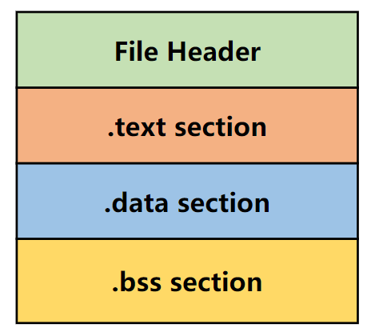

# 目标文件 

**编译器编译源代码后生成的文件叫做目标文件。目标文件从结构上讲，它是已经编译后的可执行文件格式，只是还没有经过链接的过程，其中可能有符号或者某些地址还没有被调整**。其实它本身就是按照可执行文件格式存储的，只是跟真正的可执行文件在结构上稍有不同。

## 1.目标文件的格式

现在 PC 平台流行的可执行文件格式（Executable）主要是 Windows 下的 PE（Portable Executable）和 Linux 的 ELF（Executable Linkable Format），它们都是 COFF（Common file format）格式的变种。**<font color="red">目标文件就是源代码编译后但未进行链接的那些中间文件（Windows 的 **`.obj`** 和 Linux 下的 **`.o`**）</font>**。它跟可执行文件的内容与结构相似，所以一般跟可执行文件格式一起采用一种格式来存储。从广义上看，目标文件与可执行文件的格式其实几乎是一样的，所以我们可以广义地将目标文件与可执行文件看成是一类类型的文件。在 Windows 下，我们可以统称它们为 PE-COFF 文件格式。在 Linux 下，我们可以将它们统称为 ELF 文件。

不光是可执行文件（Windows 的 **`.exe`** 和 Linux 下的 ELF 可执行文件）按照可执行文件格式来存储。**<font color="red">动态链接库（DLL，Dynamic Linking Library）（Windows 的 `.dll` 和 Linux 的 `.so`）及静态链接库（Static Linking Library）（Windows 的 `.lib` 和 Linux 的 `.a`）文件都按照可执行文件格式存储</font>**。它们在 Windows 下都按照 PE-COFF 格式存储，Linux 下按照 ELF 格式存储。

>静态链接库稍有不同，它是把很多目标文件捆绑在一起形成一个文件，再加上一些索引，你可以简单地把它理解为一个包含有很多目标文件的文件包。

ELF 文件标准中把系统重采用的 ELF 格式文件分为如下 4 类：

- 可重定位文件（Relocatable File）：这类文件包含了代码和数据，可以被用来链接成可执行文件或共享目标文件，**静态链接库也可以归为这一类**。比如 Linux 的 **`.o/.a`**  和 Windows 的 **`.obj`** 文件；
- 可执行文件 (Executable File)：这类文件包含了可以直接执行的程序，它的代表就是 ELF 可执行文件。它们一般都没有扩展名。比如 **`/bin/bash`** 文件，Windows 的 **`.exe`**；
- 共享目标文件 (Shared Object File)：这类文件包含了代码和数据，可以在以下两种情况下使用。**一种是链接器可以使用这类文件和其他的可重定位文件和共享目标文件进行链接，产生新的共享目标文件或可执行文件**。另一种是动态链接器可以将几个这种共享目标文件与可执行文件结合，作为进程映像的一部分来运行。比如 Linux 的 **`.so`**，如 **`/lib/glibc-2.5.so`**、Windows 的 DLL；
- 核心转储文件 (Core Dump File)：当进程意外终止时，系统可以将该进程的地址空间的内容及终止时的一些其他信息转储到这类转储文件中。Linux 下的 core dump。

我们可以在 Linux 下使用 file 命令来查看相应的文件格式，上面几种文件在 file 命令下会显示出相应的类型：

```c{.line-numbers}
monica@monica-virtual-machine:~/linkers_loaders$ file a.o
a.o: ELF 32-bit LSB relocatable, Intel 80386, version 1 (SYSV), not stripped
monica@monica-virtual-machine:~/linkers_loaders$ file /bin/bash
/bin/bash: ELF 64-bit LSB pie executable, x86-64, version 1 (SYSV), dynamically linked, interpreter /lib64/ld-linux-x86-64.so.2, BuildID[sha1]=7a6408ba82a2d86dd98f1f75ac8edcb695f6fd60, for GNU/Linux 3.2.0, stripped
monica@monica-virtual-machine:~/linkers_loaders$ file file1.so 
file1.so: ELF 32-bit LSB shared object, Intel 80386, version 1 (SYSV), dynamically linked, BuildID[sha1]=535dabcb55ddf5ccf8f9a49df35559849d15ddb5, not stripped
```

这里对 **<font color="red">一种是链接器可以使用这类文件和其他的可重定位文件和共享目标文件进行链接，产生新的共享目标文件或可执行文件</font>** 这句话进行解释，链接器的核心任务是将一个或多个输入文件（可重定位文件 **`.o`**、静态库 **`.a`**、共享库 **`.so`**）合并，解析它们之间的符号引用以及重定位，并生成一个最终的输出文件。这个输出文件主要有两种类型：

**（1）生成可执行文件**

```shell{.line-numbers}
# 完整步骤分解
# 1. 编译 (Compilation): 从 main.c 生成可重定位目标文件 main.o
gcc -c main.c -o main.o
# 2. 链接 (Linking): 将 main.o 与共享库 libmath.so 链接，生成可执行文件 my_app
gcc main.o -o my_app -lmath 
# 快捷方式 (编译和链接一步完成)
gcc main.c -o my_app -lmath
```

在这个场景下，链接器 ld（由 gcc 调用）的输入是 **`main.o`** 和 **`libmath.so`**，输出是一个可执行文件 my_app。

**（2）生成共享目标文件**

```shell{.line-numbers}
# 假设我们正在开发一个名为 libmycomplex.so 的库
# 它由 part1.c 和 part2.c 组成，并且它自身还依赖于数学库

# 1. 编译: 分别生成两个可重定位目标文件
gcc -c -fPIC part1.c -o part1.o
gcc -c -fPIC part2.c -o part2.o

# 2. 链接: 将 part1.o, part2.o 与 libmath.so 链接，
#    生成一个新的共享目标文件 libmycomplex.so
gcc -shared -o libmycomplex.so part1.o part2.o -lmath
```

在这个场景下，链接器的输入是 **`part1.o`**、**`part2.o`** 和 **`libmath.so`**，输出是一个新的共享目标文件 **`libmycomplex.so`**，供更高层次的模块链接使用。

>**`-fPIC`** 选项作用于编译阶段，告诉编译器产生与位置无关代码；这样一来，产生的代码中就没有绝对地址了，全部使用相对地址，所以代码可以被加载器加载到内存的任意位置。另外，如果想创建一个动态链接库，可以使用 GCC 的 **`-shared`** 选项。输入文件可以是源文件、汇编文件或者目标文件。

## 2.目标文件是什么样的

目标文件中除了机器指令和数据外，还包括了链接时所需的一些信息，比如符号表、调试信息、字符串等。一般目标文件将这些信息按不同的属性，以"节"（Section）的形式存储（链接视图），有时候也叫"段"（Segment）（加载视图），默认情况下统一将它们称为"段"。

程序源代码编译后的机器指令经常被放在代码段（Code Section）里，代码段常见的名字有 **`.code`** 或 **`.text`**；全局变量和局部静态变量数据经常放在数据段（Data Section），数据段的一般名字都叫 **`.data`**。

<div align="center">
    
</div>

从图中可以看到，ELF 文件的开头是一个"文件头"，**它描述了整个文件的文件属性，包括文件是否可执行，是静态链接还是动态链接及入口地址（如果是可执行文件）、目标硬件、目标操作系统等信息**。文件头还包括一个段表（Section Table），段表其实是一个描述文件中各个段的数据。段表描述了文件中每个段在文件中的偏移位置及段的属性等，从段表里面可以得到每个段的所有信息。

对照上图来看，一般 C 语言的编译后执行语句都编译成机器代码，保存在 **`.text`** 段；已初始化的全局变量和静态变量都保存在 **`.data`** 段；未初始化的全局变量和静态变量一般放在一个叫 **`.bss`** 的段里。我们知道未初始化的全局变量和静态变量默认值都是 0，本来它们也可以放在 **`.data`** 段的，但是因为它们都是 0，所以为它们在 **`.data`** 段中分配空间并且存放数据 0 是没有必要的。

程序运行的时候它们的确是要占内存空间的，并且可执行文件必须记录所有未初始化的全局变量和静态变量的大小总和，记为 **`.bss`** 段。**<font color="red">所以 **`.bss`** 段只是为未初始化的全局变量和静态变量预留位置而已，它并没有内容，所以它在文件中也不占据空间</font>**。

假设有如下函数：

```c{.line-numbers}
// SimpleSection.c
int printf(const char* format, ...);

extern int akk;
int global_init_var = 84;
int global_uninit_var;
static int global_static_var = 22;
static int global_unist_static_var;

void func() {
	static int foo = 2;
	printf("%d\n", foo);
}

int main(void) {
 	static int static_var1 = 85;
 	static int static_var2;
 	
 	printf("%d\n", static_var1);
 	return a;
}
```

我们使用 gcc 来编译这个文件 **`gcc -c SimpleSection.c`**（参数 **`-c`** 表示只编译不链接）。然后使用 **`objdump -h`** 来显示这个目标文件的内部结构如下所示，**`-h`** 选项（或 **`--section-headers`**）用于显示目标文件的节头（Section Headers）摘要信息，这些信息描述了二进制文件中各个节（Section）的基本属性。

其中 **`Size`** 表示这节的大小，VMA 表示虚拟内存地址（程序运行时该节的内存地址），LMA 表示加载内存地址（通常与 VMA 相同），File off 表示该节在文件中的偏移量，Align 表示对齐方式（2**4 表示 16 字节对齐）。

```c{.line-numbers}
SimpleSection.o：     文件格式 elf32-i386

节：
Idx Name                        Size      VMA       LMA       File off  Algn
  0 .group                      00000008  00000000  00000000  00000034  2**2
                                CONTENTS, READONLY, GROUP, LINK_ONCE_DISCARD
  1 .text                       00000075  00000000  00000000  0000003c  2**0
                                CONTENTS, ALLOC, LOAD, RELOC, READONLY, CODE
  2 .data                       00000010  00000000  00000000  000000b4  2**2
                                CONTENTS, ALLOC, LOAD, DATA
  3 .bss                        0000000c  00000000  00000000  000000c4  2**2
                                ALLOC
  4 .rodata                     00000004  00000000  00000000  000000c4  2**0
                                CONTENTS, ALLOC, LOAD, READONLY, DATA
  5 .text.__x86.get_pc_thunk.ax 00000004  00000000  00000000  000000c8  2**0
                                CONTENTS, ALLOC, LOAD, READONLY, CODE
  6 .comment                    0000002c  00000000  00000000  000000cc  2**0
                                CONTENTS, READONLY
  7 .note.GNU-stack             00000000  00000000  00000000  000000f8  2**0
                                CONTENTS, READONLY
  8 .eh_frame                   00000084  00000000  00000000  000000f8  2**2
                                CONTENTS, ALLOC, LOAD, RELOC, READONLY, DATA
```

从上面的结果可以看出，LMA 和 VMA 的结果为 0，这是因为在 **`.o`** 文件中，也就是在最终链接和装载之前，没有固定的运行地址（VMA）和装载地址（LMA），objdump 就以 0 占位。**`SimpleSection.o`** 中除了最基本的代码段、数据段和 BSS 段以外，还有 3 个段，分别为只读数据段（**`.rodata`**）、释信息段 (**`.comment`**) 和堆栈提示段 (**`.note.GNU-stack`**)。

同时上述节（section）具有一组属性标志：

- **`CONTENTS`**：表示该节包含实际的数据内容，带有 **`CONTENTS`** 标志的节在目标文件中有实际的数据，而不仅仅是占位符或符号信息。
- **`ALLOC`**：表示该节需要在内存中分配空间。带有 **`ALLOC`** 标志的节在程序加载时会被映射到进程的虚拟地址空间中。
- **`LOAD`**：表示该节需要被加载到内存中。带有 **`LOAD`** 标志的节在程序加载时会被加载到内存中。
- **`RELOC`**：表示该节中的内容可能需要在链接阶段进行重定位。具体地址在链接阶段由链接器决定。
- **`READONLY`**：表示该节的内容在程序运行期间不可修改。

并且从上面可以看出，已初始化的全局和静态变量有 4 个整形变量，因此 **`.data`** 段的大小是 16 字节（0x10）。未初始化的全局和静态变量有 3 个整形变量，因此 **`.bss`** 段的大小是 12 字节（0xc），并且 **`.bss`** 段和后面 **`.rodata`** 段的起始地址相同，说明 **`.bss`** 段在 ELF 文件中不占据空间。

有一个专门的命令叫做 "size"，可以用来查看 ELF 文件中代码段、数据段和 BSS 段的长度：

```c{.line-numbers}
monica@monica-virtual-machine:~/linkers_loaders$ size SimpleSection.o
   text	   data	    bss	    dec	    hex	filename
    257	     16	     12	    285	    11d	SimpleSection.o
```

### 2.1 代码段

objdump 的 **`-s`** 参数可以将所有段的内容以十六进制的方式打印出来。

```c{.line-numbers}
monica@monica-virtual-machine:~/linkers_loaders$ objdump -s SimpleSection.o

SimpleSection.o：     文件格式 elf32-i386

Contents of section .group:
 0000 01000000 07000000                    ........        
Contents of section .text:
 0000 5589e553 83ec04e8 fcffffff 05010000  U..S............
 0010 008b9008 00000083 ec08528d 90000000  ..........R.....
 0020 005289c3 e8fcffff ff83c410 908b5dfc  .R............].
 0030 c9c38d4c 240483e4 f0ff71fc 5589e553  ...L$.....q.U..S
 0040 51e8fcff ffff0501 0000008b 900c0000  Q...............
 0050 0083ec08 528d9000 00000052 89c3e8fc  ....R......R....
 0060 ffffff83 c410b800 0000008d 65f8595b  ............e.Y[
 0070 5d8d61fc c3                          ].a..           
Contents of section .data:
 0000 54000000 16000000 02000000 55000000  T...........U...
Contents of section .rodata:
 0000 25640a00                             %d..            
Contents of section .text.__x86.get_pc_thunk.ax:
 0000 8b0424c3                             ..$.            
Contents of section .comment:
 0000 00474343 3a202855 62756e74 75203131  .GCC: (Ubuntu 11
 0010 2e342e30 2d317562 756e7475 317e3232  .4.0-1ubuntu1~22
 0020 2e303429 2031312e 342e3000           .04) 11.4.0.    
Contents of section .eh_frame:
 0000 14000000 00000000 017a5200 017c0801  .........zR..|..
 0010 1b0c0404 88010000 20000000 1c000000  ........ .......
 0020 00000000 32000000 00410e08 8502420d  ....2....A....B.
 0030 05448303 6ac5c30c 04040000 30000000  .D..j.......0...
 0040 40000000 32000000 43000000 00440c01  @...2...C....D..
 0050 00491005 02750042 0f037578 06100302  .I...u.B..ux....
 0060 757c6ec1 0c010041 c341c543 0c040400  u|n....A.A.C....
 0070 10000000 74000000 00000000 04000000  ....t...........
 0080 00000000                             .... 
```

**`-d`** 参数可以将所有包含指令的段反汇编。

```c{.line-numbers}
monica@monica-virtual-machine:~/linkers_loaders$ objdump -d SimpleSection.o
SimpleSection.o：     文件格式 elf32-i386

Disassembly of section .text:

00000000 <func>:
   0:	55                   	push   %ebp
   1:	89 e5                	mov    %esp,%ebp
   3:	53                   	push   %ebx
   4:	83 ec 04             	sub    $0x4,%esp
   7:	e8 fc ff ff ff       	call   8 <func+0x8>
   c:	05 01 00 00 00       	add    $0x1,%eax
  11:	8b 90 08 00 00 00    	mov    0x8(%eax),%edx
  17:	83 ec 08             	sub    $0x8,%esp
  1a:	52                   	push   %edx
  1b:	8d 90 00 00 00 00    	lea    0x0(%eax),%edx
  21:	52                   	push   %edx
  22:	89 c3                	mov    %eax,%ebx
  24:	e8 fc ff ff ff       	call   25 <func+0x25>
  29:	83 c4 10             	add    $0x10,%esp
  2c:	90                   	nop
  2d:	8b 5d fc             	mov    -0x4(%ebp),%ebx
  30:	c9                   	leave  
  31:	c3                   	ret    

00000032 <main>:
  32:	8d 4c 24 04          	lea    0x4(%esp),%ecx
  36:	83 e4 f0             	and    $0xfffffff0,%esp
  39:	ff 71 fc             	push   -0x4(%ecx)
  3c:	55                   	push   %ebp
  3d:	89 e5                	mov    %esp,%ebp
  3f:	53                   	push   %ebx
  40:	51                   	push   %ecx
  41:	e8 fc ff ff ff       	call   42 <main+0x10>
  46:	05 01 00 00 00       	add    $0x1,%eax
  4b:	8b 90 0c 00 00 00    	mov    0xc(%eax),%edx
  51:	83 ec 08             	sub    $0x8,%esp
  54:	52                   	push   %edx
  55:	8d 90 00 00 00 00    	lea    0x0(%eax),%edx
  5b:	52                   	push   %edx
  5c:	89 c3                	mov    %eax,%ebx
  5e:	e8 fc ff ff ff       	call   5f <main+0x2d>
  63:	83 c4 10             	add    $0x10,%esp
  66:	b8 00 00 00 00       	mov    $0x0,%eax
  6b:	8d 65 f8             	lea    -0x8(%ebp),%esp
  6e:	59                   	pop    %ecx
  6f:	5b                   	pop    %ebx
  70:	5d                   	pop    %ebp
  71:	8d 61 fc             	lea    -0x4(%ecx),%esp
  74:	c3                   	ret    

Disassembly of section .text.__x86.get_pc_thunk.ax:

00000000 <__x86.get_pc_thunk.ax>:
   0:	8b 04 24             	mov    (%esp),%eax
   3:	c3                   	ret 
```

### 2.2 数据段

**`.data`** 段保存的是已经初始化了的全局变量和静态变量，SimpleSection.c 里面我们在调用 printf 的时候，用到了一个字符串常量 **`%d\n`**，它是一种只读数据，所以它被放到了 **`.rodata`** 段，我们可以从输出结果看到 **`.rodata`** 这个段的 4 个字节刚好是这个字符串常量的 ASCII 字节序，最后以 **`\0`** 结束。**`.rodata`** 段存放的是只读数据，一般是程序里面的只读变量（如 const 修饰的变量）和字符串常量。设置只读数据段，操作系统在加载的时候可以将 **`.rodata`** 段的属性映射成只读，这样对于这个段的任何修改操作都会作为非法操作处理，保证了程序的安全性。 

### 2.3 **`.bss`** 段

**`.bss`** 段存放的是未初始化的全局变量和静态变量，GCC 10 及以上默认启用 **`-fno-common`**，从 Clang 11 及以上默认启用 **`-fno-common`**。但是在其他编译器版本中（默认启用 **`-fcommon`** 选项），未初始化的全局变量默认是放在 COMMON 块中。默认启用 **`-fno-common`** 时，**`.bss`** 节的大小为 12 字节。

```c{.line-numbers}
  3 .bss                        0000000c  00000000  00000000  000000c4  2**2
                                ALLOC
```

COMMON 符号指的是一类特殊的全局符号，用于表示未初始化的全局变量（又称可共同定义的符号）。在早期的编程语言（如 FORTRAN）中，有一个概念叫做 COMMON 块，允许在多个源文件中声明同名的公共变量块，链接器在链接时为这些变量分配一个共同的内存区域。

这一特性后来被引入 C 语言的编译/链接模型中，使得 C 语言允许 tentative definition（暂定定义）：**<font color="red">即可以在不同的源文件中多次定义同名的未初始化全局变量而不报重定义错误，链接器会将它们合并为一个符号并只分配一块内存空间</font>**。GCC 和 Clang 在 C 语言中历史上默认开启 **`-fcommon`** 选项来启用这种语义。

需要强调的是，**COMMON 符号只存在于可重定位目标文件（.o 文件）中。在最终链接生成的可执行文件或共享库中，不会有节索引为 COMMON 的符号**。这是因为链接器在产生最终文件时，会为所有 COMMON 符号分配空间，将它们放入合适的段中（通常是 **`.bss/.data`** 段）。因此，在最终可执行文件的符号表中，这些符号将不再是 COMMON 类型，而是变成已分配到 **`.bss/.data`** 的全局符号。

使用 **`gcc -c SimpleSection.c -m32 -fcommon`** 开启 COMMON 选项时，**`.bss`** 节的大小变为 8 字节。可以看到，global_uninit_var 变量被放在 COMMON 块中。

```c{.line-numbers}
  3 .bss          00000008  00000000  00000000  000000c4  2**2
                  ALLOC
monica@monica-virtual-machine:~/linkers_loaders$ readelf -s SimpleSection.o

Symbol table '.symtab' contains 18 entries:
   Num:    Value  Size Type    Bind   Vis      Ndx Name
    12: 00000004     4 OBJECT  GLOBAL DEFAULT  COM global_uninit_var
```

>注意，对于声明 **`static int global_static_var = 0`**，变量 **`global_static_var`** 依然被视为未被初始化，被放在 **`.bss`** 段中。

### 2.4 自定义段

正常情况下，GCC 编译出来的目标文件中，代码会被放到 **`.text`** 段，全局变量和静态变量会被放到 **`.data`** 和 **`.bss`** 段，正如我们前面所分析的。但是有时候你可能希望变量或某些部分代码能够放到你所指定的段中去，以实现某些特定的功能。

```c{.line-numbers}
__attribute__((section("FOO"))) int global = 42;
__attribute__((section("BAR"))) void foo() {
}
```

我们在全局变量或函数之前加上 **`__attribute__((section("name")))`** 属性就可以把相应的变量或函数放到以 name 作为段名的段中。

```c{.line-numbers}
monica@monica-virtual-machine:~/linkers_loaders$ objdump -h SimpleSection.o

SimpleSection.o：     文件格式 elf32-i386

  4 FOO           00000004  00000000  00000000  000000c0  2**2
                  CONTENTS, ALLOC, LOAD, DATA
  5 BAR           00000010  00000000  00000000  000000c4  2**0
                  CONTENTS, ALLOC, LOAD, RELOC, READONLY, CODE
```

## 3.ELF 文件结构描述

ELF 文件的总体结构如下所示

