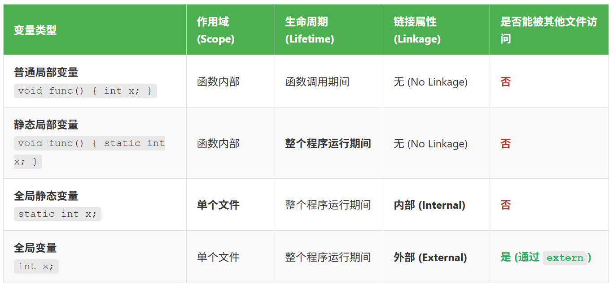

# 目标文件

## 4.链接的接口——符号

**<font color="red">在链接中，目标文件之间相互拼合实际上是目标文件之间对地址的引用，即对函数和变量的地址的引用</font>**。比如目标文件 B 要用到了目标文件 A 中的函数 foo，那么我们就称**目标文件 A 定义（Define）了函数 foo，称目标文件 B 引用（Reference）了目标文件 A 中的函数 foo**。 这两个概念也同样适用于变量。每个函数或变量都有自己独特的名字，才能避免链接过程中不同变量和函数之间的混淆。在链接中，我们将函数和变量统称为符号（Symbol），函数名或变量名就是符号名（Symbol Name）。

我们可以将符号看作是链接中的粘合剂，整个链接过程正是基于符号才能够正确完成。每一个目标文件都会有一个相应的符号表（Symbol Table），这个表里面记录了目标文件中所用到的所有符号。每个定义的符号有一个对应的值，叫做符号值（Symbol Value），对于变量和函数来说，符号值就是它们的地址。我们将符号表中的

- 定义在本目标文件的全局符号，可以被其他目标文件引用。比如 **`SimpleSection.o`** 里面的 **`func1`**、**`main`** 和 **`global_init_var`**；
- 在本目标文件中引用的全局符号，却没有定义在本目标文件，这一类叫做外部符号（External Symbol）。比如 **`SimpleSection.o`** 里面的 **`printf`**；
- **段名，这种符号往往由编译器产生，它的值就是该段的起始地址**。比如 **`SimpleSection.o`** 里面的 **`.text`**、**`.data`** 等；
- 局部符号，这类符号只在编译单元内部可见。比如 SimpleSection.o 里面的 **`static_var`** 和 **`static_var2`**。调试器可以使用这些符号来分析程序或崩溃时的核心转储文件。这些局部符号对于链接过程没有作用，链接器往往也忽略它们；

对于我们来说，最值得关注的就是全局符号，即上面分类中的第一类和第二类。因为链接过程只关心全局符号的相互粘合，局部符号、段名、行号等对于其他目标文件来说是"不可见"的。

```c{.line-numbers}
monica@monica-virtual-machine:~/linkers_loaders$ nm SimpleSection.o
00000000 T foo
00000004 d foo.2
00000000 T func
00000000 D global
00000000 D global_init_var
         U _GLOBAL_OFFSET_TABLE_
00000004 b global_static_var
00000000 B global_uninit_var
00000008 b global_unist_static_var
00000032 T main
         U printf
00000008 d static_var1.1
0000000c b static_var2.0
00000000 T __x86.get_pc_thunk.ax
```

这是我们使用 nm 命令查看 **`SimpleSection.o`** 目标文件中符号表的结果。其中 T 表示该符号位于代码段，通常是函数的定义。d/D 表示该符号位于已初始化的数据段（data section），通常是全局变量的定义。U 表示该符号在当前文件中被引用，但未在当前文件中定义，通常是外部函数或变量。b/B 表示该符号位于未初始化的数据段（bss section），通常是未初始化的全局或者静态变量。

>d/b 表示本地符号（Local Symbol）。**这些符号的作用域被限制在当前编译单元（也就是这个 **`.c`** 文件）之内**，对链接器来说是不可见的。这通常是由 static 关键字修饰的变量。
>D/B 表示全局符号（Global Symbol）。**这些符号对链接器是可见的**，可以被工程中的其他文件引用（extern）。这是默认的链接属性。

### 4.1 ELF 符号表结构

ELF 文件中的符号表往往是文件中的一个段，段名一般叫 **`.symtab`**。符号表的结构很简单，它是一个 **`Elf32_Sym`** 结构（32 位 ELF 文件）的数组。每个 **`Elf32_Sym`** 结构对应一个符号。这个数组的第一个元素，也就是下标 0 的元素为无效的未定义符号。使用 readelf 查看 SimpleSection.o 文件中的符号表如下所示：

```c{.line-numbers}
monica@monica-virtual-machine:~/linkers_loaders$ readelf -s SimpleSection.o

Symbol table '.symtab' contains 21 entries:
   Num:    Value  Size Type    Bind   Vis      Ndx Name
     0: 00000000     0 NOTYPE  LOCAL  DEFAULT  UND 
     1: 00000000     0 FILE    LOCAL  DEFAULT  ABS SimpleSection.c
     2: 00000000     0 SECTION LOCAL  DEFAULT    2 .text
     3: 00000000     0 SECTION LOCAL  DEFAULT    4 .data
     4: 00000000     0 SECTION LOCAL  DEFAULT    7 BAR
     5: 00000004     4 OBJECT  LOCAL  DEFAULT    5 global_static_var
     6: 00000008     4 OBJECT  LOCAL  DEFAULT    5 global_unist_sta[...]
     7: 00000000     0 SECTION LOCAL  DEFAULT    9 .rodata
     8: 00000004     4 OBJECT  LOCAL  DEFAULT    4 foo.2
     9: 00000008     4 OBJECT  LOCAL  DEFAULT    4 static_var1.1
    10: 0000000c     4 OBJECT  LOCAL  DEFAULT    5 static_var2.0
    11: 00000000     0 SECTION LOCAL  DEFAULT   10 .text.__x86.get_[...]
    12: 00000000     4 OBJECT  GLOBAL DEFAULT    6 global
    13: 00000000    16 FUNC    GLOBAL DEFAULT    7 foo
    14: 00000000     0 FUNC    GLOBAL HIDDEN    10 __x86.get_pc_thunk.ax
    15: 00000000     0 NOTYPE  GLOBAL DEFAULT  UND _GLOBAL_OFFSET_TABLE_
    16: 00000000     4 OBJECT  GLOBAL DEFAULT    4 global_init_var
    17: 00000000     4 OBJECT  GLOBAL DEFAULT    5 global_uninit_var
    18: 00000000    50 FUNC    GLOBAL DEFAULT    2 func
    19: 00000000     0 NOTYPE  GLOBAL DEFAULT  UND printf
    20: 00000032    67 FUNC    GLOBAL DEFAULT    2 main
```

**`Elf32_Sym`** 的结构定义如下：

```c{.line-numbers}
typedef struct {
    Elf32_Word st_name;
    Elf32_Addr st_value;
    Elf32_Word st_size;
    unsigned char st_info;
    unsigned char st_other;
    Elf32_Half st_shndx;
} Elf32_Sym;
```

这几个成员的定义如下所示：

- **`st_name`**：符号名，这个成员包含了该符号名在字符串表中的下标；
- **`st_value`**：符号相对应的值。这个值跟符号有关，不同的符号，它所对应的值含义不同；
- **`st_size`**：符号大小。对于包含数据的符号，这个值是该数据类型的大小。比如一个 double 型的符号它占用 8 个字节。如果该值为 0，则表示该符号大小为 0 或未知；
- **`st_info`**：符号类型和绑定信息；
- **`st_other`**：该成员目前为 0，没用；
- **`st_shndx`**：符号所在的段；

**（1）符号类型和绑定信息**

该成员的低 4 位表示符号的类型（Symbol Type），高 28 位表示符号的绑定信息（Symbol Binding）。

符号的绑定信息如下所示：

- **`STB_LOCAL`**：局部符号，对于目标文件的外部不可见，对于 C 语言而言，在文件作用域内使用 static 关键字声明的函数或全局变量通常会被编译器赋予 **`STB_LOCAL`** 绑定；
- **`STB_GLOBAL`**：全局符号，外部可见；
- **`STB_WEAK`**：弱符号；

符号的类型如下所示：

- **`STT_NOTYPE`**：未知类型符号；
- **`STT_OBJECT`**：该符号是个数据对象，比如变量、数组等；
- **`STT_FUNC`**：该符号是个函数或其他可执行代码；
- **`STT_SECTION`**：**该符号表示一个段，这种符号必须是 **`STB_LOCAL`** 的**；
- **`STT_FILE`**：该符号表示文件名，**一般都是该目标文件所对应的源文件名，它一定是 **`STB_LOCAL`** 类型的**，并且它的 **`st_shndx`** 一定是 **`SHN_ABS`**；

**（2）符号所在的段**

**<font color="red">如果符号定义在本目标文件中</font>**，那么这个成员表示符号所在的段在段表中的下标；但是如果符号不是定义在本目标文件中，或者对于有些特殊符号，**`st_shndx`** 的值有些特殊：

- **`SHN_ABS`**：表示该符号包含了一个绝对的值。比如表示文件名的符号就属于这种类型的；
- **`SHN_COMMON`**：表示该符号是一个 COMMON 块类型的符号，一般来说，未初始化的全局符号定义就是这种类型的；
- **`SHN_UNDEF`**：表示该符号未定义。这个符号号表示该符号在本目标文件被引用到，但是定义在其他目标文件中；

**（3）符号值**

符号值（**`st_value`**）的值有如下几种情况：

- 在目标文件中，如果是符号的定义并且该符号不是 COMMON 块类型的，则 **`st_value`** 表示该符号在段中的偏移。**<font color="red">即符号所对应的函数或变量位于由 **`st_shndx`** 指定的段，偏移 **`st_value`** 的位置</font>**；
- 在目标文件中，如果符号是 COMMON 块类型的（即 **`st_shndx`** 为 **`SHN_COMMON`**），则 **`st_value`** 表示该符号的对齐属性；
- 在可执行文件中，**`st_value`** 表示符号的虚拟地址；

global_uninit_var 和 global_init_var 变量的 **`st_value`** 值为 0，表示在 **`.bss`** 和 **`.data`** 段中距离节起始位置的偏移量均为 0，也就是位于段最开始处。

### 4.2 特殊符号

当我们使用 ld 作为链接器来链接生产可执行文件时，它会为我们定义许多特殊的符号；这些符号并没有在你的程序中定义, 但是你可以直接声明并且引用它, 我们称之为特殊符号。链接器会在将程序最终链接成可执行文件的时候将其解析成正确的值，注意，只有使用 ld 链接生产最终可执行文件的时候这些符号才会存在。

- **`__executable_start`**：该符号为程序起始地址，注意，不是入口地址，是程序的最开始的地址。
- **`_etext`** 或 **`etext`** 或 **`__etext`**，该符号为代码段结束地址，即代码段最末尾的地址。
- **`edata`** 或 **`_edata`**，该符号为数据段结束地址，即数据段最末尾的地址。
- **`_end`** 或 **`end`**，该符号为程序结束地址。

### 4.3 符号修饰和函数签名

C++ 中两个相同名字的函数 func(int) 和 func(double)，尽管函数名相同，但是参数列表不同，这就是函数重载。为了支持 C++ 这些复杂的特性（重载、继承、虚机制、名称空间），发明了符号修饰（Name Decoration）或符号改编（Name Mangling）的机制。比如下面的代码：

```cpp{.line-numbers}
// mangling_test.cpp

// 1. 全局函数重载
int func(int i) { return i; }
float func(float f) { return f; }

// 2. 类与嵌套类
class C {
public: // 设为 public 方便外部调用演示
    int func(int i) { return i; }
    class C2 {
    public:
        int func(int i) { return i; }
    };
};

// 3. 命名空间
namespace N {
    int func(int i) { return i; }
    class C {
    public:
        int func(int i) { return i; }
    };
}

// 4. 主函数调用以确保符号被生成
int main() {
    func(1);
    func(1.0f);
    C c_instance;
    c_instance.func(2);
    C::C2 c2_instance;
    c2_instance.func(3);
    N::func(4);
    N::C nc_instance;
    nc_instance.func(5);
    return 0;
}
```

这段代码中有 6 个同名函数叫 func，只不过它们的返回类型和参数及所在的名称空间不同。我们引入一个术语叫 函数签名（Function Signature），函数签名包含了一个函数的信息，包括函数名，它的参数类型，它所在的类和名称空间及其他信息。

在编译器及链接器处理符号时，它们使用某种 **名称修饰** 的方法，使得每个同函数名对应一个修饰后名称（Decorated Name）。编译器在将 C++ 源代码编译成目标文件时，会将函数和变量的名字进行修饰，形成符号名，也就是说，**<font color="red">C++ 的源代码编译后的目标文件中所使用的符号名是相应的函数和变量的修饰后名称</font>**，C++ 编译器和链接器都使用符号来识别和处理函数和变量。

我们使用 **`gcc manglecpp.cpp -c -o manglecpp.o`** 编译上述 cpp 文件，然后使用 nm 查看修饰后的符号名称，接下来使用 **`nm manglecpp.o | c++filt -t`** 命令查看修饰之前的符号名称。
 
```c{.line-numbers}
monica@monica-virtual-machine:~/linkers_loaders$ nm manglecpp.o
0000000000000034 T main
                 U __stack_chk_fail
0000000000000010 T _Z4funcf
0000000000000000 T _Z4funci
0000000000000000 W _ZN1C2C24funcEi
0000000000000000 W _ZN1C4funcEi
0000000000000000 W _ZN1N1C4funcEi
0000000000000024 T _ZN1N4funcEi
monica@monica-virtual-machine:~/linkers_loaders$ nm manglecpp.o | c++filt -t
0000000000000034 T main
                 U __stack_chk_fail
0000000000000010 T func(float)
0000000000000000 T func(int)
0000000000000000 W C::C2::func(int)
0000000000000000 W C::func(int)
0000000000000000 W N::C::func(int)
0000000000000024 T N::func(int)
```

#### 4.3.1 W 弱符号解析

这里注意，全局函数 **`func(float)`**、**`func(int)`** 以及 **`N::func(int)`** 的类型都是 T 类型，表示位于代码段的强符号，而 **`C::C2::func(int)`**、**`C::func(int)`**、**`N::C::func(int)`** 的类型都是 弱符号 W。

这是因为这 3 个函数都是类的成员函数，根据 C++ 规范，当在函数的声明说明符序列中使用 inline 说明符时，它将函数声明为内联函数。**<font color="red">在类/结构体/联合体定义中完整定义的函数，无论是成员函数还是非成员 friend 函数，都隐式地是内联函数</font>**。程序中可以有内联函数或变量的多个定义，只要每个定义出现在不同的翻译单元（不同的 cpp 源文件）中，并且所有定义都相同。

例如，内联函数或内联变量可以在头文件中定义，该头文件被包含在多个源文件中时，链接器会把这些副本合并为一个，而不是报重复定义错误。这就是对 ODR（One Definition Rule，单一定义规则）的放宽，而非内联函数必须在整个程序里只有一个定义；而内联函数可以在多个翻译单元各有一份相同定义。综上，这是为了解决 C++ 的 **单一定义规则（One Definition Rule - ODR）** 头文件（头文件中有类内部实现的成员函数）被多个源文件包含场景下的一个难题。

接下来举例进行说明，首先是正确示例，类内定义（隐式 inline）可被多个 **`.cpp`** 包含，能正常链接；用 nm 能看到成员函数是 W（weak）。

```c{.line-numbers}
// foo.h
#pragma once

struct C {
    // 在类体内定义 ⇒ 语言层面是 inline 函数（允许跨多个 TU 有相同定义）
    int add1(int x) { return x + 1; }
    int mul2(int x) { return 2 * x; }
};

// a.cpp
#include "foo.h"

int free_func(int);  // 仅声明，定义在 b.cpp
int main() {
  C c;
  return free_func(c.add1(1)) + c.mul2(5);
}

// b.cpp
#include "foo.h"

int free_func(int x) {
  C c;
  return c.add1(x);
}
```

然后编译并且查看符号，可以看到定义在 **`struct C`** 结构体中的函数 add1 和 mul2 都是弱符号 W。

```shell{.line-numbers}
monica@monica-virtual-machine:~/linkers_loaders$ g++ -c a.cpp b.cpp
monica@monica-virtual-machine:~/linkers_loaders$ g++ a.o b.o -o ab
monica@monica-virtual-machine:~/linkers_loaders$ nm a.o
0000000000000000 T main
                 U __stack_chk_fail
                 U _Z9free_funci
0000000000000000 W _ZN1C4add1Ei
0000000000000000 W _ZN1C4mul2Ei
monica@monica-virtual-machine:~/linkers_loaders$ nm b.o
                 U __stack_chk_fail
0000000000000000 T _Z9free_funci
0000000000000000 W _ZN1C4add1Ei
```

接下来是错误的例子，把非 inline 的定义放在头文件里，被多个 **`.cpp`** 包含会违反 ODR，链接时报"多重定义"。

```c{.line-numbers}
// foo_bad.h
#pragma once

struct C {
    int add1(int x);   // 只有声明，不是 inline
};

// 错误：在头文件里给"非 inline"函数做类外定义
// 这个头会被 a.cpp 和 b.cpp 都包含，从而在两个目标文件中各自生成一个定义
int C::add1(int x) { return x + 1; }

// a_bad.cpp
#include "foo_bad.h"
int free_func(int);
int main() {
    C c;
    return free_func(c.add1(1));
}

// b_bad.cpp
#include "foo_bad.h"
int free_func(int x) {
    C c;
    return c.add1(x);
}
```

然后编译，链接得到的结果如下所示：

```shell{.line-numbers}
monica@monica-virtual-machine:~/linkers_loaders$ g++ -c a_bad.cpp b_bad.cpp 
monica@monica-virtual-machine:~/linkers_loaders$ g++ a_bad.o b_bad.o -o ab
/usr/bin/ld: b_bad.o: in function `C::add1(int)':
b_bad.cpp:(.text+0x0): multiple definition of `C::add1(int)'; a_bad.o:a_bad.cpp:(.text+0x0): first defined here
collect2: error: ld returned 1 exit status
```

#### 4.3.2 C++ 名称修饰方法

GCC 的基本 C++ 名称修饰方法如下：所有的符号都以 **`_Z`** 开头；**对于嵌套的名字**（在名称空间或在类里面的），后面紧跟 N，然后是各个名称空间和类的名字，每个名字前是名字字符串长度，再以 E 结尾。比如 **`N::C::func`** 经过名称修饰以后就是 **`_ZN1N1C4funcE`**。对于一个函数来说，它的参数列表紧跟在 E 后面，对于 int 类型来说，就是字母 i。

**<font color="red">签名和名称修饰机制不光被用到函数上，C++ 中的全局变量和静态变量也有同样的机制</font>**。对于全局变量来说，它跟函数一样都是一个全局可见的名称，它也遵循上面的名称修饰机制，比如一个名称空间 foo 中的全局变量 bar，它修饰后的名字为：**`_ZN3foo3barE`**。

值得注意的是，变量的类型并没有被加入到修饰后名称中，所以不论这个变量是整形还是浮点型，甚至是一个全局对象，它的名称都是一样的。名称修饰机制也被用来防止静态变量的名字冲突。比如 main() 函数里面有一个静态变量叫 foo，而 func() 函数里面也有一个静态变量叫 foo。为了区分这两个变量，GCC 会将它们的符号名分别修饰成两个不同的名字：**`_ZZ4mainE3foo`** 和 **`_ZZ4funcvE3foo`**，这样就区分了这两个变量。

```cpp{.line-numbers}
/*
 * SimpleSection.cpp
 */
int printf(const char* format, ...);

int global_init_var = 84;
int global_uninit_var;
static int global_static_var = 100;
static int global_uninit_static_var = 0;
 
void func1(int i) {
	printf("%d\n", i);
}

void func() {
	static int foo = 2;
	printf("%d\n", foo);
}

void func2(int i, float oo) {
	static int foo = 2;
	printf("%d\n", foo);
}

int main(void) {
    static int static_var = 85;
    static int static_var2;
    int a = 1;
    int b;
    func1(static_var + static_var2 + a + b);
    return a;
}
```

使用 g++ 编译之后，查看符号名称如下所示：

```c{.line-numbers}
monica@monica-virtual-machine:~/linkers_loaders$ g++ a.cpp -c
monica@monica-virtual-machine:~/linkers_loaders$ nm a.o
0000000000000000 D global_init_var
0000000000000000 B global_uninit_var
0000000000000085 T main
000000000000002b T _Z4funcv
0000000000000000 T _Z5func1i
0000000000000052 T _Z5func2if
                 U _Z6printfPKcz
0000000000000004 d _ZL17global_static_var
0000000000000004 b _ZL24global_uninit_static_var
0000000000000008 d _ZZ4funcvE3foo
0000000000000010 d _ZZ4mainE10static_var
0000000000000008 b _ZZ4mainE11static_var2
000000000000000c d _ZZ5func2ifE3foo

monica@monica-virtual-machine:~/linkers_loaders$ nm a.o | c++filt -t
0000000000000000 D global_init_var
0000000000000000 B global_uninit_var
0000000000000085 T main
000000000000002b T func()
0000000000000000 T func1(int)
0000000000000052 T func2(int, float)
                 U printf(char const*, ...)
0000000000000004 double global_static_var
0000000000000004 bool global_uninit_static_var
0000000000000008 double func()::foo
0000000000000010 double main::static_var
0000000000000008 bool main::static_var2
000000000000000c double func2(int, float)::foo
```

对于 **`_ZZ`**，在 Itanium C++ ABI中，所有经过名称修饰的 C++ 符号都以 **`_Z`** 开头。如果符号是在函数内部定义的局部实体（比如局部静态变量或 lambda 表达式），它的修饰名会在函数名之后插入一个额外的 Z 来表示这一点。对于 **`_ZL`** 来说，L 是 GCC/Clang 的内部链接扩展标记，**`_ZL`** is a GCC mangling extension used to mangle the names of internal-linkage symbols（比如全局 static 变量）. Because it's only used for internal-linkage symbols, it's not part of the ABI.

最后参数列表类型和符号的对应关系如下：

```c{.line-numbers}
    int    -> i 
    float  -> f 
    double -> d 
    char   -> c 
    void   -> v 
    const  -> K 
    *      -> P 
```

C/C++ 中变量类型、作用域、生命周期与链接属性对比如下所示：

<div align="center">
    
</div>

#### 4.3.3 extern "C"

从上文可以看出，C 语言和 C++ 语言中对函数和变量的符号名修饰不同，这个差异是致命的。如果一个 C 文件想调用一个 C++ 文件中的函数，或者反过来，它们会因为对同一个函数的"命名方式"理解不同而导致链接失败。链接器会报告"未定义的符号"（Undefined Symbol）错误。

C++ 为了与 C 兼容，在符号的管理上，C++ 有一个用来声明或定义一个 C 的符号的 **`extern "C"`** 关键字用法，其含义为请对被 extern "C" 修饰的这部分代码，使用 C 语言的链接规范（即不进行名字修饰），而不是 C++ 的。

```c{.line-numbers}
extern "C" {
    int func(int);
    int var;
}
```

**<font color="red">C++ 编译器会将在 **`extern "C"`** 的大括号内部的代码当作 C 语言代码处理</font>**。所以很明显，上面的代码中，C++ 的名称修饰机制将不会起作用。它声明了一个 C 的函数 func，定义了一个整形全局变量 var。如果单独声明某个函数或变量为 C 语言的符号，那么也可以使用如下格式：

```c{.line-numbers}
extern "C" int func(int);
extern "C" int var;
```

在很多时候我们会碰到有些头文件声明了一些 C 语言的函数和全局变量，但是这个头文件可能会被 C 语言代码或 C++ 代码包含。假设你有一个非常稳定、经过测试的 C 语言库，用于数学计算。

```c{.line-numbers}
// math_lib.h
#ifndef MATH_LIB_H
#define MATH_LIB_H

// 为了让这个头文件既能被 C 编译器也能被 C++ 编译器使用，我们使用 __cplusplus 宏。这是标准做法。
#ifdef __cplusplus
extern "C" {
#endif

int add(int a, int b);
double square_root(double x);

#ifdef __cplusplus
}
#endif
#endif // MATH_LIB_H
```

如果不加任何处理，当我们的 C 语言程序包含 **`math_lib.h`** 的时候，并且用到了 square_root 函数，编译器会将 square_root 符号引用正确处理；但是在 C++ 语言中，编译器会认为这个 square_root 函数是一个 C++ 函数，将需要修饰的符号修饰成 _Z11square_rootd，这样链接器就无法与 C 语言库中的 unmodified 符号进行链接。

所以对于 C++ 来说，必须使用 **`extern "C"`** 来声明 square_root 这个函数。但是 C 语言又不支持 **`extern "C"`** 语法，如果为了兼容 C 语言和 C++ 语言定义又两套头文件，未免过于麻烦。幸好我们有 C++ 的宏 **`__cplusplus`**，C++ 编译器会在编译 C++ 的程序时默认定义这个宏，我们可以使用条件宏来判断当前编译单元是不是 C++ 代码。具体代码如上所示。

如果当前编译单元是 C++ 代码，那么 square_root 会在 **`extern "C"`** 里面被声明；如果是 C 代码，就直接声明。上面这段代码中的技巧几乎在所有的系统头文件里面都被用到。

```c{.line-numbers}
// math_lib.c
#include "math_lib.h"
#include <math.h>

int add(int a, int b) {
    return a + b;
}

double square_root(double x) {
    if (x < 0) return 0.0;
    return sqrt(x);
}
```

在 C 语言程序 **`math_lib.c`** 中包含 **`math_lib.h`** 头文件时，直接使用 add 和 square_root 两个符号。

```c{.line-numbers}
// main.cpp
#include <iostream>
#include "math_lib.h" // 包含 C 语言的头文件

int main() {
    int sum = add(5, 3); // C++ 代码调用 C 函数
    double root = square_root(16.0);

    std::cout << "5 + 3 = " << sum << std::endl;
    std::cout << "Square root of 16.0 is " << root << std::endl;

    return 0;
}
```

在 main.cpp 中，当 C++ 编译器检测到 **`__cplusplus`** 宏被定义了，所以 **`extern "C" { ... }`** 块会生效。这告诉编译器，add 和 square_root 这两个函数的符号名应该遵循 C 的规则。当链接器链接 **`main.o`** 和 **`math_lib.o`** 时，**`main.o`** 会去寻找名为 add/square_root 的符号，而 **`math_lib.o`** 中正好提供了这个符号，链接成功！

#### 4.3.4 弱符号和强符号

我们经常在编程中碰到一种情况叫符号重复定义。多个目标文件中含有相同名字全局符号的定义，那么这些目标文件链接的时候将会出现符号重复定义的错误。比如我们在目标文件 A 和目标文件 B 都定义了一个全局整形变量 global，并将它们都初始化，那么链接器将 A 和 B 进行链接时会报错：

```c{.line-numbers}
b.o:(.data+0x0): multiple definition of `global'
a.o:(.data+0x0): first defined here
```

这种符号的定义可以被称为强符号（Strong Symbol）。有些符号的定义可以被称为弱符号（Weak Symbol）。对于 C/C++ 语言来说，编译器默认函数和初始化的全局变量为强符号。在 GCC 10 之前，未初始化的全局变量（暂定定义）是 COMMON 符号，在 GCC 10 之后默认开启 **`-fno-common`**，未初始化的全局变量保存在 **`.bss`** 段中，属于强符号。GCC 文档如下：

>A common mistake in C is omitting extern when declaring a global variable in a header file. If the header is included by several files it results in multiple definitions of the same variable. In previous GCC versions this error is ignored. GCC 10 defaults to **`-fno-common`**, which means a linker error will now be reported. To fix this, use extern in header files when declaring global variables, and ensure each global is defined in exactly one C file. If tentative definitions of particular variables need to be placed in a common block, **`__attribute__((__common__))`** can be used to force that behavior even in code compiled without -fcommon. As a workaround, legacy C code where all tentative definitions should be placed into a common block can be compiled with -fcommon.

一般带有显式标记（如 **`__attribute__((weak))`**），或某些 C++ 情况（比如类内定义的内联成员函数）才属于弱符号。比如下面这段程序:

```c{.line-numbers}
extern int ext;

int weak;
int strong = 1;
__attribute__((weak)) weak2 = 2;

int main() {
    return ext + 1;
}
```

最后生成的结果如下所示，weak2 是弱符号，strong 和 main 是强符号，weak 是 COMMON 符号或者强符号，而 ext 既非强符号也非弱符号，因为它是一个外部变量的引用。

```c{.line-numbers}
monica@monica-virtual-machine:~/linkers_loaders$ gcc aa.c -c
monica@monica-virtual-machine:~/linkers_loaders$ readelf -s aa.o

Symbol table '.symtab' contains 8 entries:
   Num:    Value          Size Type    Bind   Vis      Ndx Name
     0: 0000000000000000     0 NOTYPE  LOCAL  DEFAULT  UND 
     1: 0000000000000000     0 FILE    LOCAL  DEFAULT  ABS aa.c
     2: 0000000000000000     0 SECTION LOCAL  DEFAULT    1 .text
     3: 0000000000000000     4 OBJECT  GLOBAL DEFAULT    4 weak
     4: 0000000000000000     4 OBJECT  GLOBAL DEFAULT    3 strong
     5: 0000000000000004     4 OBJECT  WEAK   DEFAULT    3 weak2
     6: 0000000000000000    19 FUNC    GLOBAL DEFAULT    1 main
     7: 0000000000000000     0 NOTYPE  GLOBAL DEFAULT  UND ext
monica@monica-virtual-machine:~/linkers_loaders$ gcc aa.c -c -fcommon 
monica@monica-virtual-machine:~/linkers_loaders$ readelf -s aa.o

Symbol table '.symtab' contains 8 entries:
   Num:    Value          Size Type    Bind   Vis      Ndx Name
     0: 0000000000000000     0 NOTYPE  LOCAL  DEFAULT  UND 
     1: 0000000000000000     0 FILE    LOCAL  DEFAULT  ABS aa.c
     2: 0000000000000000     0 SECTION LOCAL  DEFAULT    1 .text
     3: 0000000000000004     4 OBJECT  GLOBAL DEFAULT  COM weak
     4: 0000000000000000     4 OBJECT  GLOBAL DEFAULT    3 strong
     5: 0000000000000004     4 OBJECT  WEAK   DEFAULT    3 weak2
     6: 0000000000000000    19 FUNC    GLOBAL DEFAULT    1 main
     7: 0000000000000000     0 NOTYPE  GLOBAL DEFAULT  UND ext
```

#### 4.3.5 强引用和弱引用

目前我们所看到的对外部目标文件的符号引用在目标文件被最终链接成可执行文件时，它们必须要被正确决议，如果没有找到该符号的定义，链接器就会报符号未定义错误，这种被称为强引用（Strong Reference）。与之相对应还有一种弱引用（Weak Reference），根据 GCC 的文档，The weakref attribute marks a declaration as a weak reference. Without arguments, it should be accompanied by an alias attribute naming the target symbol. Alternatively, target may be given as an argument to weakref itself, naming the target definition of the alias. 这段话解释了 weakref 的两种等价语法（如下所示）。

```c{.line-numbers}
/* Given the declaration: */
extern int y (void);

/* the following... */
static int x (void) __attribute__ ((weakref ("y")));
/* is equivalent to... */
static int x (void) __attribute__ ((weakref, alias ("y")));
```

The target must have the same type as the declaration. In addition, if it designates a variable it must also have the same size and alignment as the declaration.A declaration to which weakref is attached and that is associated with a named target must be static. **<font color="red">即使用 weakref 的声明必须是 static 的</font>**。

简单来说，**`__attribute__((weakref))`** 的核心作用是创建一个别名，但这个别名对目标符号的引用是"弱"的。在处理弱引用时，如果该符号有定义，则链接器将该符号的引用决议；如果该符号未被定义，则链接器对于该引用不报错。链接器不认为它是一个错误。一般对于未定义的弱引用，链接器默认其为 0，或者是一个特殊的值，以便于程序代码能够识别。

对于 **`static int x (void) __attribute__ ((weakref ("y")))`**，可以在代码里正常使用这个别名（比如函数 x），在链接时，如果链接器找不到别名所指向的目标（函数 y）的定义，它不会报错。

A weak reference is an alias that does not by itself require a definition to be given for the target symbol. If the target symbol is only referenced through weak references, then it becomes a weak undefined symbol. If it is directly referenced, however, then such strong references prevail, and a definition is required for the symbol, not necessarily in the same translation unit.

我们可以把对一个符号（比如函数 y）的引用分为两种，第一种是强引用，也就是在代码中直接使用目标符号名 **`y()`**，当链接器看到强引用时，它必须在所有链接的目标文件中找到一个 y 的定义，否则报 **`undefined reference to y`** 的链接错误。第二种是弱引用，通过带有 weakref 属性的别名来使用目标符号，即 **`x()`**，当链接器看到弱引用时，它不会强制要求 y 必须有定义。

```c{.line-numbers}
/* aa.c */
#include <stdio.h>

void real_foo(void);  // 这个可能在别的目标文件/库里定义

/* 方式 1：weakref + alias */
static void foo(void) __attribute__((weakref, alias("real_foo")));

/* 方式 2：把目标名作为 weakref 的参数（等价写法） */
static void bar(void) __attribute__((weakref("real_foo")));

int main(void) {
    if (foo == NULL) printf("foo is NULL\n");          // 如果 real_foo 存在，foo 别名就不为 NULL
    if (bar == NULL) printf("bar is NULL\n");;         // 同理
    // 使用别名来使用目标符号，链接器不会报错，不强制 real_foo 有定义
    foo();
    // 直接使用目标符号名进行引用，编译时链接器就会报错
    // real_foo();
}
```

编译运行之后的结果为：

```c{.line-numbers}
monica@monica-virtual-machine:~/linkers_loaders$ ./a.out 
foo is NULL
bar is NULL
段错误
```

这种弱符号和弱引用对于库来说十分有用，比如库中定义的弱符号（也就是别名）可以被用户定义的强符号所覆盖，从而使得程序可以使用用户自定义版本的库函数；或者程序可以对某些扩展功能模块的引用定义为弱引用，当我们将扩展模块与程序链接在一起时，功能模块就可以正常使用；如果我们去掉了某些功能模块，那么程序也可以正常链接，只是缺少了相应的功能，这使得程序的功能更加容易裁剪和组合。