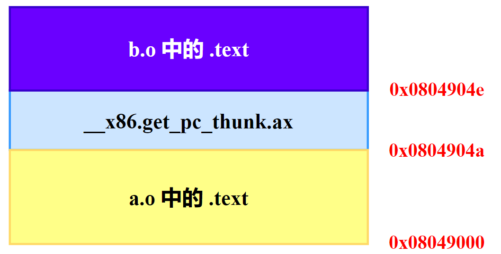
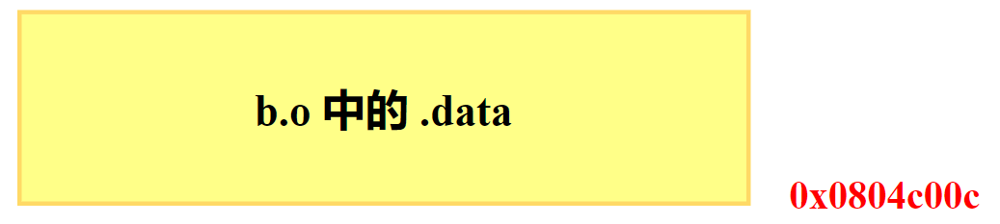

# 静态链接

## 1.空间和地址分配

### 1.1 相似段合并

对于链接器来说，整个链接过程中，它就是将几个输入目标文件加工后合并成一个输出文件。对于多个输入目标文件，链接器将相同性质的段合并到一起，比如将所有输入文件的 **`.text`** 合并到输出文件的 **`.text`** 段，接着是 **`.data`** 段、**`.bss`** 段等。**`.bss`** **<font color="red">段在目标文件和可执行文件中并不占用文件的空间，但是它在装载时占用地址空间</font>**。所以链接器在合并各个段的同时，也将 **`.bss`** 合并，并且分配虚拟空间。

现在链接器一般都采用一种叫 **两步链接（Two-pass Linking）** 的方法。也就是说整个链接过程分两步。

- **空间与地址分配**：扫描所有的输入目标文件，并且获得它们的各个段的长度、属性和位置，并且将输入目标文件中的符号表中所有的符号定义和符号引用收集起来，统一放到一个全局符号表。这一步中，链接器将能够获得所有输入目标文件的段长度，并且将它们合并，计算出输出文件中各个段合并后的长度与位置，并建立映射关系。
- **符号解析与重定位**：使用上面第一步中收集到的所有信息，读取输入文件中段的数据、重定位信息，并且进行符号解析与重定位，调整代码中的地址等。事实上第二步是链接过程的核心，特别是重定位过程。

我们使用 ld 链接器将 a.o 和 b.o 链接起来，**`ld a.o b.o -e main -o ab`**，其中 **`-e main`** 表示将 main 函数作为程序入口，ld 链接器将默认程序的入口设置为 **`_start`**。

```c{.line-numbers}
monica@monica-virtual-machine:~/linkers_loaders$ readelf -S a.o
There are 14 section headers, starting at offset 0x298:

节头：
  [Nr] Name              Type            Addr     Off    Size   ES Flg Lk Inf Al
  [ 0]                   NULL            00000000 000000 000000 00      0   0  0
  [ 1] .group            GROUP           00000000 000034 000008 04     11   5  4
  [ 2] .text             PROGBITS        00000000 00003c 00004a 00  AX  0   0  1
  [ 3] .rel.text         REL             00000000 0001ec 000020 08   I 11   2  4
  [ 4] .data             PROGBITS        00000000 000086 000000 00  WA  0   0  1
  [ 5] .bss              NOBITS          00000000 000086 000000 00  WA  0   0  1
  [ 6] .text.__x86.[...] PROGBITS        00000000 000086 000004 00 AXG  0   0  1
  [ 7] .comment          PROGBITS        00000000 00008a 00002c 01  MS  0   0  1
  [ 8] .note.GNU-stack   PROGBITS        00000000 0000b6 000000 00      0   0  1
  [ 9] .eh_frame         PROGBITS        00000000 0000b8 000060 00   A  0   0  4
  [10] .rel.eh_frame     REL             00000000 00020c 000010 08   I 11   9  4
  [11] .symtab           SYMTAB          00000000 000118 000090 10     12   4  4
  [12] .strtab           STRTAB          00000000 0001a8 000042 00      0   0  1
  [13] .shstrtab         STRTAB          00000000 00021c 00007a 00      0   0  1

monica@monica-virtual-machine:~/linkers_loaders$ readelf -S b.o
There are 14 section headers, starting at offset 0x25c:

节头：
  [Nr] Name              Type            Addr     Off    Size   ES Flg Lk Inf Al
  [ 0]                   NULL            00000000 000000 000000 00      0   0  0
  [ 1] .group            GROUP           00000000 000034 000008 04     11   6  4
  [ 2] .text             PROGBITS        00000000 00003c 000043 00  AX  0   0  1
  [ 3] .rel.text         REL             00000000 0001c0 000010 08   I 11   2  4
  [ 4] .data             PROGBITS        00000000 000080 000004 00  WA  0   0  4
  [ 5] .bss              NOBITS          00000000 000084 000000 00  WA  0   0  1
  [ 6] .text.__x86.[...] PROGBITS        00000000 000084 000004 00 AXG  0   0  1
  [ 7] .comment          PROGBITS        00000000 000088 00002c 01  MS  0   0  1
  [ 8] .note.GNU-stack   PROGBITS        00000000 0000b4 000000 00      0   0  1
  [ 9] .eh_frame         PROGBITS        00000000 0000b4 00004c 00   A  0   0  4
  [10] .rel.eh_frame     REL             00000000 0001d0 000010 08   I 11   9  4
  [11] .symtab           SYMTAB          00000000 000100 000080 10     12   4  4
  [12] .strtab           STRTAB          00000000 000180 00003d 00      0   0  1
  [13] .shstrtab         STRTAB          00000000 0001e0 00007a 00      0   0  1

monica@monica-virtual-machine:~/linkers_loaders$ readelf -S ab
There are 9 section headers, starting at offset 0x31a0:

节头：
  [Nr] Name              Type            Addr     Off    Size   ES Flg Lk Inf Al
  [ 0]                   NULL            00000000 000000 000000 00      0   0  0
  [ 1] .text             PROGBITS        08049000 001000 000091 00  AX  0   0  1
  [ 2] .eh_frame         PROGBITS        0804a000 002000 000080 00   A  0   0  4
  [ 3] .got.plt          PROGBITS        0804c000 003000 00000c 04  WA  0   0  4
  [ 4] .data             PROGBITS        0804c00c 00300c 000004 00  WA  0   0  4
  [ 5] .comment          PROGBITS        00000000 003010 00002b 01  MS  0   0  1
  [ 6] .symtab           SYMTAB          00000000 00303c 0000c0 10      7   5  4
  [ 7] .strtab           STRTAB          00000000 0030fc 00005e 00      0   0  1
  [ 8] .shstrtab         STRTAB          00000000 00315a 000043 00      0   0  1
Key to Flags:
  W (write), A (alloc), X (execute), M (merge), S (strings), I (info),
  L (link order), O (extra OS processing required), G (group), T (TLS),
  C (compressed), x (unknown), o (OS specific), E (exclude),
  D (mbind), p (processor specific)
```

#### 1.1.1 节组

从上面 **`a.o`**、**`b.o`** 和 ab 三个文件的段表可以看出，a.o 文件的 **`.text`** 段大小为 0x4a，b.o 文件的 **`.text`** 段大小为 0x43，加起来并不等于 ab 中的 **`.text`** 段的大小 0x91。这是因为在 a.o 和 b.o 中都有 4 字节的 **`.text.__x86.get_pc_thunk.ax`** 桩代码，链接器在链接时从 **`a.o`** 和 **`b.o`** 中挑 1 份（只有 1 份）并入到 ab 程序的 .text 中。在 a.o 和 b.o 中，**`__x86.get_pc_thunk.ax`** 桩代码都属于一种特殊的节组 **`GRP_COMDAT`**。

根据文档，Some sections occur in interrelated groups. For example, an out-of-line definition of an inline function might require, in addition to the section containing its executable instructions, a read-only data section containing literals referenced, one or more debugging information sections and other informational sections. Furthermore, there may be internal references among these sections that would not make sense if one of the sections were removed or replaced by a duplicate from another object. Therefore, such groups must be included or omitted from the linked object as a unit. A section cannot be a member of more than one group. 

这段话描述了这么一个场景，假设一个函数 **`foo()`**。它的机器码在 **`.text`** 节，它用到的一个字符串常量在 **`.rodata`** 节，它的调试信息在 **`.debug_info`** 节，这三个节是紧密关联的，作为一个原子单元来处理。因此，当链接器决定丢弃或替换时，必须把它们作为一个整体处理。这正是 **`SHT_GROUP`** 的目的，把相关节列在一个组节里，必要时整体保留或整体丢弃。

A section which is part of a group, and is to be retained or discarded with the group as a whole, is identified by a new section header attribute **`SHF_GROUP`**. **<font color="red">This section is a member (perhaps the only one) of a group of sections, and the linker should retain or discard all or none of the members</font>**.

A section cannot be a member of more than one group. 节不能同时属于多个组，如果某个字符串常量被多处共享，它通常不会被放进"每个函数的私有组"；想要把某函数所需常量跟它绑定，编译器会把该常量放进该函数专用的小节并把这个小节加上 **`SHF_GROUP`**，再由 **`SHT_GROUP`** 把这些成员节串起来。

>**`SHF_GROUP`** 是节标志，是 **`sh_flags`** 标志位中的一位，常在 **`readelf -S`** 的 **`Flg`** 列显示为 G。**`SHT_GROUP`** 是一种专门的节类型，类似于 **`SHT_SYMTAB`** 表示该段的内容为符号表，**`SHT_GROUP`** 节的节数据是 **`Elf32_Word`** 项的数组。第一项是一个标志字。其余项是一系列节头索引。

This is a COMDAT group. It may duplicate another COMDAT group in another object file, where duplication is defined as having the same group signature. In such cases, only one of the duplicate groups may be retained by the linker, and the members of the remaining groups must be discarded. 也就是说 COMDAT 是一种特殊的节组，用于支持多个目标文件中的相同符号（例如内联函数）。COMDAT 组允许同一符号的多个定义，链接器会根据其符号签名来识别并保留唯一的副本。在链接时，如果链接器发现相同的符号签名，它会保留其中一个节组，其余的会被丢弃。这种机制保证了在链接时，如果多个源文件中都有对同一个内联函数或模板的定义，最终链接出来的程序只包含一个定义。

```c{.line-numbers}
monica@monica-virtual-machine:~/linkers_loaders$ readelf -g a.o
COMDAT group section [    1] `.group' [__x86.get_pc_thunk.ax] contains 1 sections:
   [Index]    Name
   [    6]   .text.__x86.get_pc_thunk.ax

monica@monica-virtual-machine:~/linkers_loaders$ readelf -g b.o
COMDAT group section [    1] `.group' [__x86.get_pc_thunk.ax] contains 1 sections:
   [Index]    Name
   [    6]   .text.__x86.get_pc_thunk.ax
```

为了便于理解 **`GRP_COMDAT`**，我们使用 C++ 模板函数作为例子，创建如下 3 个文件：

```c{.line-numbers}
// template.h
#pragma once
#include <iostream>
template<typename T>
void print_value(T value) {
    const char* message = "The value is: "; // 一个相关的只读数据
    std::cout << message << value << std::endl;
}

// a.cpp
#include "template.h"
void func_a() {
    print_value(100); // 实例化 print_value<int>
}

// b.cpp
#include "template.h"
void func_b() {
    print_value(200); // 再次实例化 print_value<int>
}

// main.cpp
void func_a();
void func_b();

int main() {
    func_a();
    func_b();
    return 0;
}
```

编译为目标文件。

```c{.line-numbers}
g++ -c a.cpp -o a.o -m32
g++ -c b.cpp -o b.o -m32
g++ -c main.cpp -o main.o -m32
```

如下是 **`a.o`** 和 **`main.o`** 中的节组信息，在 **`a.o`** 中，**<font color="red">编译器将实例化后的模版函数 **`print_value(int)`** 放入到 COMDAT 组</font>**。因为如果 **`print_value`** 定义在头文件中，那么其他编译单元（如 **`b.cpp`**）也可能会实例化它，从而导致链接时出现"多重定义"错误。COMDAT 机制使得链接器在遇到多个同签名的 COMDAT 组时，只会保留一个，其他的全部丢弃。

另外在 **`print_value(int)`** 的 COMDAT 组中，不仅包含了此模板函数的代码，还包含了其重定位信息。例如，**`print_value`** 内部调用了 **`std::cout`**，这个调用地址在编译时是不确定的，需要链接器来填充。将重定位节也放入组内，保证了处理的原子性。如果链接器决定丢弃 a.o 中的这个 **`print_value`** 实现（因为它可能选择了 b.o 中的版本），它会把对应的代码节和重定位节一起丢弃。

同时，在 a.o 中编译器生成了 **`__x86.get_pc_thunk.ax`** 和 **`__x86.get_pc_thunk.bx`** 两个辅助函数，这两个辅助函数在其他的地址无关文件中也可能用到，所以这里编译器也将其放到 COMDAT 组中进行去重。

```c{.line-numbers}
monica@monica-virtual-machine:~/linkers_loaders$ readelf -g a.o
COMDAT group section [    1] `.group' [_Z11print_valueIiEvT_] contains 2 sections:
   [Index]    Name
   [    9]   .text._Z11print_valueIiEvT_
   [   10]   .rel.text._Z11print_valueIiEvT_

COMDAT group section [    2] `.group' [__x86.get_pc_thunk.ax] contains 1 sections:
   [Index]    Name
   [   13]   .text.__x86.get_pc_thunk.ax

COMDAT group section [    3] `.group' [__x86.get_pc_thunk.bx] contains 1 sections:
   [Index]    Name
   [   14]   .text.__x86.get_pc_thunk.bx

monica@monica-virtual-machine:~/linkers_loaders$ readelf -g main.o
COMDAT group section [    1] `.group' [__x86.get_pc_thunk.bx] contains 1 sections:
   [Index]    Name
   [    6]   .text.__x86.get_pc_thunk.bx
```

#### 1.1.2 段合并

从下面的段表可以看出，**`.comment`**、**`.symtab`**、**`.strtab`**、**`.shstrtab`** 这 4 个段的 Addr 值为 0，这是因为这些节只在链接和调试时有用，当操作系统加载器将程序从磁盘文件加载到内存中准备运行时，它会完全忽略这些节，不为它们分配任何内存空间。因此既然这些节不被加载到内存中，它们自然也就没有内存地址，所以 Addr 字段被设置为 0。

并且由于 **`.text`** 段的内存权限是可读可执行，**`.eh_frame`** 段的内存权限是只读，**`.got.plt`** 和 **`.data`** 的权限是可读可写，因此链接器按照权限分组，将所有具有相同内存权限需求的节聚合在一起。

```c{.line-numbers}
monica@monica-virtual-machine:~/linkers_loaders$ readelf -S ab
There are 9 section headers, starting at offset 0x31a0:

节头：
  [Nr] Name              Type            Addr     Off    Size   ES Flg Lk Inf Al
  [ 0]                   NULL            00000000 000000 000000 00      0   0  0
  [ 1] .text             PROGBITS        08049000 001000 000091 00  AX  0   0  1
  [ 2] .eh_frame         PROGBITS        0804a000 002000 000080 00   A  0   0  4
  [ 3] .got.plt          PROGBITS        0804c000 003000 00000c 04  WA  0   0  4
  [ 4] .data             PROGBITS        0804c00c 00300c 000004 00  WA  0   0  4
  [ 5] .comment          PROGBITS        00000000 003010 00002b 01  MS  0   0  1
  [ 6] .symtab           SYMTAB          00000000 00303c 0000c0 10      7   5  4
  [ 7] .strtab           STRTAB          00000000 0030fc 00005e 00      0   0  1
  [ 8] .shstrtab         STRTAB          00000000 00315a 000043 00      0   0  1

monica@monica-virtual-machine:~/linkers_loaders$ readelf -l ab

Elf 文件类型为 EXEC (可执行文件)
Entry point 0x8049000
There are 5 program headers, starting at offset 52

程序头：
  Type           Offset   VirtAddr   PhysAddr   FileSiz MemSiz  Flg Align
  LOAD           0x000000 0x08048000 0x08048000 0x000d4 0x000d4 R   0x1000
  LOAD           0x001000 0x08049000 0x08049000 0x00091 0x00091 R E 0x1000
  LOAD           0x002000 0x0804a000 0x0804a000 0x00080 0x00080 R   0x1000
  LOAD           0x003000 0x0804c000 0x0804c000 0x00010 0x00010 RW  0x1000
  GNU_STACK      0x000000 0x00000000 0x00000000 0x00000 0x00000 RW  0x10

 Section to Segment mapping:
  段节...
   00     
   01     .text 
   02     .eh_frame 
   03     .got.plt .data 

monica@monica-virtual-machine:~/linkers_loaders$ readelf -h ab
ELF 头：
  Magic：   7f 45 4c 46 01 01 01 00 00 00 00 00 00 00 00 00 
  类别:                              ELF32
  数据:                              2 补码，小端序 (little endian)
  Version:                           1 (current)
  OS/ABI:                            UNIX - System V
  ABI 版本:                          0
  类型:                              EXEC (可执行文件)
  系统架构:                          Intel 80386
  版本:                              0x1
  入口点地址：                        0x8049000
  程序头起点：                        52 (bytes into file)
  Start of section headers:          12704 (bytes into file)
  标志：                              0x0
  Size of this header:               52 (bytes)
  Size of program headers:           32 (bytes)
  Number of program headers:         5
  Size of section headers:           40 (bytes)
  Number of section headers:         9
  Section header string table index: 8
```

另外，**`.text`** 段没有从 **`0x08048000`** 开始，是因为从 **`0x08048000`** 开始的第一个内存页（第 1 个 **`PT_LOAD`** 段），被用来存放 ELF 头和程序头表。ELF 头大小为 52 字节，而程序头表的总大小为 160 字节，总大小为 212 字节，刚好等于第一个 **`PT_LOAD`** 段的大小 0x000d4（212 字节）。

#### 1.1.3 符号地址确定

我们还是以 **`a.o`** 和 **`b.o`** 作为例子，来分析这两个步骤中链接器的工作过程。在第一步的扫描和空间分配阶段，链接器按照前面介绍的空间分配方法进行分配，这时候输入文件中的各个段在链接后的文件 ab 中的虚拟地址也就已经确定了，比如 **`.text`** 段起始地址为 **`0x08049000`**，**`.data`** 段的起始地址为 **`0x0804c00c`**。

当前面一步完成之后，链接器开始计算各个符号的虚拟地址。**<font color="red">因为各个符号在段内的相对位置是固定的，所以这时候其实 main、shared 和 swap 的地址也已经是确定的了，只不过链接器需要给每个符号加上一个偏移量，使它们能够调整到正确的虚拟地址</font>**。

<div align="center">
    
</div>

比如我假设 a.o 中的 main 函数相对于 **`a.o`** 的 **`.text`** 段的偏移是 X，但是经过链接合并以后，a.o 的 **`.text`** 段位于虚拟地址 **`0x08049000`**，那么 main 的地址应该是 **`0x08049000+X`**。从上面的输出可以看到，main 函数位于 **`a.o`** 的 **`.text`** 段的最开始，也就是偏移为 0，即在最终的输出文件 ab 中的地址应该是 **`0x08049000+0`**。然后接着是 **`__x86.get_pc_thunk.ax`** 段，由于 **`a.o`** 中 **`.text`** 段的大小为 0x4a，因此 **`__x86.get_pc_thunk.ax`** 段在 ab 文件中的地址为 **`0x0804904a`**。swap 函数位于 **`b.o`** 的 **`.text`** 段的最开始，偏移量也为 0，而 b.o 中的 **`.text`** 段在 **`__x86.get_pc_thunk.ax`** 之后，因此 swap 函数的地址为 **`0x0804904a+4=0x0804904e`**。

<div align="center">
    
</div>

shared 变量在 **`b.o`** 的 **`.data`** 段的最开始，也就是偏移为 0，并且 **`b.o`** 的 **`.data`** 段位于 ab 文件中的 **`0x0804c00c`** 地址处（a.o 文件中 **`.data`** 段的大小为 0）。因此 shared 变量在 ab 文件中的地址为 **`0x0804c00c+0=0x0804c00c`**。

```c{.line-numbers}
monica@monica-virtual-machine:~/linkers_loaders$ readelf -s a.o | grep main
     4: 00000000    74 FUNC    GLOBAL DEFAULT    2 main
monica@monica-virtual-machine:~/linkers_loaders$ readelf -s ab | grep main
     9: 08049000    74 FUNC    GLOBAL DEFAULT    1 main

monica@monica-virtual-machine:~/linkers_loaders$ readelf -s ab | grep ax
     6: 0804904a     0 FUNC    GLOBAL HIDDEN     1 __x86.get_pc_thunk.ax

monica@monica-virtual-machine:~/linkers_loaders$ readelf -s b.o | grep swap
     5: 00000000    67 FUNC    GLOBAL DEFAULT    2 swap
monica@monica-virtual-machine:~/linkers_loaders$ readelf -s ab | grep swap
     5: 0804904e    67 FUNC    GLOBAL DEFAULT    1 swap

monica@monica-virtual-machine:~/linkers_loaders$ readelf -s b.o | grep shared
     4: 00000000     4 OBJECT  GLOBAL DEFAULT    4 shared
monica@monica-virtual-machine:~/linkers_loaders$ readelf -s ab | grep shared
     7: 0804c00c     4 OBJECT  GLOBAL DEFAULT    4 shared
```

## 2.符号解析与重定位

### 2.1 重定位

A basic difference between the i386 ABI and the x86-64 ABI is the way the GOT table is found. The i386 ABI, like (most) other processor specific ABIs, uses a dedicated register (%ebx) to address the base of the GOT table. The function prologue of every function needs to set up this register to the correct value.The x86-64 processor family introduces a new IP-relative addressing mode which is used in this ABI instead of using a dedicated register.